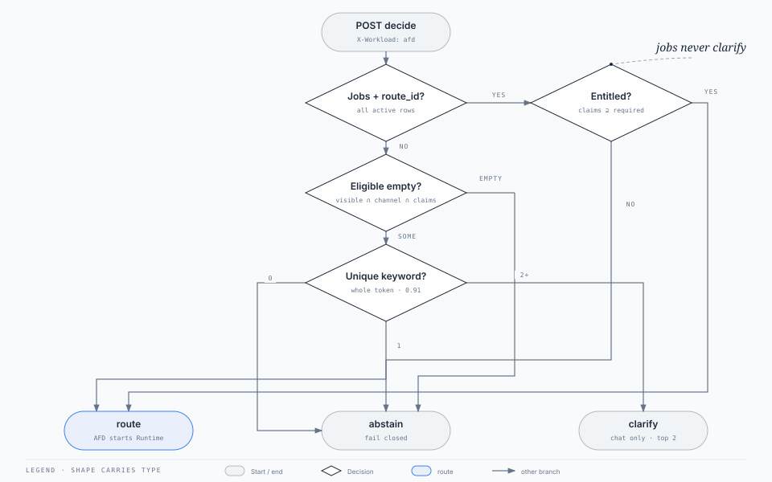

# Agent Data Plane

**This box does not run agents. It names them.**

Front Door is the door. Runtime is the kitchen. Registry is the pantry. **Data Plane is the menu** — versioned, entitled, and the only place that answers *which route is this turn?*

Channels never dial this process. Jane talks to Front Door. Front Door (and, after a pin, Runtime / Control Plane) talks to **:3007**.

| | |
| --- | --- |
| Port | **3007** |
| Stack | Java 21, Spring Boot 3.5, Flyway |
| Database | `adp` (schema `dataplane`) |
| Compose | `agent-data-plane` |
| Auth | Workload only. `Authorization: Bearer fabric-internal` + `X-Workload` |
| Decide caller | **`afd` only.** Anyone else → **403**. Channel bearer → **401**. |

Docs map: [docs/README.md](../docs/README.md). Frozen decide bodies: [docs/05-reference/](../docs/05-reference/README.md). Box pack (may be ahead of this binary): [docs/04-architecture/agent-plane.md](../docs/04-architecture/agent-plane.md).

---

## You are here


Jane never dials this process. Front Door is the only decide caller. Runtime and Control Plane may GET rows. Data Plane does not start Runtime.

A down catalogue **fails closed** (no new starts). A down Runtime does not stop classify.

---

## What it owns

1. **Catalogue** — routes, manifests, prompt packs, workflows, corpora. Pointers and policy. Not tool schemas (Registry). Not memories (Runtime / stores the route names).
2. **Decide** — active ∩ claims ∩ channel, then either bind a named `route_id` or keyword-classify the utterance.
3. **Eligible chips** — chat-visible routes the identity may see.

Three outcomes. Only **`route`** is startable, and **Front Door** starts Runtime.

| Outcome | Meaning | Jobs? |
| --- | --- | --- |
| `route` | Bind this `route_id` @ `route_version` | Yes, if entitled |
| `clarify` | Two keyword winners. Ask Jane. | **Never** |
| `abstain` | No eligible row, or no keyword hit, or named id not entitled | Fail closed |

### How decide actually chooses



Non-`afd` is rejected before this tree (403). Chat with a named `route_id` binds inside eligible — same entitle shape as jobs, omitted here.

Keywords match **whole tokens** so `"hi"` does not steal `"this"`, while `"$42"` still hits `"42"`.

This binary does **not** pin, start Runtime, mint `correlation_id`, store transcripts, or serve a decision-audit API (`GET /v1/decisions` is 404 on purpose).

---

## Auth

Every path except `GET /health`:

```http
Authorization: Bearer fabric-internal
X-Workload: afd
```

`X-Workload` is one of `afd` · `adp` · `acp` · `ar` · `acr`. Anything else, or a channel `Bearer stub`, is **401**.

| Caller | `X-Workload` | Decide | Catalogue GET | Eligible |
| --- | --- | --- | --- | --- |
| Front Door | `afd` | yes | yes | yes |
| Control Plane | `acp` | **403** | yes | yes |
| Runtime | `ar` | **403** | yes (pinned row) | yes |
| Registry / self | `acr` / `adp` | **403** | yes | yes |

Eligible also reads **`X-Stub-Claims`** (JSON). Decide reads **`claims` in the JSON body**. Same shape:

```json
{ "sub": "jane", "emts": { "accounts:read": true } }
```

Only `emts` keys whose value is `true` count. Missing header / body → empty entitlements → empty eligible / abstain.

Optional: send `X-Request-Id`; this process echoes it (or mints `req-…`).

---

## APIs

Base: `http://localhost:3007`. All catalogue list endpoints default to the **live** cut. Pass `?include=all` to see drafts, retired, and every version.

### Health

| Method | Path | Auth | Response |
| --- | --- | --- | --- |
| `GET` | `/health` | none | `{"status":"UP"}` |

### Intent

| Method | Path | Who | What |
| --- | --- | --- | --- |
| `POST` | `/v1/intent/decide` | **`afd` only** | Classify or entitle. Body below. |
| `GET` | `/v1/intent/eligible?channel=web` | any workload | Chat-visible ∩ channel ∩ `X-Stub-Claims`. Default channel `web`. |

#### `POST /v1/intent/decide`

Chat ([frozen](../docs/05-reference/decide-chat-request.json)):

```json
{
  "ingress": "chat",
  "channel": "web",
  "session_id": "sess-88",
  "message": "Why was I charged $42?",
  "route_id": null,
  "claims": { "sub": "jane", "emts": { "accounts:read": true } }
}
```

Jobs ([frozen](../docs/05-reference/decide-jobs-route.json)): `ingress: "jobs"`, `route_id` set, `message` null. Still entitle. Never `clarify`.

| Field (response) | `route` | `clarify` | `abstain` |
| --- | --- | --- | --- |
| `outcome` | `"route"` | `"clarify"` | `"abstain"` |
| `intent_label` | from row | null | null |
| `route_id` / `route_version` | bound | null | null |
| `confidence` | `1.0` jobs / `0.91` chat | null | null |
| `eligible_routes` | ids considered | ids considered | ids considered (maybe `[]`) |
| `clarify_prompt` | omitted | string | omitted |
| `candidates` | omitted | up to 2 `{intent_label,route_id,confidence,label}` | omitted |

### Catalogue — routes

| Method | Path | Default |
| --- | --- | --- |
| `GET` | `/v1/catalog/routes` | **Active** rows (`?include=all` → every version) |
| `GET` | `/v1/catalog/routes/{routeId}` | Active row. Pin with `?route_version=2026.08.1` |
| `GET` | `/v1/catalog/routes/{routeId}/versions` | `{ "route_id", "versions": [ … ] }` |

Route body (pointers, not blobs): `route_id`, `route_version`, `active`, `status`, `intent_label`, `autonomy_mode`, `description`, `activation_target`, `agent_client_id`, `tool_manifest` + version, nested `manifest`, `policy_profile`, `model_profile`, `retrieval`, `memory_profile`, `workflow_id`, `prompt_id`, `output_schema_id`, `eval_suite_id`, `max_loop_steps`, `fallback`, `required_claims`, `channels`, `chat_visible`.

`retrieval` is omitted when mode is blank / `none` / `omit`.

### Catalogue — manifests, prompts, workflows

Same four-shape on each resource. List = latest (manifests, workflows) or **published** (prompts). `?include=all` lists every version.

| Resource | List | Latest / published | All versions | One version |
| --- | --- | --- | --- | --- |
| Manifests | `GET /v1/catalog/manifests` | `GET /v1/catalog/manifests/{id}` | `…/{id}/versions` | `…/{id}/versions/{version}` |
| Prompts | `GET /v1/catalog/prompts` | `GET /v1/catalog/prompts/{id}` | `…/{id}/versions` | `…/{id}/versions/{version}` |
| Workflows | `GET /v1/catalog/workflows` | `GET /v1/catalog/workflows/{id}` | `…/{id}/versions` | `…/{id}/versions/{version}` |

Wrappers: `{ "manifests": […] }`, `{ "prompts": […] }`, `{ "workflows": […] }`. Version lists: `{ "manifest_id"|"prompt_id"|"workflow_id", "versions": […] }`.

| Resource | Body highlights |
| --- | --- |
| Manifest | `manifest_id`, `manifest_version`, `description`, `status`, `tools[]` (`name`, `capability_id`, `capability_version`, `pdp_action`, `risk_tier`) |
| Prompt | `prompt_id`, `prompt_version`, `host`, `status`, `owner`, `by_llm_role` |
| Workflow | `workflow_id`, `workflow_version`, `description`, `status`, `stages[]` (`id`, `tool`, `type`, `llm_role`, `corpus`, `side_effect`, `requires_approval`, `branch`, `allowlist`, `max_tool_calls`) |

Prompt `GET /{id}` prefers the latest **published** pack, then any version. Manifest/workflow `GET /{id}` is the latest version on file.

### Catalogue — corpora

No version path. One row per index. Runtime looks up each `retrieval.scope` id, then POSTs `url`.

| Method | Path |
| --- | --- |
| `GET` | `/v1/catalog/corpora` (published; `?include=all` for drafts) |
| `GET` | `/v1/catalog/corpora/{corpusId}` |

Body: `corpus_id`, `display_name`, `url`, `collection`, `auth`, `owner`, `status`, `region`, `updated_at`.

### Errors

| Status | When |
| --- | --- |
| **401** | Missing/wrong bearer or `X-Workload` |
| **403** | Non-`afd` posted decide |
| **404** | Unknown id/version `{ "error": { "code": "NOT_FOUND", "message": "…" } }` |

Unknown jobs `route_id` is **200 `abstain`**, not 404. Catalogue miss is 404.

---

## Curl (stack up)

```bash
HDR=(-H 'Authorization: Bearer fabric-internal' -H 'X-Workload: afd')

curl -sf localhost:3007/health && echo

curl -sf "${HDR[@]}" localhost:3007/v1/catalog/routes | jq '.routes[].route_id'

curl -sf "${HDR[@]}" \
  -H 'X-Stub-Claims: {"sub":"jane","emts":{"accounts:read":true}}' \
  'localhost:3007/v1/intent/eligible?channel=web'

curl -sf "${HDR[@]}" -H 'Content-Type: application/json' \
  -d '{"ingress":"chat","channel":"web","session_id":"sess-88","message":"Why was I charged $42?","route_id":null,"claims":{"sub":"jane","emts":{"accounts:read":true}}}' \
  localhost:3007/v1/intent/decide

curl -sf "${HDR[@]}" \
  'localhost:3007/v1/catalog/routes/fee_explain?route_version=2026.08.1'
```

Control Plane browse: same URLs, `X-Workload: acp`. Swap `afd` → `ar` on decide and watch **403**.

---

## Hexagon

| Package | Role |
| --- | --- |
| `domain` | Rows, decide records, `NotFound` / `Forbidden`. No Spring. |
| `application` | Catalogue, decide, stores (ports) |
| `adapters.in.http` | Controllers, workload filter, stub claims |
| `adapters.out.jdbc` | Flyway-backed stores |

Tests seed **in-memory** twins of the Flyway demo. Keep them aligned; `CataloguePinLintTest` and `SeedCatalogueSqlTest` exist so they cannot drift in silence.

---

## Tests / eval gate

Image build runs `mvn test`. No Compose required for the routing gate:

```bash
./agent-data-plane/run-eval.sh
# RoutingEvalTest + JobsEntitleEvalTest + CataloguePinLintTest
```

Playbook (add an incident, do not delete a case to go green): [src/test/resources/eval/README.md](src/test/resources/eval/README.md).

---

## Non-goals

- A public URL or channel `Bearer stub` on these APIs
- Pin, freeze, `correlation_id`, or `POST` to Runtime
- LLM classify (Layer ③). Keywords are the classifier in this binary
- Decision audit store / `GET /v1/decisions`
- Hydrating tool schemas (Registry) or executing a workflow (Runtime)
- Serving Jane a `route_id` on the chat JSON (Front Door strips it)
