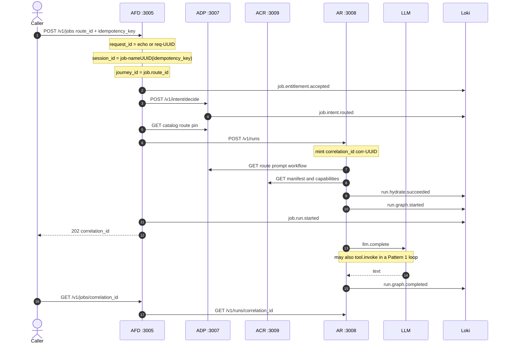
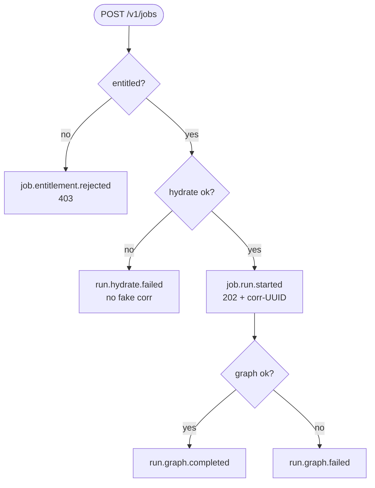
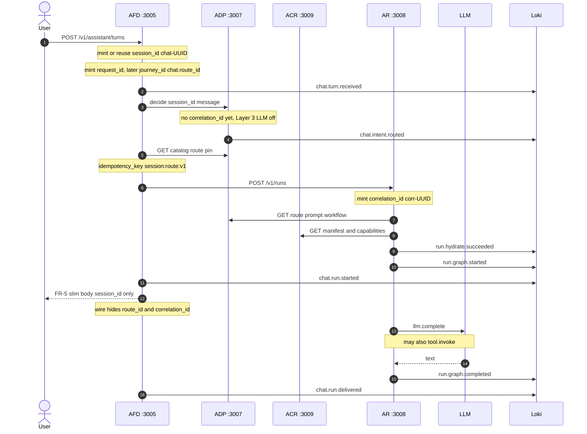
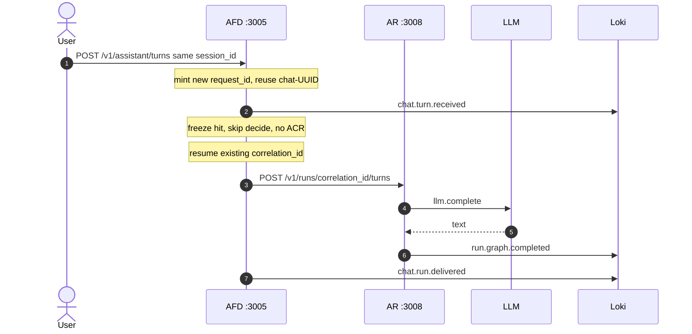
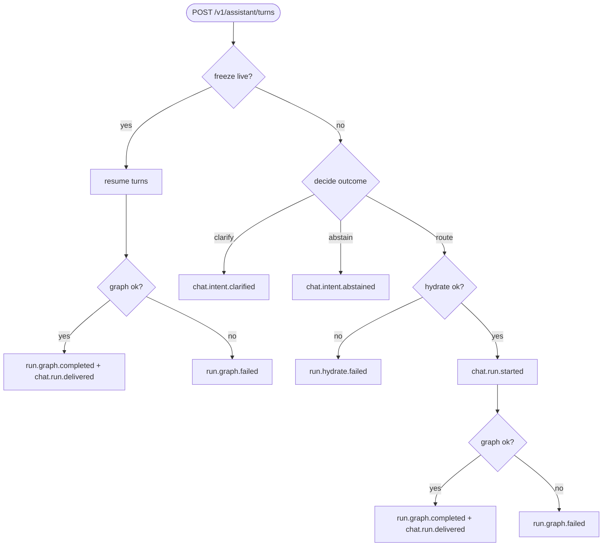
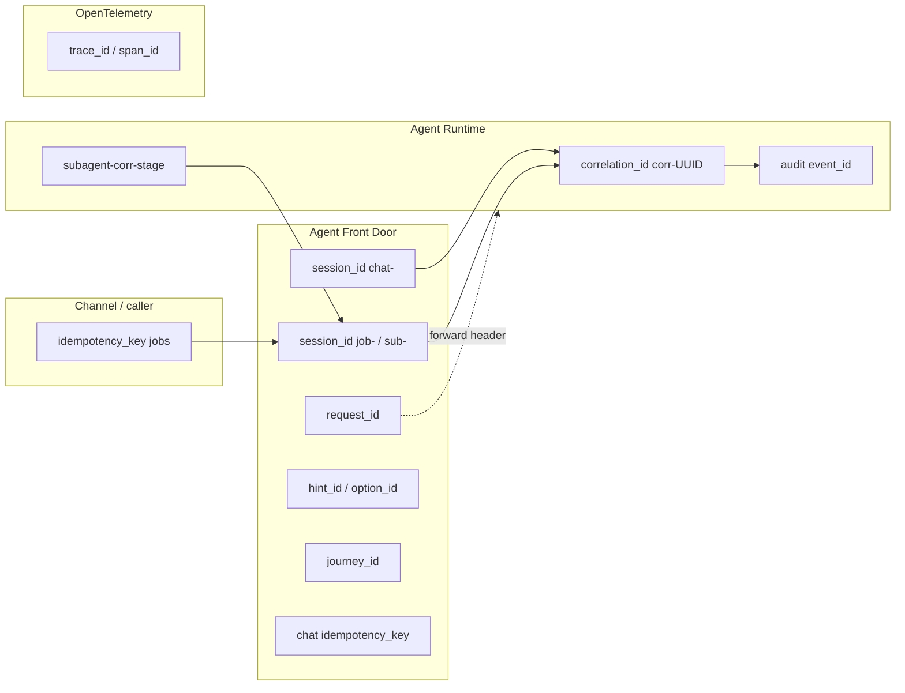

# Identifiers

Which ids the fabric mints, who owns them, and how they show up in Grafana (Loki business events + Tempo spans).

Related: [overview](overview.md) · [memory](memory.md) · [README observability](../../README.md#observability-grafana-lgtm)

**Worked examples used below** (one jobs run + one chat thread):

| Field | Jobs example | Chat example |
| --- | --- | --- |
| `route_id` | `fee_explain` | `fee_explain` |
| Caller / AFD key | `idempotency_key` = `job-fee-explain:v1` | (AFD builds start key) |
| `request_id` | `req-f4cfcc86-b8ed-45c7-9a1b-2c3d4e5f6071` | `req-a1b2c3d4-e5f6-0718-9abc-def012345678` |
| `session_id` | `job-19268885-49db-3eb1-a2a9-cf65e30048f7` | `chat-11111111-1111-4111-8111-111111111111` |
| `journey_id` | `job.fee_explain` | `chat.fee_explain` |
| `correlation_id` | `corr-550e8400-e29b-41d4-a716-446655440000` | `corr-7c9e6679-7425-40de-944b-e07fc1f90ae7` |
| `trace_id` | `9af5f0a0c9c181acfcd5d0ce42efc599` | `dad8eff12d624d8d61c627fd3d4c9f66` |

## Contents

| # | Section | What you get |
| --- | --- | --- |
| 1 | [Pick an id](#1-pick-an-id) | One-row cheat sheet: which id answers which question |
| 2 | [Id catalogue](#2-id-catalogue) | Shape, minter, lifetime for every id |
| 3 | [Jobs — success](#3-jobs--success) | Happy path sequence + business events |
| 4 | [Jobs — failure & edges](#4-jobs--failure--edges) | Entitle reject, hydrate fail, graph fail, poll |
| 5 | [Chat — success](#5-chat--success) | New route + follow-up turn |
| 6 | [Chat — failure & edges](#6-chat--failure--edges) | Clarify, abstain, hydrate fail, graph fail |
| 7 | [Who may mint](#7-who-may-mint) | Ownership swimlane |
| 8 | [Subagents](#8-subagents) | Child `corr-` / `sub-` linkage |
| 9 | [Grafana](#9-grafana) | Live labels + queries |
| 10 | [Source map](#10-source-map) | Code pointers |

---

## 1. Pick an id

| You want to know… | Use | Example |
| --- | --- | --- |
| Did **this HTTP call** land? | `request_id` | `req-f4cfcc86-b8ed-45c7-9a1b-2c3d4e5f6071` |
| Show me **this journey** in Loki | `session_id` | `job-19268885-49db-3eb1-a2a9-cf65e30048f7` or `chat-11111111-1111-4111-8111-111111111111` |
| Did **this run** finish? Poll / audit | `correlation_id` | `corr-550e8400-e29b-41d4-a716-446655440000` |
| Group metrics by product path | `journey_id` | `job.fee_explain` / `chat.fee_explain` |
| Open the start→loop Tempo tree | `trace_id` | `9af5f0a0c9c181acfcd5d0ce42efc599` |

**AFD never mints `correlation_id`.** No AR `202` → AFD returns `503` and does not invent one.

### UUID-shaped vs not

| Kind | Ids | Shape |
| --- | --- | --- |
| **UUID (dashed)** | `request_id`, `correlation_id`, `session_id` (`chat-` / `job-` / `sub-`), audit `event_id` | `prefix-` + `8-4-4-4-12` hex (`job-`/`sub-` use name-UUID; others random) |
| **Not UUID** | `journey_id` | `job.fee_explain` / `chat.fee_explain` (route string) |
| **Not UUID** | `idempotency_key` | Caller string, e.g. `job-fee-explain:v1` |
| **Not UUID** | `hint_id` / `option_id` | Short opaque tokens, e.g. `hint-a1b2c3d4` |
| **Not UUID** | `route_id` / `route_version` | Catalogue ids, e.g. `fee_explain` @ `2026.08.1` |
| **Not UUID** | `trace_id` / `span_id` | OTel hex (32 / 16), no dashes |
| **Not UUID** | Subagent key (whole string) | `subagent-{corr-UUID}-{stage_id}` — embeds a UUID but is not itself one |

---

## 2. Id catalogue

| Id | Shape | Who mints | Example | Lifetime | Use |
| --- | --- | --- | --- | --- | --- |
| `request_id` | `req-` + UUID | **AFD** edge (echo inbound if set); ADP/ACR mint only if header missing | `req-f4cfcc86-b8ed-45c7-9a1b-2c3d4e5f6071` | One channel hop chain | MDC / span / Loki before a run exists |
| `session_id` (chat) | `chat-` + UUID | **AFD** when client omits one | `chat-11111111-1111-4111-8111-111111111111` | Chat thread (freeze ~45 min) | Freeze PK; stickiness |
| `session_id` (jobs) | `job-` + name-UUID | **AFD** from `idempotency_key` (stable) | `job-19268885-49db-3eb1-a2a9-cf65e30048f7` | That jobs freeze | Freeze PK; not conversation memory |
| `session_id` (subagent) | `sub-` + name-UUID | **AFD** for subagent-shaped keys | `sub-3f1a0c2e-8b9d-4e7a-9c1f-2d4e6a8b0c2e` | Child freeze | Parent link on audit |
| `idempotency_key` | Caller string (jobs); chat: `session:route:v1` | **Caller** or **AFD** | `job-fee-explain:v1` / `chat-11111111-…:fee_explain:v1` | Dedup start | Same key → same `correlation_id` |
| `correlation_id` | `corr-` + UUID | **AR only** (`uuid4()`) | `corr-550e8400-e29b-41d4-a716-446655440000` | One run | Status poll; audit chain |
| `journey_id` | `job.{route}` / `chat.{route}` | **AFD** (not unique per call) | `job.fee_explain` | Metric bucket | Loki + `fabric_journey_outcome_total` |
| `hint_id` / `option_id` | `hint-` / `opt-` + token | **AFD** | `hint-a1b2c3d4` / `opt-e5f60718` | Opaque under `session_id` | Wire-safe route chips |
| Subagent key | `subagent-{parent_corr}-{stage}` | **AR** | `subagent-corr-550e8400-…-0000-start_contract_review` | Child idempotency | AFD parses parent `corr-` |
| `event_id` | UUID | Audit producers | `8f14e45f-ceea-467c-9a7e-2b4d8c1a9f3e` | Append-only row | AADP ingest |
| `trace_id` / `span_id` | OTel hex | OpenTelemetry SDK | `9af5f0a0c9c181acfcd5d0ce42efc599` / `31652c05931fc4b4` | That distributed trace | Tempo |

`route_id` / `route_version` are **published catalogue pins** (e.g. `fee_explain` @ `2026.08.1`), not runtime-minted ids.

---

## 3. Jobs — success

Happy path: entitle → decide `route` → hydrate → start → LLM (and tools) → `run.graph.completed`.

### What AFD mints on `POST /v1/jobs`

Before decide, AFD attaches three ids (plus OTel `trace_id`). **None of these is `correlation_id`** — that comes later from AR.

| Id | How it is made | Example | Why |
| --- | --- | --- | --- |
| `request_id` | Edge filter: echo inbound `X-Request-Id`, else mint `req-` + UUID | `req-f4cfcc86-b8ed-45c7-9a1b-2c3d4e5f6071` | Correlate **this HTTP POST** across AFD → ADP → AR logs/spans before a run exists |
| `session_id` | `SessionIds.mintJobOrSub(idempotency_key)` → `job-` + **name-UUID** (deterministic from the key). Subagent keys get `sub-` instead | `job-19268885-49db-3eb1-a2a9-cf65e30048f7` from key `job-fee-explain:v1` | Freeze / journey key. Same `idempotency_key` → **same** `session_id` (retry-safe). Not a random UUID like chat |
| `journey_id` | Literal `"job." + route_id` | `job.fee_explain` | KPI / business-event bucket. Shared by every run of that route — **not** unique per call |

Caller still supplies `idempotency_key` (e.g. `job-fee-explain:v1`) and `route_id` (e.g. `fee_explain`). AFD does not mint that key.



| Step | Business event (or span) | Ids (example) |
| --- | --- | --- |
| Entitle | `job.entitlement.accepted` | `session_id=job-19268885-…`, `request_id=req-f4cfcc86-b8ed-45c7-…`, `journey_id=job.fee_explain`, `trace_id=9af5f0a0…` — **no** `correlation_id` |
| Decide | `job.intent.routed` | same + `route_id=fee_explain` — still **no** `correlation_id` |
| Hydrate / start | `run.hydrate.succeeded` → `run.graph.started` → `job.run.started` | **`correlation_id=corr-550e8400-e29b-41d4-a716-446655440000` appears** |
| Graph | Tempo `llm.complete` / `tool.invoke` | same start `trace_id` + `session_id` + `correlation_id` |
| Done | `run.graph.completed` | `session_id=job-19268885-…` + `correlation_id=corr-550e8400-…` |
| Poll | *(no business event)* | `GET /v1/jobs/corr-550e8400-e29b-41d4-a716-446655440000` |

---

## 4. Jobs — failure & edges

| Scenario | What happens | Business events | Caller sees | Example |
| --- | --- | --- | --- | --- |
| Not entitled | Decide not `route` | `job.intent.abstained` → `job.entitlement.rejected` | **403** | `session_id=job-…` present; **no** `corr-…` |
| Hydrate miss | Bad pin / registry 404 | `run.hydrate.failed` | AFD **503** / AR **422** `HYDRATE_FAILED` | AFD does **not** invent `corr-550e8400-…` |
| Graph error | e.g. loop exceeded steps | `run.graph.started` … then `run.graph.failed` | Poll `status=failed` (`recoverable` may be true) | `202` already returned `corr-550e8400-…`; Loki `run.graph.failed` |
| Duplicate idempotency key | Replay `job-fee-explain:v1` | No second robot | Same `202` body | Same `correlation_id=corr-550e8400-…` |
| Status poll | `GET /v1/jobs/{corr}` | *(none)* | Slim status JSON | New `request_id=req-…`; lookup `corr-550e8400-…` |



---

## 5. Chat — success

### New route (first pin)



| Step | Business event (or span) | Ids (example) |
| --- | --- | --- |
| Turn in | `chat.turn.received` | `session_id=chat-11111111-…`, `request_id=req-a1b2c3d4-e5f6-0718-…`, `trace_id=dad8eff1…` — **no** `correlation_id` |
| Decide | `job.intent.routed` | same + `route_id=fee_explain` — still **no** `correlation_id` |
| Start key | *(AFD local)* | `idempotency_key=chat-11111111-…:fee_explain:v1`; `journey_id=chat.fee_explain` |
| Hydrate / start | `run.hydrate.succeeded` → `run.graph.started` → `chat.run.started` | **`correlation_id=corr-7c9e6679-7425-40de-944b-e07fc1f90ae7`**; freeze `chat-11111111-…` → pin + corr |
| User reply | FR-5 JSON | `{"session_id":"chat-11111111-…","status":"accepted"}` — **no** `route_id` / `correlation_id` on the wire |
| Graph | Tempo `llm.complete` / `tool.invoke` | `trace_id=dad8eff1…` + `session_id` + `correlation_id=corr-7c9e6679-…` |
| Done | `run.graph.completed` → `chat.run.delivered` | `session_id=chat-11111111-…` + `correlation_id=corr-7c9e6679-…` |

### Follow-up turn (freeze live)

Skip decide and ACR. Same `session_id` and `correlation_id`; **new** `request_id` / `trace_id` for this HTTP call.



| Step | Business event (or span) | Ids (example) |
| --- | --- | --- |
| Turn in | `chat.turn.received` | **same** `session_id=chat-11111111-…`; **new** `request_id=req-99aa88bb-ccdd-eeff-0011-223344556677`, **new** `trace_id=…` |
| Resume | *(no decide / no ACR)* | freeze → existing `correlation_id=corr-7c9e6679-…` + `fee_explain` pin |
| Graph | Tempo `llm.complete` | `session_id=chat-11111111-…` + `correlation_id=corr-7c9e6679-…` |
| Done | `run.graph.completed` → `chat.run.delivered` | same journey ids; **no** second `corr-` mint |

---

## 6. Chat — failure & edges

| Scenario | What happens | Business events | User-facing (example) | `correlation_id`? |
| --- | --- | --- | --- | --- |
| Clarify | Decide needs options | `chat.intent.clarified` | `session_id=chat-11111111-…` + `option_id=opt-e5f60718` | Not started |
| Abstain | No safe route | `chat.intent.abstained` | `{"session_id":"chat-11111111-…","status":"abstain"}` | Not started |
| Hydrate miss | Pin/registry fail | `run.hydrate.failed` | Start fails closed | Not invented by AFD |
| Graph error | Loop / stage throw | `run.graph.failed` | Events / poll show failed | Yes if `chat.run.started` already returned (e.g. `corr-7c9e6679-…`) |
| Hints only | `GET .../hints` | *(none required)* | `session_id=chat-11111111-…`, `hint_id=hint-a1b2c3d4` | No run |



---

## 7. Who may mint



Jobs `idempotency_key` is caller-owned (e.g. `job-fee-explain:v1`). `trace_id` is SDK-owned (AFD preserves inbound `traceparent`).

---

## 8. Subagents

When a `kind=agent` stage runs, AR builds:

```text
idempotency_key = subagent-{parent_correlation_id}-{stage_id}
```

| Piece | Example |
| --- | --- |
| Parent `correlation_id` | `corr-550e8400-e29b-41d4-a716-446655440000` |
| Stage | `start_contract_review` |
| Child idempotency key | `subagent-corr-550e8400-e29b-41d4-a716-446655440000-start_contract_review` |
| Child `session_id` | `sub-3f1a0c2e-8b9d-4e7a-9c1f-2d4e6a8b0c2e` (name-UUID of that key) |
| Child `correlation_id` | `corr-0a1b2c3d-4e5f-6789-abcd-ef0123456789` (new AR mint) |

AFD parses `parent_correlation_id` from the `subagent-corr-…` pattern for audit. Parent resume packets list child `correlation_id`s.

---

## 9. Grafana

Login: [http://localhost:3000](http://localhost:3000) (`admin` / `admin`).

| Event | Example labels |
| --- | --- |
| `job.entitlement.accepted` | `session_id=job-19268885-…`, `request_id=req-f4cfcc86-b8ed-45c7-…`, `journey_id=job.fee_explain`, `trace_id=9af5f0a0…` — no `correlation_id` |
| `job.intent.routed` | + `route_id=fee_explain` — still no `correlation_id` |
| `run.hydrate.succeeded` / `run.graph.started` | + `correlation_id=corr-550e8400-…` |
| `job.run.started` | `session_id=job-19268885-…` + `correlation_id=corr-550e8400-…` |
| `run.graph.completed` / `run.graph.failed` | `session_id=job-19268885-…` + `correlation_id=corr-550e8400-…` |

```logql
{service_name=~"agent-front-door|agent-data-plane|agent-runtime"} | session_id="job-19268885-49db-3eb1-a2a9-cf65e30048f7"
```

```logql
{service_name=~"agent-front-door|agent-data-plane|agent-runtime"} | correlation_id="corr-550e8400-e29b-41d4-a716-446655440000"
```

```traceql
{.correlation_id="corr-550e8400-e29b-41d4-a716-446655440000"}
```

Prefer the `trace_id` on **start** events (e.g. `9af5f0a0c9c181acfcd5d0ce42efc599`) for the full AFD → ADP → ACR → AR → `llm.complete` tree — not later status-poll traces.

`graph.invoke` pausing for a specialist join (`waiting_for=subagent`) or `human_gate` is control flow, not a span error. Those spans stay OK and carry `waiting_for` / `stage_id` (and `subagent_ids` when joining). Look for `run.graph.waiting`, not `exception.message`.

---

## 10. Source map

| Concern | Code | Example mint |
| --- | --- | --- |
| `request_id` | `agent-front-door/.../RequestIdFilter.java` | `req-f4cfcc86-b8ed-45c7-9a1b-2c3d4e5f6071` |
| `session_id` | `SessionIds.java`, `JobsService`, `AssistantService` | `job-19268885-…` / `chat-11111111-…` |
| `correlation_id` | `agent-runtime/app/core/agent_core.py` `_mint_correlation_id` | `corr-550e8400-e29b-41d4-a716-446655440000` |
| Subagent key | `agent-runtime/app/graph/workflow.py` | `subagent-corr-550e8400-…-start_contract_review` |
| Audit `event_id` | `audit_client.py`, AFD `AuditEvents` | `8f14e45f-ceea-467c-9a7e-2b4d8c1a9f3e` |
| Business events / `journey_id` | AFD `BusinessEvents`, AR `telemetry.emit` | `job.fee_explain` |
