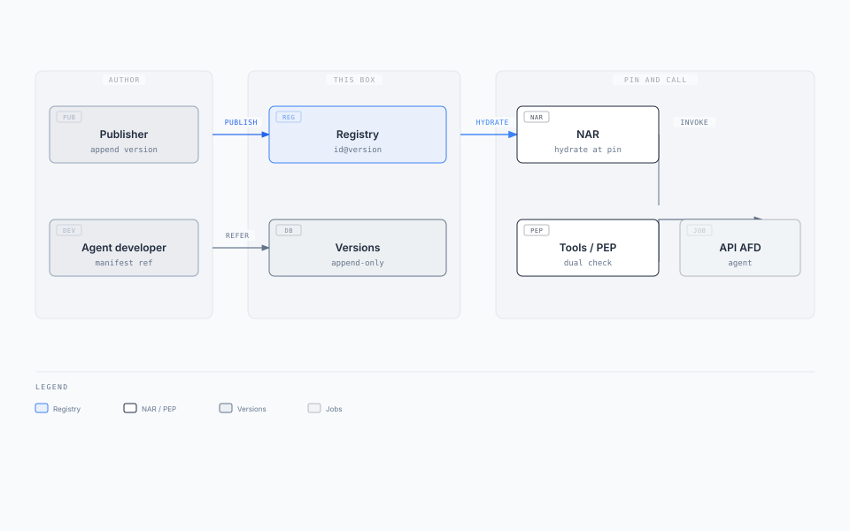
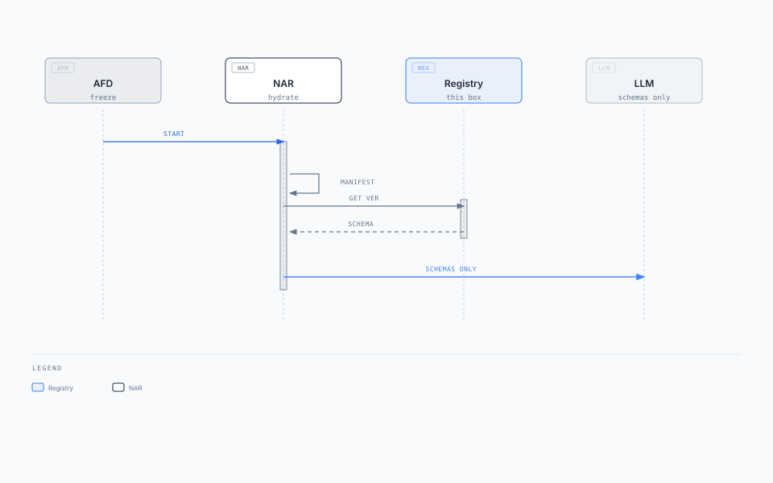
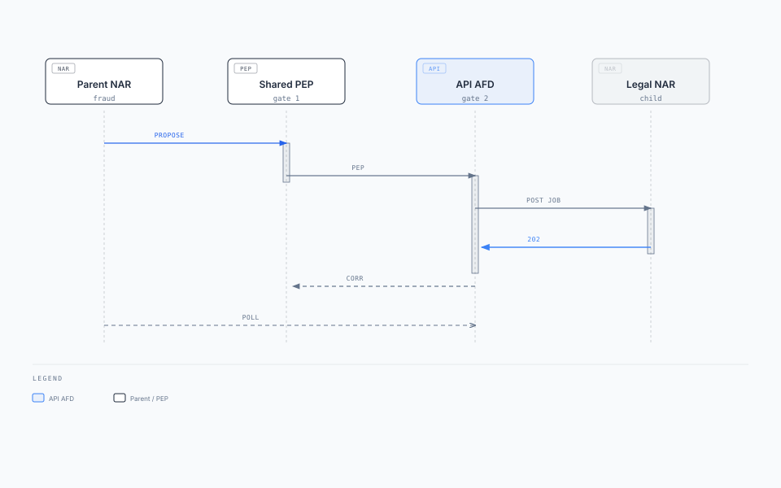

# Agent Capability Registry — solution architecture and design

**Box:** Agent Capability Registry (with Agent Plane; AR hydrates at pin)  
**Parent:** [Enterprise Agent Fabric](./narrative/enterprise-agent-fabric.mdx) · **Behaviour source:** [agent-capability-registry.mdx](./narrative/agent-capability-registry.mdx)  
**Status:** Draft · **Date:** 2026-08-20  
**This binary:** [02-understand/status.md](../02-understand/status.md). This pack may be ahead of code.  
**Audience:** CTO / chief architect (solution on a page); platform engineer (design)

Publishers publish versions. Agent developers refer. AR hydrates once, then calls `invoke`. A catalog, not a third AFD, not MCP `list_tools`, and not a client the loop calls on every turn.

**Placement:** locked fabric decision — the registry sits **with Agent Plane** (beside ACP and Data Plane). Memory, RAG, and Tools / PEP stay in Shared. The product page that still says "in Shared" is behind this pack.

---

## 1. Solution on a page

### Business problem

Teams inline OpenAPI into manifests, or they bind `latest`, or they treat MCP `list_tools` as the enterprise catalog. The loop fetches tools when the model first names them. Parent AR POSTs Legal's `activation_target`. A published capability is mistaken for permission. Every domain republishes the same OCR API.

### Key requirements

| ID | Requirement (this box) |
| --- | --- |
| Locked-8 | Capabilities are references. Publishers append immutable `id@version`. Manifests refer. AR hydrates the **whole** pinned manifest before the LLM. |
| Locked-8 | `kind=agent` `invoke` is API AFD jobs, not the callee AR. |
| FR-8 / FR-10 | LLM never sees `{jobs_url}` or `activation_target`. Jobs `Authorization` is the calling agent token. Child mints **its** robot. |
| — | Route row still has no `tools[]`. Only a `tool_manifest` pointer. |
| — | Publish is append-only. Overwriting `1.2.0` is not a version. Manifests may reference `published` only. |

Hydrate is pin-time, not turn-time. Scale with new starts and catalog reads, not with loop steps.

### Architecture



[Editorial diagram](./diagrams/registry-solution.html)

Three objects, two writers. Three moments — only the last is the AR loop.

### Key technology decisions

| Choice | Why |
| --- | --- |
| Package versions, not live `list_tools` | Exam and pin need a frozen schema. `1.2.0` never changes once published. |
| Manifest stores a reference, not "latest" | Publishing `2.0.0` must not move `fraud_investigate_v1`. |
| Hydrate whole manifest at pin | No mid-loop registry GET. Cache `(manifest_id, manifest_version)`. |
| Two `kind`s, one catalog | `domain` = governed business API. `agent` = start another catalogue row via API AFD. Same `id` + `version` UX. Do not add kinds for retrieve, prompts, workflows, memory, or MCP — [capabilities](../02-understand/capabilities.md). |
| PEP then invoke | A published capability is not permission. Dual check still runs. Agent-start still entitles at API AFD. |
| `pdp_action` / `risk_tier` on the manifest | Agent policy, not publisher API contract. |
| Registry with Agent Plane | Same band as catalogue. Shared stays Memory / RAG / Tools. |

### Expected outcomes

- Domain teams publish an API once; agent developers copy a ref.
- A2A is a named tool on the parent manifest, same jobs contract as partners.
- In-flight runs keep hydrated schemas if the registry later goes down.
- Reviewers see which catalog versions moved in the manifest PR.

### This box owns / does not own

| Owns | Does not own |
| --- | --- |
| Immutable capability versions (schema, `invoke`, snippet, owner, status) | Pin, start, PEP permit, dual check |
| Search / list for UI and CI | Route choice, classify, `activation_target` |
| Hydrate reads at pin | Loop-time tool fetch, MCP server per internal API |

If the registry dies: **new** runs cannot hydrate; in-flight pins still have schemas.

---

## 2. Context

Publishers and CI write versions. Agent developers refer from manifests. AR hydrates at pin. Registry UI searches. Chat/UI never sees this catalog.

| Actor | Relationship |
| --- | --- |
| Publisher | Pipeline `PUT`s one version. Humans draft; CI sets `status=published`. |
| Agent developer | Copies `{ id, version }` into `tool_manifest`. Does not republish the API or callee route. |
| AR | `GET` each ref **once** after downloading the pinned manifest. Loop does not call this box. |
| Registry UI | Search, detail, version history. Not a channel API. |
| Shared PEP | Executes hydrated `invoke` after dual check. Not the registry. |
| Chat/UI | **None.** Schemas never go to the browser as catalog JSON. |

Same freeze vs new route: a summarizer helper is a **domain** capability on this manifest. Legal MSA review is an **agent-start** capability. If Legal is only a stage on the same `workflow_id`, stay in parent AR — not this path.

---

## 3. Container / component architecture

Publish API and read API sit in front of the append-only version store. Pipeline and UI write. AR reads once at pin. Manifest git is the refer side, not this store. Detail: [solution diagram](./diagrams/registry-solution.html).

| Object | Who writes it | What it holds |
| --- | --- | --- |
| Capability version | Publisher | One immutable release: schema, `invoke`, snippet. `ocr_extract@1.2.0` or `start_contract_review@1.0.0` |
| Tool manifest | Agent developer | References: `id` + `version` + `pdp_action` + `risk_tier` |
| Route row | Platform / domain | `tool_manifest` pointer. Still no inlined tools |

| Moment | Who | What happens |
| --- | --- | --- |
| Publish | Publisher | Pipeline puts one version. Append-only. |
| Refer | Agent developer | `{ id, version }` in `tool_manifest`. |
| Call | AR | Download whole pinned manifest, hydrate every ref onto the run pin, schemas only to the LLM. `invoke` after PEP. |

---

## 4. Deployment architecture

```text
  No public ingress
          │
  Mesh: pipeline, registry UI, AR
          │
  Registry API (stateless, 3 AZ)
          │
  Append-only store (multi-AZ)
          │
  Read cache: (id, version) and
  (manifest_id, manifest_version) hydrate blobs
```

| Concern | Stance |
| --- | --- |
| Ingress | Internal only. Not a channel API. |
| Scale | Publish rate + pin hydrates (refs per new run). Does **not** grow with tokens in the loop or SSE. Signal: hydrate p99, catalog QPS. |
| Cache | Hydrated `(manifest_id, manifest_version)` if many runs share a pin. Do not resolve `latest`. Do not GET when the model first names a tool. |
| Failover | Reads from replicas. Publish to primary. In-flight AR pins do not need this box. |
| Isolation | Independent of Layer ② decide CPU. A registry outage must not take classify (catalogue is a different store). |
| Egress | None to AR start or domain APIs. This box does not invoke. |

API AFD scales with child job `POST` RPS from AR (agent-start only) — that is the [AFD pack](./agent-front-door.md), not this deployment.

---

## 5. API design

Module or internal RPC. Plane and AR are not public URLs. The loop does not call these paths.

### Auth

Pipeline / CI: publish role. Registry UI: operator role (draft save). AR: read published versions only. No channel identities.

### Endpoints

| Method | Path | Who / when |
| --- | --- | --- |
| `PUT` | `/v1/capabilities/{id}/versions/{version}` | Pipeline (publish). UI (draft save). Existing `published` `(id, version)` → conflict |
| `GET` | `/v1/capabilities/{id}/versions/{version}` | UI detail. AR hydrate (every ref, once) |
| `GET` | `/v1/capabilities/{id}/versions` | UI version history |
| `GET` | `/v1/capabilities?q=` | UI search of `published` |

AR start still goes to `{activation_target}` ([Runtime](./agent-runtime.md)). Agent-start `invoke` is a later `POST` to `{jobs_url}` on API AFD.

### Capability version (contract)

Treat a capability like a package.

| Field | Why |
| --- | --- |
| `id` | Stable product name: `ocr_extract` or `start_contract_review`. Not vendor. |
| `version` | Immutable semver. |
| `kind` | `domain` or `agent`. |
| `description` | Developer and later the model. |
| `input_schema` / `output_schema` | JSON Schema → tool schema on the run pin. LLM stages bind `output_schema`: [schemas](../02-understand/schemas.md). |
| `invoke` | After PEP. Domain: method, path, auth to the **governed business API**. Agent-start: `POST` `{jobs_url}` with a **fixed** `route_id`. Not an MCP URL. Not an AR URL. |
| `snippet` | Documentation, not runtime. |
| `owner` | Team that may publish the next version. |
| `status` | `draft` / `published` / `deprecated`. Manifests: `published` only. |

Breaking the contract is a **new major**. Adding an optional field is a minor. Overwriting `1.2.0` is not a version.

Domain example:

```json
{
  "id": "ocr_extract",
  "version": "1.2.0",
  "kind": "domain",
  "description": "Extract text from a document id.",
  "input_schema": {
    "type": "object",
    "required": ["doc_id"],
    "properties": { "doc_id": { "type": "string" } }
  },
  "output_schema": {
    "type": "object",
    "required": ["text"],
    "properties": { "text": { "type": "string" } }
  },
  "invoke": {
    "method": "POST",
    "url": "https://api.internal/ocr/extract",
    "auth": "domain-oauth"
  },
  "owner": "document-intel",
  "status": "published"
}
```

Agent-start example (`route_id` fixed on the capability, not chosen by the model):

```json
{
  "id": "start_contract_review",
  "version": "1.0.0",
  "kind": "agent",
  "description": "Start governed Legal MSA review as a jobs run.",
  "input_schema": {
    "type": "object",
    "required": ["document_id"],
    "properties": {
      "document_id": { "type": "string" },
      "matter_id": { "type": "string" }
    }
  },
  "output_schema": {
    "type": "object",
    "required": ["correlation_id"],
    "properties": { "correlation_id": { "type": "string" } }
  },
  "invoke": {
    "method": "POST",
    "url": "https://api-afd.internal/v1/jobs",
    "auth": "calling-agent-oauth",
    "body": { "route_id": "contract_review" }
  },
  "owner": "legal-agents",
  "status": "published"
}
```

Manifest (agent policy on the ref, not on the publisher record):

```json
{
  "manifest_id": "fraud_investigate_v2",
  "manifest_version": "2026.08.1",
  "tools": [
    {
      "name": "search_transactions",
      "capability_id": "search_transactions",
      "capability_version": "1.4.0",
      "pdp_action": "search_transactions",
      "risk_tier": "low"
    },
    {
      "name": "start_contract_review",
      "capability_id": "start_contract_review",
      "capability_version": "1.0.0",
      "pdp_action": "start_contract_review",
      "risk_tier": "high"
    }
  ]
}
```

Adding a tool or bumping `ocr_extract` `1.2.0` → `1.3.0` is a **new manifest version**, not an edit in place. Bump the route row only when the pointer itself changes.

### Errors, idempotency, rate limits

| Condition | Behaviour |
| --- | --- |
| `PUT` of existing `published` `(id, version)` | 409 conflict. Append a new version. |
| `GET` missing / still `draft` from AR | Hydrate fail. AR must not start. |
| Search | `published` only for developers. Operators may see `draft`. |
| Idempotent publish | Same payload to same `(id, version)` while `draft` may upsert. Once `published`, immutable. |
| Rate limit | Publish is low QPS. Hydrate QPS = new runs × refs. Cache manifests. |

CI on the manifest PR: each ref exists and is `published`. CI does not bake schemas (pin-time hydrate).

---

## 6. Data architecture


**Indexes:** unique `(id, version)`. Search: `status=published` + text on `id` / `description`. Manifest store may be git; AR must still resolve to immutable blobs at pin.

**Consistency:** Published versions are immutable (read-your-writes for AR via version key). No `latest` pointer in runtime. Deprecate by status; do not rewrite.

**Retention:** Append-only. Deprecated versions remain GET-able so old pins and exam still hydrate. Archival per compliance; never silently 404 a version that might be on a live pin.

**Partitioning:** by `id`. Small catalog relative to run volume.

---

## 7. Event / messaging design

Publish is synchronous HTTP. Optional events for UI/cache, not for the loop.

| Topic | Partition key | Producer | Consumer | Semantics |
| --- | --- | --- | --- | --- |
| `capability.published` (optional) | `id` | Registry | Search indexer, cache invalidation | At-least-once. Payload is `(id, version)`, not `latest` |
| `{runs_topic}` | — | Not this box | — | Registry does not start runs |
| Job-start | — | Not this box | API AFD | Invoke happens later in PEP / AR |

| Concern | Stance |
| --- | --- |
| Ordering | Per `id` useful for UI. Runtime always GETs a named version. |
| Retries | Publish: caller retries; 409 means it already landed. |
| Poison | Invalid schema on `PUT`: 400, no event. |
| Replay | Re-index from the append-only store. Events are not the source of truth. |
| Delivery | At-least-once if used. AR must not depend on consuming this topic to hydrate. |

---

## 8. Sequence diagrams

### Happy path — hydrate at pin



[Editorial diagram](./diagrams/registry-seq-hydrate.html)

### Happy path — domain invoke

AR proposes a hydrated name. PEP dual-checks user + agent, then calls the governed domain API from the pin. Result returns to AR.

### Happy path — agent-start invoke (two gates)



[Editorial diagram](./diagrams/registry-seq-a2a.html)

Parent freeze stays `fraud_investigate`. Child freeze is `contract_review`. Two tickets. Parent never POSTs Legal's `activation_target`.

### Failure — unpublished or missing ref

`GET` of a missing or still-`draft` version fails hydrate. AR does not `202` a tool-less run.

### Duplicate publish

Second `PUT` of `ocr_extract@1.2.0` with `published`: 409. Developer who needs a change publishes `1.2.1` or `2.0.0` and bumps the **manifest** reference.

---

## 9. Failure and resilience design

| Failure | Behaviour |
| --- | --- |
| Registry down at pin | New runs fail hydrate. In-flight pins continue (schemas already on the run pin). Classify/decide unaffected. |
| Registry down mid-loop | No effect if hydrate already happened. Do not lazy-fetch. |
| Missing / draft ref | Fail start. Do not skip the tool silently. |
| PEP deny | No invoke. Published ≠ permitted. |
| API AFD deny on agent-start | Child does not start. Parent run handles the error. User was not entitled. |
| Duplicate child start | Jobs `idempotency_key` on AR/AFD. |
| Poison proposal (`invoke_any_agent`, model-chosen `route_id`) | Impossible if `invoke.body.route_id` is fixed and the name must match the pin. |
| Cache serving `latest` | Forbidden. Cache key is exact version or exact manifest version. |
| Regional failure | Fail over registry store. Old pins do not need it. Rebuild search index from append-only table. |

**Retries / backoff:** hydrate GET: short retry then fail start. Publish: retry until 200/409. Invoke retries are PEP/AR, not this box.

**Circuit breakers:** none that fail open to `latest`. Prefer fail start.

**DR:** append-only store is the source. Manifest git is the source for refs. Run pin is the source for what actually hydrated.

**Anti-patterns**

- AR POSTs the callee `activation_target`.
- `invoke_any_agent` or a model-chosen `route_id` on agent-start.
- Chat AFD for A2A (SSE, classify, chips). Software callers use jobs.
- Manifest allowlist without AFD entitle.
- Build-time hydrate (the route is pinned at session start).
- Lazy tool fetch; loop calling the registry on the turn.
- `latest` as a reference.
- MCP server per internal API that already has a governed `invoke`.
- Mixing `retrieval.scope` (corpora) with this catalog.
- Treating a published capability as permission.
- User bearer as the jobs `Authorization`, or AR workload identity as the jobs caller.
- Copying the parent agent token into the child run.

---

## How a reference lands

| Step | What they do |
| --- | --- |
| 1. Find | Search the registry. Copy `id` + `version`. Domain and agent-start look the same here. |
| 2. Write | Manifest `tools[]`: name, `capability_id`, `capability_version`, `pdp_action`, `risk_tier`. No inlined OpenAPI. |
| 3. PR | Reviewers see which catalog versions moved. CI checks each ref exists and is `published`. |
| 4. Pin | AFD freezes the route. First AR downloads that whole `tool_manifest`, hydrates every ref, then talks to the LLM. |
| 5. Call | Proposal must match a hydrated name. PEP. Then `invoke` from the pin. |

---

## Read next

[Agent Runtime](./agent-runtime.md) · [Agent Front Door](./agent-front-door.md) · [Agent Plane](./agent-plane.md) · [Behaviour source](./narrative/agent-capability-registry.mdx)
