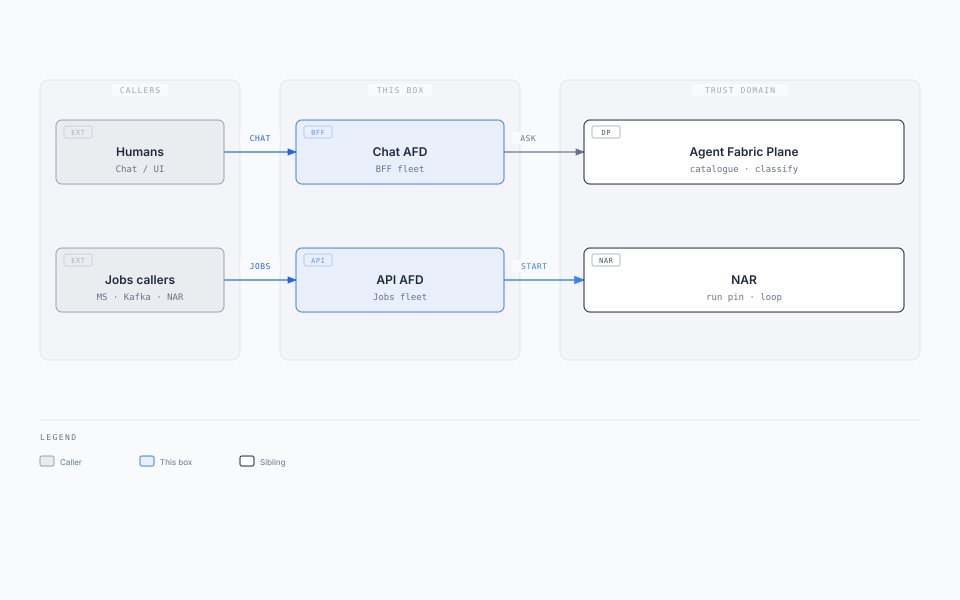
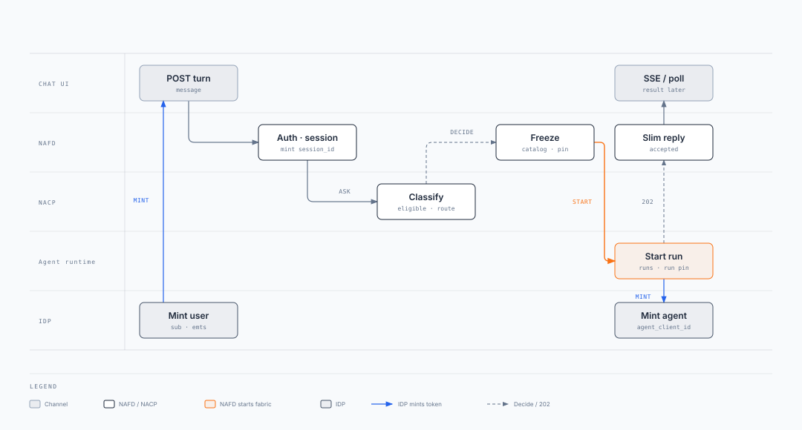
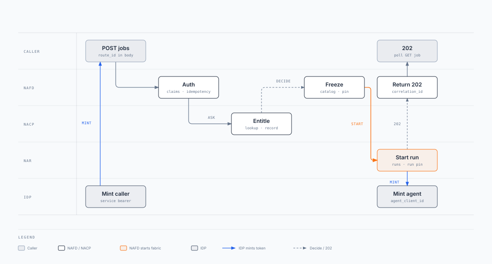

import Details from '@theme/Details';

# Agent Fabric Front Door (AFD)

**Box:** Chat AFD (BFF) + API AFD (HTTP handler + Kafka job-start worker)

Parent: [Enterprise Agent Fabric](./enterprise-agent-fabric-architecture.mdx) · Siblings: [Agent Fabric Plane](./agent-fabric-plane.mdx) · [Agent Fabric Runtime](./agent-fabric-runtime.mdx) · [Agent Fabric Capability Registry](./agent-fabric-capability-registry.mdx) · [Agent Fabric Audit](./agent-fabric-audit.mdx)

**Two fleets. One contract. Only way in.** · **Status:** Draft · **Date:** 2026-09-02

**Behaviour source:** [status](../02-understand/status.md). This pack may be ahead of code.

Chat AFD is BFF-shaped (Chat/UI). API AFD is handler-shaped (HTTP jobs + Kafka ingest). They share [Agent Fabric Plane](./agent-fabric-plane.mdx), the frozen-route/session store, and the start contract. They do not share a process (FR-9). Kafka `{runs_topic}` is [AR](./agent-fabric-runtime.mdx) return, not a third AFD.

**Pin split:** AFD **calls** the Agent Data Plane (catalogue + classify). On `route`, this AFD **pins** `route_id` + versions and async-starts AR.

**Local v1:** chat and jobs share one Front Door process on port **3005**. Production splits into two fleets (FR-9); the contract is unchanged.

---

## 1. Solution on a page

### Business problem

Channels and partner APIs invent their own dispatch. Chat sockets and job bursts share one process, so a hung SSE pool takes down Legal jobs (or the reverse). Callers wait for the memo, so the decide SLO dies. Browsers and domain services dial the Agent Plane or AR and leak auth, routing internals, and side doors into high-risk agents.

### Key requirements

| ID | Requirement (this box) |
| --- | --- |
| FR-1 | Only Chat AFD and API AFD call decide. Kafka ingest is the API AFD. `{runs_topic}` is return, not start. |
| FR-4 | On `route`, this AFD pins `route_id` + versions + `agent_client_id`, async-starts AR, returns slim UI or `202` + `correlation_id`. |
| FR-5 | Chat/UI never sees `route_id`, `run_id`, `agent_client_id`, `confidence`, or `router_layer`. |
| FR-6 | Empty-state chips are eligible + chat-visible. A tap is Layer ①. No start until `outcome=route`. |
| FR-7 | Generic chat classifies. Jobs name `route_id` and skip classifier + clarify, not entitle. |
| FR-8 | Channels never dial `activation_target`. UI, jobs caller, and model never pin. |
| FR-9 | Chat AFD and API AFD are separate fleets (process, autoscaler, failure domain). They share Agent Plane, frozen-route/session store, and start contract. |

Decide+pin+start-ack p99 &lt; 100 ms. Wait only for AR `202`, never the loop.

### Architecture

<div className="gain-diagram-wrap">


</div>

[Editorial source](./diagrams/afd-solution.html)

Entitle → classify (chat) or entitle-only (jobs) → freeze → start. Callers never dial AR.

### Key technology decisions

| Choice | Why |
| --- | --- |
| Two fleets, one contract | Chat is connection-bound (SSE/poll, hints, clarify). Jobs are bursty and skip classify. Shared process couples failure domains (FR-9). |
| AFD writes the freeze, not ACP | Decide SLO stays classify. Pin + start sit on the box that already holds the channel session. |
| Shared KV for freeze, not replica memory | Next `"yes"` lands on another replica. Keyed by `session_id`, TTL 30–60 min. |
| Async start by default | AR loop is seconds to minutes. Pattern 0 is the only sync wait. |
| Kafka `{runs_topic}` is return | Same slim status as HTTP `GET` run. AFD fans out. Not a public start. |
| Kafka job-start worker is API AFD | Topic bind = Layer ① `route_id`. Prevents a third public ingress. |

### Expected outcomes

- One ingress decision for a shared experience; users do not pick chatbots.
- Chat down does not take jobs; jobs burst does not starve SSE.
- No public Agent Plane or AR URL. No channel-dial of Legal or payments.
- Continuations (`"yes"`, `"$500"`) and job retries keep the same pinned route.

### This box owns / does not own

| Owns | Does not own |
| --- | --- |
| Channel auth surface, `session_id`, hints, SSE/poll, jobs OpenAPI | Classify, eligible set, route catalogue |
| Frozen route/session, pin + async start | Run pin, loop, Patterns 0–3 |
| Fan-out of AR status (SSE / `GET` job / Kafka consume) | Agent identity mint, dual check, tool invoke |
| Mapping opaque `hint_id` / `option_id` → `route_id` | Decision audit (ACP writes it) |

---

## 2. Two fleets, one contract

| Layer | Count | Why |
| --- | --- | --- |
| **Agent Plane** | One per trust domain | Same eligible set, entitlements, eval, audit |
| **Ingress contract** | One | Entitle → classify → freeze → start. Callers never dial AR |
| **AFD fleets** | Two (production) | Chat/UI is connection-bound. Jobs are bursty and skip classify |
| **Kafka** | Return path, or jobs ingest | `{runs_topic}` is how AR talks back. A Kafka **worker that starts a job** is the API AFD |

| # | Ingress | Who is the AFD | How the route is chosen | Typical response |
| --- | --- | --- | --- | --- |
| **1. UI** | Chat/UI, copilot, portal, Teams, mobile, `POST /v1/assistant/turns` | **Chat AFD** (own fleet) | Eligible prune, then layered classify (unless a chip hits Layer ①) | Slim message; SSE/poll for async |
| **2. Jobs** | `POST /v1/jobs`; Kafka job start | **API AFD** (own fleet) | Explicit `route_id` in body or Layer ① topic bind | `202` + `correlation_id`. No user: fail closed or `escalate_human` |

<div className="gain-diagram-wrap">


</div>

| If they skip the AFD | What breaks |
| --- | --- |
| Browser or partner → Data Plane | Auth leaks into Plane ① |
| Caller waits for the memo | Decide SLO dies |
| `route_id` without entitle | Side door |
| Caller starts AR | Channel dials Legal / payments |
| Kafka as a third public start | Dispatch outside Plane ① |

**Default start is async.** After `route`, that AFD `POST`s the freeze. AR returns `202 { "correlation_id" }`. Sync wait is Pattern 0 only.

---

## 3. Context

<div className="gain-diagram-wrap">



</div>

[Editorial source](./diagrams/afd-context.html)

| Actor | Relationship |
| --- | --- |
| Human on Chat/UI | IdP user bearer. Sees slim messages and opaque options only. |
| Partner / system | IdP service bearer. Posts explicit `route_id` to `{jobs_url}`. |
| Parent AR | Calling-agent bearer. Same jobs contract as partners (not Chat AFD). |
| Agent Data Plane | Internal. Decide, eligible, catalogue row. AFD is the only decide caller. |
| AR | Internal. Start, resume, open-run, status. Channels never see this URL. |
| IdP | Mints user/caller bearer at ingress. After pin, AR asks it for the agent token. |

---

## 4. Container / component architecture

| Component | Responsibility |
| --- | --- |
| Chat turn handler | Auth, mint/reuse `session_id`, continuation vs new decide, freeze, start, slim reply. |
| Hints | `GET` eligible ∩ chat-visible. Opaque `hint_id`. Cache per `(claims-hash, channel, route_table_version)`. |
| SSE / poll | After accepted turn. Reads AR HTTP or `{runs_topic}`. Not catalog JSON. |
| Jobs HTTP | `POST` `{jobs_url}` with `route_id`. Entitle, freeze, start. `202` + `correlation_id`. |
| Kafka job-start worker | Same as jobs HTTP. `route_id` from body or Layer ① topic bind. |
| Status fan-out | `GET` job and `{runs_topic}` consume. Does **not** call the data plane. |
| Frozen-route/session store | Shared KV. Keyed by `session_id` or `job:{idempotency_key}`. Pin miss: AR open-run API. |

**Stateless handlers.** Do not keep the freeze in replica memory.

---

## 5. Frozen route/session {#frozen-route-session}

The AFD stores the **frozen route/session** so `"yes"` or a jobs retry keeps the same `route_id`, versions, and `agent_client_id`. Pin miss: **AR API**, not AR Postgres. See [Three principals](./enterprise-agent-fabric-architecture.mdx#three-principals).

| Record | Who writes it | Lives where | Job |
| --- | --- | --- | --- |
| **Frozen route/session** | AFD | AFD store, keyed by `session_id` or `job:{idempotency_key}`, TTL | Pinned route (`route_id`, versions, `activation_target`, `agent_client_id`, `correlation_id`) |

| Field | Role |
| --- | --- |
| `session_id` | Partition key. Chat thread. |
| `route_id` | Pinned workflow. Absent until `outcome=route`. |
| `route_table_version` | Pin. Nobody re-reads `active`. |
| `activation_target` | Which AR to start. |
| `agent_client_id` | Which robot. Frozen here; AR mints after copy. |
| `correlation_id` | Written after AR `202`. |
| `idempotency_key` | Jobs only. |
| `expires_at` | TTL 30–60 min from last pin / continuation. |

---

## 6. APIs {#apis}

Agent Plane and AR are not public URLs. Both AFDs call decide, catalogue row, and start.

### Chat AFD

| Method | Path | When / response |
| --- | --- | --- |
| `POST` | `/v1/assistant/turns` | Free text, hint tap, or clarify pick. Slim message. On `route`, accepted; result on SSE/poll |
| `GET` | `/v1/assistant/hints` | Empty state. Eligible labels + opaque `hint_id`s |
| `GET` | `/v1/assistant/sessions/{session_id}/events` | SSE (or poll). Slim tokens / final message |

Continuation: skip decide. Resume AR.

### API AFD

| Method | Path | When / response |
| --- | --- | --- |
| `POST` | `{jobs_url}` (default `/v1/jobs`) | Partner / system / parent AR. `202 { "correlation_id" }` |
| `GET` | `{jobs_url}/{correlation_id}` | Caller poll. Status / slim result from AR HTTP |
| `consume` | `{runs_topic}` | Result fan-out. Same slim body as `GET`. Not a start |

### Errors

| Condition | HTTP | Behaviour |
| --- | --- | --- |
| Missing / invalid bearer | 401 | Do not decide, do not start |
| Empty eligible / missing job claims | 403 | Fail closed |
| Duplicate jobs `idempotency_key` | 202 | Return the original `correlation_id` |
| AR start-ack timeout | 503 | No fake success. Do not invent `correlation_id` |

<Details summary="UI turn request (JSON)">

```json
{
  "session_id": "sess-88",
  "message": "Why was I charged $42?",
  "hint_id": null,
  "option_id": null
}
```

</Details>

<Details summary="Jobs start (JSON)">

```json
{
  "route_id": "contract_review",
  "idempotency_key": "job-4412:v1",
  "payload": { "document_id": "doc-19", "matter_id": "m-88" }
}
```

```json
{ "correlation_id": "corr-9f3c" }
```

</Details>

### Call map {#call-map}

| Ingress | AFD → Data Plane | AFD → AR |
| --- | --- | --- |
| UI new turn | Decide. Eligible for chips. Catalogue row on `route` | Start on `route`. Resume on continuation. Open-run on cache miss |
| Jobs HTTP / Kafka / AR agent-start | Decide with explicit `route_id`. Catalogue row on `route` | Start |
| `{runs_topic}` consume / `GET` job | None | Status only |

Decide JSON: [Agent Fabric Plane](./agent-fabric-plane.mdx#apis). Start / `202`: [Agent Fabric Runtime](./agent-fabric-runtime.mdx#apis).

---

## 7. Swim lanes

### UI turn

<div className="gain-diagram-wrap">



</div>

### Jobs API

<div className="gain-diagram-wrap">



</div>

---

## 8. Deployment architecture

Cloud-agnostic. One trust domain. Three availability zones.

| Concern | Stance |
| --- | --- |
| Ingress | Chat AFD and API AFD are **separate** hostnames, deployments, HPAs. No shared process in production. |
| Egress | ClusterIP / mesh to Agent Plane and AR. No public Plane or AR URL. |
| Freeze store | Managed Redis/Valkey or equivalent, multi-AZ. Not an in-memory map. |
| Kafka | Job-start topics consumed only by API AFD. `{runs_topic}` consumed by both fleets for fan-out. |
| Scaling | Chat: connections + turn RPS. API: HTTP RPS + ingest lag + result-consumer lag. |
| Failover | One AFD down: the other ingress still works. Freeze store down: continuations degrade to AR open-run. |

---

## 9. Event / messaging design

| Topic | Direction | Who | Semantics |
| --- | --- | --- | --- |
| Job-start (configurable) | Inbound | API AFD worker | At-least-once start. Dedup via `idempotency_key` on AR |
| `{runs_topic}` | Inbound consume | Chat AFD, API AFD fan-out | Same slim schema as `GET /v1/runs/{id}`. Not a start |
| `{runs_topic}` | Produced by AR | — | AFD must not publish start events here |

---

## 10. Sequence diagrams

### Happy path — UI turn

<div className="gain-diagram-wrap">


</div>

[Editorial source](./diagrams/afd-seq-ui.html)

### Happy path — jobs API

<div className="gain-diagram-wrap">


</div>

[Editorial source](./diagrams/afd-seq-jobs.html)

---

## 11. Failure and resilience {#isolation-and-shed}

| Failure | Behaviour |
| --- | --- |
| Chat AFD down | Jobs still work. Inverse is true. |
| One AR / `activation_target` down | Other targets still start. Controlled error after `202` or on start-ack timeout. |
| Freeze store down | Continuations → AR open-run. New `route` can still start if start-ack works. |
| Agent Plane down / catalogue unreadable | Do not start. Fail closed. |
| Shared down | Routing still works. AFD unaffected; AR degrades. |
| `{runs_topic}` lag | SSE/poll may stall; decide still succeeds. Scale fan-out independently. |

**Anti-patterns:** freeze in replica memory; one autoscaler for UI BFF and jobs URL; Kafka ingest as a third public start; `{runs_topic}` as job start; caller waits for the memo; public Agent Plane URL.

---

## 12. Scaling {#scaling}

Decide capacity is turns/s × (entitle + classify + pin + start-ack). Run capacity is a different fleet. Scale Chat AFD, API AFD, and Agent Plane as three fleets (FR-9). Numbers: [Enterprise Agent Fabric §3](./enterprise-agent-fabric-architecture.mdx#nfrs).

| Axis | Grows with | Scale signal |
| --- | --- | --- |
| **Chat AFD** | Concurrent chats, SSE/poll, hint refresh | Connections + turn RPS |
| **API AFD** | Job `POST` RPS, Kafka ingest, `{runs_topic}` consume | HTTP RPS + ingest lag |
| **Frozen-route/session store** | Sessions with a live pin (TTL 30–60 min) | Active keys, not QPS |

**Start edge.** Wait only for `202` + `correlation_id`, never the memo.

Plane and AR scale: [Agent Fabric Plane §12](./agent-fabric-plane.mdx#scaling) · [Agent Fabric Runtime §12](./agent-fabric-runtime.mdx#scaling).

---

## Read next

**[Agent Fabric Plane](./agent-fabric-plane.mdx)** · [Agent Fabric Runtime](./agent-fabric-runtime.mdx) · [Agent Fabric Capability Registry](./agent-fabric-capability-registry.mdx) · [Enterprise Agent Fabric](./enterprise-agent-fabric-architecture.mdx)
