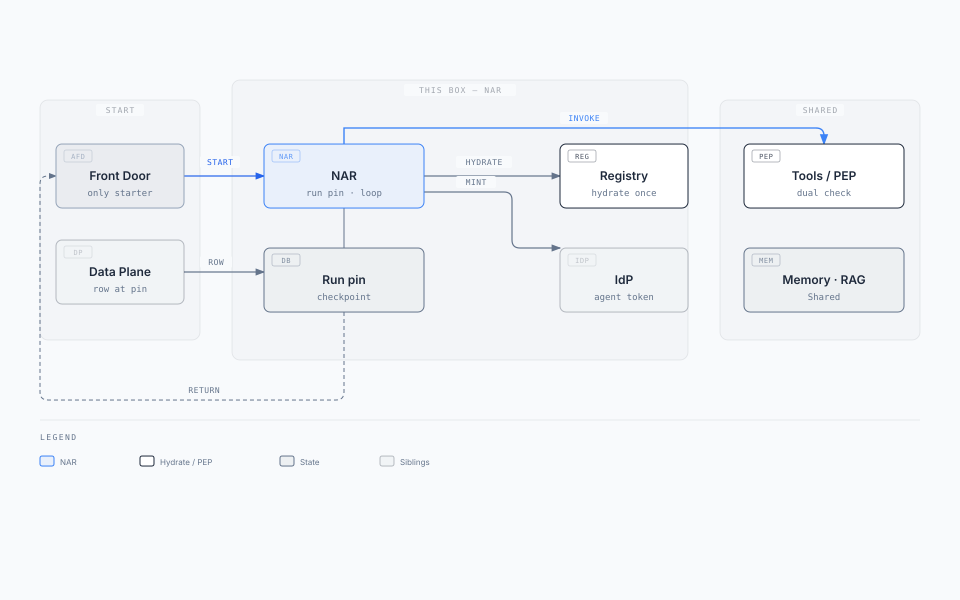

import Details from '@theme/Details';

# Agent Fabric Runtime (AR)

**Box:** AR (Agent Fabric Runtime) + calls into Shared (Memory, RAG, Tools / PEP)

Parent: [Enterprise Agent Fabric](./enterprise-agent-fabric-architecture.mdx) · Siblings: [Agent Fabric Front Door](./agent-fabric-front-door.mdx) · [Agent Fabric Plane](./agent-fabric-plane.mdx) · [Agent Fabric Capability Registry](./agent-fabric-capability-registry.mdx) · [Agent Fabric Audit](./agent-fabric-audit.mdx)

**Specialised agents underneath. Does the work. Does not classify the next utterance.** · **Status:** Draft · **Date:** 2026-09-02

**Behaviour source:** [status](../02-understand/status.md). This pack may be ahead of code.

Only the **AFD** starts AR. On `route`, that AFD `POST`s the freeze. AR **fetches the catalogue row** at the pinned version, **hydrates** from the Registry, copies the **run pin**, returns `202 { "correlation_id" }`, and runs LangGraph. Memory, RAG, and Tools sit in **Shared**. Fabric rule: [Three principals](./enterprise-agent-fabric-architecture.mdx#three-principals).

**Local v1:** Python FastAPI + LangGraph on port **3008**. Patterns 0–3, `human_gate`, `kind=agent`, checkpoint resume wired. See [status](../02-understand/status.md) for gaps.

---

## 1. Solution on a page

### Business problem

Routing and work share a clock, so a 12-step loop kills the decide SLO. Channels dial `activation_target` and skip entitlement. The runtime is treated as the robot: one bearer at boot with every route's scopes, or the user token as the tool-call caller. Memory, RAG, and tools get copied into every agent process.

### Key requirements

| ID | Requirement (this box) |
| --- | --- |
| FR-1 / FR-4 | Only AFD starts AR. AR fetches the catalogue row at the **pinned** version, copies the freeze, requests a token for the pinned `agent_client_id`, returns `202`. Nobody re-reads `active`. |
| FR-8 | Channels never dial `activation_target`. |
| FR-10 | Three principals. User ≠ agent ≠ AR workload. Tool calls use the agent bearer plus user claims. |
| — | Default start is async. Pattern 0 is the only sync wait. Hydrate the **whole** pinned manifest before the LLM. |

Run SLO ≠ decide SLO. Loop may take seconds to minutes.

### Architecture

<div className="gain-diagram-wrap">



</div>

[Editorial source](./diagrams/runtime-solution.html)

AR returns two ways: HTTP status and Kafka. Same slim body. AFD fans out.

### Key technology decisions

| Choice | Why |
| --- | --- |
| Scale per `activation_target` | Isolate the box (PCI, release, network). Shared compute is not a shared robot. |
| Run pin is durable | AFD freeze is TTL. Loop checkpoint, token **reference**, `run_id` live here. |
| Pin first, then mint | Downscoped token after copy. Route change → new token, do not widen. |
| Shared Memory / RAG / Tools | Not inside AR. If Shared is down, routing still works; runs degrade. |
| Dual check in PEP | User **and** agent (route-scoped bearer). AR proposes; Shared enforces. |
| Hydrate at pin, not at turn | Registry QPS follows new runs, not tokens in the loop. |
| LangGraph from hydrated list | Pattern 0/2/3 compile linear or branch graphs. Pattern 1 is LLM `CALL`/`DONE`. |

### Expected outcomes

- Specialised routes without a mega-agent.
- A down AR is a controlled error after `202`; decide still accepts other turns.
- Examiners can show which `agent_client_id` ran and that user + agent both passed.
- Parent AR starts a child via API AFD, not by POSTing Legal's AR.

### This box owns / does not own

| Component | Owns | Does not own | If it dies |
| --- | --- | --- | --- |
| AR | Run pin, Patterns 0–3, LangGraph loop. Route-scoped agent token after freeze | Next-utterance classify, `active` lookup, Shared stores, dual check | Controlled error after `202` |
| Shared | Memory, RAG, Tools | Route choice, pin, start | Runs degrade; routing still works |
| Model router | Which LLM | Which `route_id` | Inference fails; decide unaffected |

---

## 2. Job

Patterns 0–3 answer **who decides the next step** inside AR. Full contracts: [06-patterns](../06-patterns/README.md).

| Mode | Name | Who decides |
| --- | --- | --- |
| **0** | Single inference | Nobody — one LLM call |
| **1** | Autonomous | LLM `CALL` / `DONE` over a manifest |
| **2** | Deterministic | Workflow designer — fixed stages, branch, `human_gate` |
| **3** | Guided | Designer stages; LLM inside an allowlist |

### Human and specialist shapes (wired locally)

| Shape | Mechanism | Behaviour |
| --- | --- | --- |
| **Process gate** | Workflow `human_gate` | Run pauses; resume via `/turns` |
| **Async handoff** | Domain tool `escalate_to_human` | Ticket opened; parent completes |
| **Specialist child** | `kind=agent` capability | Parent POSTs API AFD `/v1/jobs`; optional join waits for child |

Detail: [generic shapes](../07-usecases/generic-shapes.md).

### Run pin

| Record | Who writes it | Lives where | Job |
| --- | --- | --- | --- |
| **Run pin** | AR | Durable run store | Copy of freeze versions plus loop checkpoint, token reference, `run_id` |

AFD freeze: `route_id` + versions + `activation_target` + `agent_client_id` + `correlation_id`. AR copies that freeze, then requests a token. Pin miss: **AR API**, not AR DB.

### Three principals (AR is not the robot)

| Principal | AR's job | AR must not |
| --- | --- | --- |
| **User** | Carry claims or approval id into Shared Tools / PEP | Use the user bearer as tool-call `Authorization` |
| **Agent** | After freeze, request a downscoped token for the pinned `agent_client_id` | Boot one token with every route's scopes |
| **AR workload** | Prove this box may talk to Shared, IdP, model router | Call downstream APIs as the AR service account |

---

## 3. Context

| Actor | Relationship |
| --- | --- |
| AFD | Only starter. Sends freeze + goal. Polls status / consumes Kafka. Open-run on freeze TTL miss. |
| Agent Data Plane | Catalogue row at pinned version. Not classify. |
| Registry | Hydrate each `id@version` once at pin. |
| IdP | Mint downscoped agent token for pinned `agent_client_id`. |
| Shared Tools / PEP | Dual check, then `invoke`. |
| API AFD | `kind=agent` invoke. Calling-agent bearer. Not Chat AFD. |
| Channels | **None.** Never dial this URL. |

---

## 4. Container / component architecture

| Component | Responsibility |
| --- | --- |
| AR API | Start, resume, open-run, status, Kafka publish. |
| Hydrate | Download pinned manifest; GET each ref from Registry; stamp onto run pin. |
| LangGraph | Build graph from hydrated list (`workflow.py`). Patterns 0–3. |
| Planner loop | Pattern 1 `CALL`/`DONE`. Pattern 2/3 stage walk. |
| Mint | Route-scoped agent token after freeze copy. |

---

## 5. APIs {#apis}

Not a public URL. `202` comes from AR. AFD does not send `correlation_id` on `mode: new`; AR returns it.

| Method | Path | When / response |
| --- | --- | --- |
| `POST` | `{activation_target}` typical `/v1/runs` | `mode: new`. `202 { "correlation_id" }`. Pattern 0 may return the inference body |
| `POST` | `/v1/runs/{correlation_id}/turns` | Stickiness. Resume / human gate / ASK / checkpoint |
| `GET` | `/v1/runs?session_id=` | AFD freeze TTL miss. Open run + pin, or empty |
| `GET` | `/v1/runs/{correlation_id}` | AFD poll. Status + slim result |
| `publish` | `{runs_topic}` | Same slim body as `GET`. AFD consumes |

<Details summary="App start and 202 (JSON)">

```json
{
  "mode": "new",
  "idempotency_key": "alert-88421:v1",
  "session_id": "sess-88",
  "route_id": "fraud_investigate",
  "route_table_version": "2026.08.1",
  "agent_client_id": "fraud-investigate-v2",
  "goal": { "alert_id": "alert-88421", "account_id": "acct-4412" }
}
```

```json
{ "correlation_id": "corr-9f3c" }
```

</Details>

<Details summary="App return: HTTP GET and Kafka (JSON)">

```json
{
  "correlation_id": "corr-9f3c",
  "status": "completed",
  "result": { "message": "Fee of $42 is the monthly account charge." }
}
```

</Details>

Who calls start: [Agent Fabric Front Door call map](./agent-fabric-front-door.mdx#call-map).

---

## 6. Shared

**Memory**, **RAG**, and **Tools** sit in Shared. The **Agent Fabric Capability Registry** sits with Agent Fabric Plane. AR calls them. They are not inside AR.

After freeze, AR **downloads the whole pinned manifest**, hydrates each `id@version` onto the run pin, then sends schemas only to the LLM. Domain `invoke` hits a governed business API. Agent-start `invoke` hits the API AFD jobs URL. [Agent Fabric Capability Registry](./agent-fabric-capability-registry.mdx).

Every tool call dual-checks **user** and **agent**. If Shared is down, routing still works and AR degrades.

---

## 7. Deployment architecture

| Concern | Stance |
| --- | --- |
| Ingress | Private. AFD only. Channels never see `activation_target`. |
| Scale | In-flight runs per `activation_target`. Independent of Agent Plane decide QPS. |
| Isolation | One AR down: other targets still start. Do not share HPA with AFD or Plane. |
| Failover | After `202`, another replica resumes from the run pin. |
| Egress | Workload identity to internals. Agent bearer only to Shared Tools (and calling-agent bearer to API AFD for agent-start). |

Loop is not on the decide clock.

---

## 8. Data architecture

| Field | Notes |
| --- | --- |
| `correlation_id` | AR-minted. Channel-visible via AFD only as opaque id on jobs. |
| `token_ref` | Pointer to secret store. Never the raw agent token in JSON. |
| `hydrated_tools` | Schemas + invoke from registry at pin. Frozen for the run. |
| `checkpoint` | Pattern 0–3 loop state. Resume after replica death. |
| `idempotency_key` | Unique where present (jobs). |

**Consistency:** Run pin is authoritative for the loop. AFD KV is a cache of the freeze. Open-run API is the reconciliation path.

---

## 9. Event / messaging design

| Topic | Partition key | Producer | Consumer | Semantics |
| --- | --- | --- | --- | --- |
| `{runs_topic}` | `correlation_id` | AR | Chat AFD, API AFD | At-least-once. Progress + completion |
| Job-start topics | — | Not AR | API AFD | AR must not ingest starts |

Agent-start child jobs use the **API AFD** jobs contract (HTTP), not `{runs_topic}` as a start.

---

## 10. Sequence diagrams

### Happy path — start, hydrate, 202, loop

<div className="gain-diagram-wrap">


</div>

[Editorial source](./diagrams/runtime-seq-start.html)

### Continuation / resume

`POST /v1/runs/{correlation_id}/turns` on the same run pin. No classify. No re-hydrate unless a new route.

### Duplicate / idempotent start

Same `idempotency_key`. Second `POST /v1/runs` returns the original `correlation_id`.

---

## 11. Failure and resilience

| Failure | Behaviour |
| --- | --- |
| AR replica death after `202` | Resume from run pin. Caller already has `correlation_id`. |
| AR down before `202` | AFD 503. Idempotent retry may start once. |
| Data Plane catalogue GET fails | Do not start. Do not load `active`. |
| Registry hydrate fails | Do not `202` a tool-less run (422 locally). |
| Shared down | Routing still works. Loop degrades. Side effects stop. |
| Parent POSTs callee `activation_target` | Forbidden. Agent-start goes to API AFD. |

**Anti-patterns:** AR POSTs another AR; one agent token at boot; user bearer as tool caller; re-read `active`; lazy tool fetch from the registry.

---

## 12. Scaling {#scaling}

Run capacity is a different fleet from decide. AR instances scale per `activation_target`, independent of Agent Plane.

| Axis | Grows with | Scale signal |
| --- | --- | --- |
| **AR instances** | In-flight runs per `activation_target` | Per-fabric queue depth |
| **Shared** | In-flight AR calls | Per-capability latency / error rate |
| **Registry** | Pin hydrates (refs per new run) | Hydrate p99, catalog QPS |

AFD and Plane scale: [Agent Fabric Front Door §12](./agent-fabric-front-door.mdx#scaling) · [Agent Fabric Plane §12](./agent-fabric-plane.mdx#scaling).

---

## Read next

**[Agent Fabric Capability Registry](./agent-fabric-capability-registry.mdx)** · [Agent Fabric Front Door](./agent-fabric-front-door.mdx) · [Agent Fabric Plane](./agent-fabric-plane.mdx) · [Patterns](../06-patterns/README.md) · [Runtime status](../02-understand/status.md)
