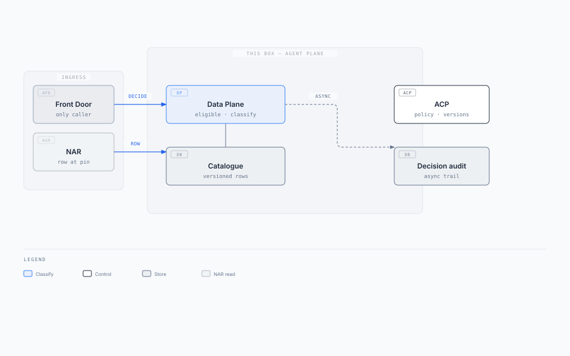
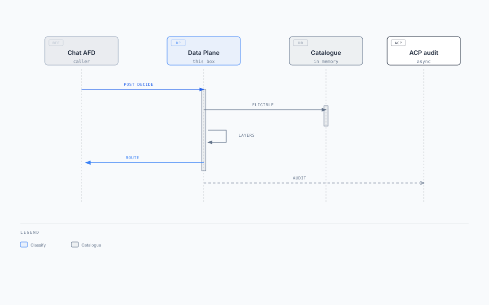

import Details from '@theme/Details';

# Agent Plane

**Box:** Agent Control Plane (ACP) + Agent Data Plane

Parent: [Enterprise Agent Fabric](./enterprise-agent-fabric-architecture.mdx) · Siblings: [Agent Front Door](./agent-front-door.mdx) · [Agent Runtime](./agent-runtime.mdx) · [Agent Capability Registry](./agent-capability-registry.mdx)

**One plane per trust domain. Two boxes inside it. Does not do the work.** · **Status:** Draft · **Date:** 2026-09-02

**Behaviour source:** [status](../02-understand/status.md). This pack may be ahead of code.

[Agent Front Door](./agent-front-door.mdx) **calls** the **Agent Data Plane** (catalogue + classify). **ACP** is the sibling **control** box (policy, versions, decision audit). Neither box pins. Neither box starts AR.

**Local v1:** ACP is a **catalogue UI only** (port 3006) — no database, no decide API. Data Plane serves decide and catalogue on port **3007**. Decision audit is production target, not local yet.

---

## 1. Solution on a page

### Business problem

Every UI and partner API guesses the agent (`if/else`, a second chatbot, a hard-coded URL). Entitlements fragment. There is no single eval surface for misroutes, no shared clarify/abstain/safety, and no versioned catalogue. High-risk routes get side doors. Operators cannot show why a turn routed.

### Key requirements

| ID | Requirement (this box) |
| --- | --- |
| FR-1 | Only the two AFDs call decide. AR may **GET** the catalogue row at the pinned version. Plane is not a public URL. |
| FR-2 | Decide = active table ∩ `required_claims` ∩ channel. Explicit `route_id` still looks up, entitles, and records. |
| FR-3 | Outcomes: `route`, `clarify`, `abstain`. Only `route` starts AR (AFD does the start). |
| FR-5 | Chat/UI never sees `route_id`, `confidence`, or `router_layer`. Decision record is server-side. |
| FR-6 / FR-7 | Eligible chips are chat-visible only. Jobs skip Layer ② / ③, not eligible, safety, or the decision record. |

Decide path: Layer ② &lt; 50 ms. Decide must not wait on a 12-step loop or on audit commit. Catalogue unreadable: fail closed.

### Architecture

<div className="gain-diagram-wrap">



</div>

[Editorial source](./diagrams/plane-solution.html)

AFD calls classify, then freezes and starts. This plane does not call AR.

### Key technology decisions

| Choice | Why |
| --- | --- |
| ACP ≠ Data Plane | Control/audit can lag. Classify must fail closed and stay on the hot path. |
| Plane does not pin or start | Pin sits on AFD. Start sits on AR. Decide SLO is classify, not work. |
| Versioned in-memory catalogue | Eligible set ∩ claims ∩ channel must be local. Origin QPS on every turn does not hold. |
| Cheap layers first | Layer ① bind, Layer ② retrieve (&lt;50 ms), Layer ③ only if needed. Safety on every path. |
| Async decision audit | Decide SLO does not include "audit committed." Exam trail may lag. |
| Layer ③ on a separate pool | If saturated: `clarify` / `abstain`, not a slower ACP. |
| Jobs still hit Plane ① | Explicit `route_id` is not a skip of entitle + record. |

### Expected outcomes

- One ingress decision for a shared experience.
- One versioned catalogue and one eval surface (golden set / CI).
- Operators can show eligible set, `router_layer`, outcome, and `route_table_version`.
- A down AR does not stop new turns. A down catalogue stops starts (correct).

### This box owns / does not own

| Box | Owns | Does not own | If it dies |
| --- | --- | --- | --- |
| ACP | Policy, versions, decision audit (target) | Pin, start, loop, AFD hot-path classify | Audit lags; in-flight runs continue |
| Agent Data Plane | Eligible set, classify, route/workflow catalogue | Pin, start, loop | Classify fails closed |
| Decision audit | Async `router_layer`, `outcome`, `eligible_routes` (target) | Chat transcript | Decide still succeeds |

---

## 2. Two boxes

| Layer | Count | Why |
| --- | --- | --- |
| **Agent Plane** | One per trust domain | Same eligible set, entitlements, eval, audit |
| **Agent Control Plane (ACP)** | One inside that plane | Control + decision record |
| **Agent Data Plane** | One inside that plane | Route/workflow catalogue + classify |

### Three routers (do not collapse)

| Router | Question | Who calls it |
| --- | --- | --- |
| **Agent Data Plane** | Which workflow / manifest / app? | AFD (classify). AR (row at pin, not classify) |
| **Agent planner** (inside AR) | Which tool / step next? | AR |
| **Model router** | Which LLM endpoint? | AR |

### Data this plane owns

| Record | Who writes it | Lives where | Job |
| --- | --- | --- | --- |
| **Decision** | ACP | Audit store (target) | Why this turn routed, clarified, or abstained |
| **Route/workflow catalogue** | Platform / domain teams | Agent Data Plane | Versioned rows. Includes `agent_client_id` per row. |

Frozen route/session is on the [AFD](./agent-front-door.mdx#frozen-route-session). Run pin is on [AR](./agent-runtime.mdx). Capability versions are on the [Registry](./agent-capability-registry.mdx) (same Agent Plane band).

---

## 3. Classify

The Agent Data Plane **classifies**. Agent Front Door **calls it**, then **freezes and starts**. AR **runs**. `202` comes from AR, not from the data plane.

**Decide =** active table ∩ `required_claims` ∩ channel. Outcomes: `route`, `clarify`, `abstain`. Only `route` starts AR.

Classification runs only over eligible routes. Cheap layers first, safety on every path. The jobs API skips Layer ② / ③. It does not skip eligible, safety, or the decision record.

<div className="gain-diagram-wrap">


</div>

| Layer | Who sees it | Contents |
| --- | --- | --- |
| **ACP decision** | AFD | `outcome`, and on `route` only: `route_id`, `intent_label`, `route_table_version`, `confidence` |
| **Decision record** | ACP / ops / eval | Full trace: `router_layer`, `eligible_routes`, `safety_flags`, `latency_ms` |

Chat/UI never sees `route_id`, `run_id`, `confidence`, or `router_layer` (FR-5).

---

## 4. Context

| Actor | Relationship |
| --- | --- |
| Chat AFD | Message + claims + `session_id`. May send `route_id` on hint tap / clarify pick (Layer ①). |
| API AFD | Explicit `route_id` + claims. Never receives `clarify`. |
| AR | `GET` catalogue row **pointers** at pinned `route_table_version` after start. Does not classify. |
| Platform / domain teams | Author versioned catalogue rows (`agent_client_id`, `activation_target`, manifest pointer). |
| Agent evals | Golden set and adversarial cases against this catalogue. CI gate. |
| Channels / browsers | **No relationship.** Not a public URL. |

---

## 5. Container / component architecture

| Component | Responsibility |
| --- | --- |
| Decide | Hot path. In-memory catalogue ∩ claims ∩ channel, then layers, then safety. |
| Eligible | Chat-visible ∩ claims ∩ channel. Event-only rows omitted. Used for chips, not start. |
| Catalogue row API | Pointers at a **pinned** version: `activation_target`, manifest, policy, model, memory, `agent_client_id`. |
| Layer ① | Bind: hint tap, clarify pick, jobs `route_id`, topic bind. |
| Layer ② | Retrieve. Budget &lt; 50 ms. **Local v1:** keyword retrieve. |
| Layer ③ | Separate pool. Rare. Saturate → `clarify` / `abstain`. **Local v1:** deferred. |
| Safety | Every path, including jobs. |
| Audit publisher | Async. Full trace. Not on the decide clock. **Local v1:** not wired. |

**Hot path.** Whole eligible set in replica memory. Unreadable: fail closed. AFD is the only decide caller.

---

## 6. APIs {#apis}

Module or internal RPC. Agent Front Door is the only decide caller. Do **not** pin. Do **not** start AR. Do **not** mint `correlation_id`.

| Method | Path | When / response |
| --- | --- | --- |
| `POST` | `/v1/intent/decide` | Every new decide. Chat: message + claims + `session_id`. Jobs: `route_id` + claims. Returns `route`, `clarify`, or `abstain` |
| `GET` | `/v1/intent/eligible` | UI hints. Chat-visible ∩ claims ∩ channel |
| `GET` | `/v1/catalog/routes/{route_id}` | After `outcome=route` only. Row **pointers** at `route_table_version`. AR reads this after start |

Chat with a frozen route/session and a continuation **does not** call decide.

<Details summary="Decide request: chat vs jobs (JSON)">

```json
{
  "ingress": "chat",
  "channel": "web",
  "session_id": "sess-88",
  "message": "Why was I charged $42?",
  "route_id": null,
  "claims": { "sub": "jane", "emts": { "accounts:read": true } }
}
```

```json
{
  "ingress": "jobs",
  "channel": "api",
  "route_id": "contract_review",
  "claims": { "sub": "svc-legal-jobs", "emts": { "legal:msa_review": true } }
}
```

</Details>

<Details summary="Decide response: route vs clarify (JSON)">

```json
{
  "outcome": "route",
  "intent_label": "fee_explain",
  "route_id": "fee_explain",
  "route_table_version": "2026.08.1",
  "confidence": 0.91,
  "eligible_routes": ["fee_explain", "account_history", "policy_qa"]
}
```

```json
{
  "outcome": "clarify",
  "clarify_prompt": "Did you want a fee explanation or recent transactions?",
  "candidates": [
    { "route_id": "fee_explain", "label": "Explain a fee" },
    { "route_id": "account_history", "label": "Show recent transactions" }
  ],
  "eligible_routes": ["fee_explain", "account_history", "policy_qa"]
}
```

</Details>

AFD channel APIs: [Agent Front Door §6](./agent-front-door.mdx#apis).

---

## 7. Deployment architecture

| Concern | Stance |
| --- | --- |
| Ingress | None from channels. AFD and AR only, private network / mesh mTLS. |
| Scale | Decide RPS + Layer ② latency. Three fleets: Chat AFD, API AFD, Agent Plane. |
| Catalogue rollout | Version bump, not turn rate. In-flight pins keep old versions via AFD. |
| Failover | Lose decide replicas: classify fails closed. Lose audit workers: decide still succeeds. |
| Isolation | Do not share an autoscaler with AFD or AR. Do not put Layer ③ on the Layer ② pool. |

Working order of saturation at hundreds of turns/s: (1) UI SSE on Chat AFD, (2) Layer ② CPU for free-text chat, (3) start-ack to a hot AR, (4) freeze KV, (5) Layer ③ — only if on the hot path. Do not.

---

## 8. Data architecture

### Route / workflow catalogue

| Field | Why |
| --- | --- |
| `route_id` | Stable name. |
| `route_table_version` | Pin unit. |
| `required_claims` | Entitlement. Not per-user rows in this table. |
| `channels` / `chat_visible` | Eligible vs chips vs event-only. |
| `activation_target` | Which AR. Omit = shared runtime. |
| `agent_client_id` | Which robot. |
| `tool_manifest` + version | Pointer. No inlined `tools[]`. |
| `autonomy_mode` | Who decides the next step: 0–3. |

**Consistency:** Catalogue reads at a named version (pinned) are repeatable. AR and AFD must not re-read `active` after pin.

**Local seed:** **32** routes in the catalogue matrix. See [03-catalogue](../03-catalogue/README.md).

---

## 9. Event / messaging design

Decide is synchronous RPC. Audit is the messaging path (target).

| Topic | Partition key | Producer | Consumer | Semantics |
| --- | --- | --- | --- | --- |
| `agent.decision.recorded` (working name) | `session_id` | ACP audit publisher | Audit store, eval | At-least-once. Decide already returned |
| Catalogue version published | `route_table_version` | Control pipeline | Decide replicas | Fan-out snapshot |

This plane does **not** consume `{runs_topic}` and does **not** produce job starts.

---

## 10. Sequence diagrams

### Happy path — chat classify → route

<div className="gain-diagram-wrap">



</div>

[Editorial source](./diagrams/plane-seq-decide.html)

### Jobs entitle (no Layer ② / ③)

API AFD sends explicit `route_id` + claims. Data Plane looks up, entitles, and records. Missing claims → fail closed. No `clarify`.

---

## 11. Failure and resilience

| Failure | Behaviour |
| --- | --- |
| Decide replicas down | Classify fails closed. AFD returns 503. No guessed route. |
| Catalogue snapshot missing | Fail closed. |
| One AR down | Plane still accepts turns. AFD start-ack fails for that target only. |
| Audit lag / audit store down | Decide still succeeds. Exam trail lags. |
| Layer ③ saturated | `clarify` / `abstain`. Do not enqueue behind Layer ②. |
| Shared down | Unaffected. Routing still works. |

**Anti-patterns:** public Agent Plane URL; pin or start on ACP; re-read `active` after pin; scaling Layer ② by adding Layer ③ replicas; event-only rows on chat chips.

---

## 12. Scaling {#scaling}

Scale Chat AFD, API AFD, and Agent Plane as three fleets. Decide must not wait on a 12-step loop. Numbers: [Enterprise Agent Fabric §3](./enterprise-agent-fabric-architecture.mdx#nfrs).

| Axis | Grows with | Scale signal |
| --- | --- | --- |
| **ACP** | New decide RPS (Layer ①–②) | Decide RPS + Layer ② latency |
| **Agent Data Plane** | Catalogue reads at pinned version | Version bump, not turn rate |
| **Decision audit** | Decide RPS (async) | Queue depth. Lag is OK |

AFD and AR scale: [Agent Front Door §12](./agent-front-door.mdx#scaling) · [Agent Runtime §12](./agent-runtime.mdx#scaling).

---

## Read next

**[Agent Runtime](./agent-runtime.mdx)** · [Agent Capability Registry](./agent-capability-registry.mdx) · [Agent Front Door](./agent-front-door.mdx) · [Catalogue matrix](../03-catalogue/README.md)
