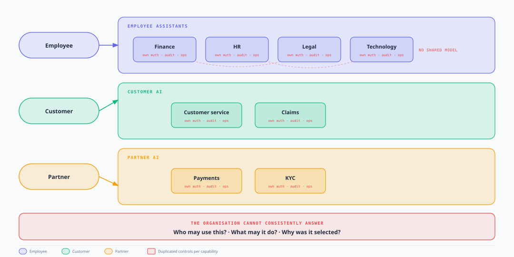

# Enterprise Agent Fabric

## Executive Brief

### One governed way to run enterprise AI

**2 September 2026**

[Full decision paper](./enterprise-agent-fabric-pitch.mdx) · [Technical design](./enterprise-agent-fabric-architecture.mdx)

---

## Why leadership should care

AI is no longer a set of pilots in individual teams. It is becoming **production capability** across the organisation — for employees, customers, partners, and operations.

That is the right direction. The risk is **how** we scale it.

If every division builds its own AI entry point, security model, approval path, and audit trail, we do not get more innovation. We get **the same enterprise plumbing rebuilt many times** — with different standards, different gaps, and no single place to answer hard questions when something goes wrong.

We need to move from *“another AI application”* to *“another governed capability in the enterprise portfolio.”*

---

## Why now

AI is moving from **answering questions** to **taking action** — touching customer data, money, operations, and regulated processes.

A standalone chatbot can live with light controls. A portfolio of AI that acts on behalf of the business cannot.

Each new capability without a common model adds:

- Duplicated platform engineering
- Inconsistent security and approval paths
- Governance overhead and user confusion
- Weaker ability to demonstrate accountability after an incident

The window to set the operating model is **before** the portfolio outgrows our ability to govern it.

---

## What is happening today

Capabilities are emerging independently:

- **Employees** — finance, HR, legal, technology assistants
- **Customers** — service and claims AI
- **Partners** — payments and KYC AI

Each team solves the visible problem — the assistant or automation — and often rebuilds the invisible work underneath: who can access it, how requests are directed, what the AI is allowed to do, how actions are approved, and how we prove what happened afterwards.

The organisation cannot consistently answer:

- **Who** was allowed to use this AI?
- **What** was it permitted to do?
- **Why** was this capability chosen, and what did it actually do?

It also lacks controls that should exist **once** for the whole portfolio:

- **One audit trail** — evidence of what was decided, allowed, executed, and approved
- **One operational view** — health, errors, and performance across AI capabilities
- **One security model** — identity and entitlement, not a side door per assistant
- **One kill switch** — pause or revoke a capability without hunting through domain deployments
- **One approval path** — shared gates for high-risk actions, not bespoke paths per team
- **One release bar** — behaviour checked before production, not only after incidents

That is not a technology inconvenience. It is a **governance, security, and operational risk** as AI starts to touch money, customers, and regulated processes.

---

## What we are proposing

**Enterprise Agent Fabric** is the common operating layer for AI across the enterprise.

It is **not** one giant AI that does everything. It is the **enterprise infrastructure** that sits between users and the specialised AI each domain builds.

**For users and applications:** one place to ask for help.

**For the enterprise:** one place where **security, governance, audit, and observability** are applied consistently — so every AI capability runs under the same enterprise standards, not a different version in each division.

**For domain teams:** freedom to build specialised AI for their business — without rebuilding the enterprise control stack every time.

At the centre, the Fabric standardises:

- **Security** — identity, entitlement, and least-privilege access for users and AI
- **Governance** — policy, approvals, and rules for what AI may do
- **Audit** — a consistent evidence trail of what was requested, decided, executed, and approved
- **Observability** — operational visibility into health, performance, and failure across the AI portfolio
- **Evaluation** — checks that AI behaviour is safe to release before it reaches production

In plain terms:

**One front door → central security, governance, audit, and observability → many specialised AI capabilities**

---

## How every request flows — from ask to completion

Executives often ask: *“What actually happens when someone uses this?”* Here is the same path every time — whether a person is chatting or a system is triggering a job.

### Example: an employee asks for help

*“I need to check my leave balance and request time off.”*

| Stage | What happens |
| --- | --- |
| **1. Ask** | The employee enters through the **enterprise front door** — one place to ask, not a hunt for the right HR bot |
| **2. Verify** | The Fabric confirms **who they are** and **what they are allowed to use** |
| **3. Route** | Intent is understood; the request is directed to the **right specialist capability** — here, HR AI — under enterprise policy |
| **4. Execute** | Domain-owned HR AI runs with **approved knowledge and tools**; it may answer, gather information, or start a workflow |
| **5. Control** | If the request leads to a **high-risk action** (for example, submitting leave that needs manager approval), the Fabric pauses, routes for approval, or hands off to a human process |
| **6. Complete** | The employee receives an answer or clear next step; the enterprise retains a **full evidence trail** — who asked, what was selected, what ran, what was approved |

The employee does not need to know which AI sits behind the experience. The enterprise always knows how the request was handled.

### The same model for automated work

When an application or batch job triggers AI — for example, a **claims system routing a case** — it follows the **same governed path**: verify → route → execute under policy → record evidence → return outcome.

Security, audit, and observability run **alongside** the request. They do not slow the caller unless policy requires a pause or approval.

**In one line:** trigger → verify and route → specialist AI runs → control if needed → outcome returned → evidence retained.

---

## Built for action — human control by design

As AI moves from answering to acting, **human control cannot be an afterthought**.

The Fabric treats approval and escalation as normal workflow — not exceptions bolted on later:

- **Pause before risk** — stop a run before a high-impact action (for example, a refund pending approval)
- **Hand off to people** — escalate to a human process when automation should not finish the job
- **Evidence for decisions** — structured output for downstream review, not just a chat reply

Every control is recorded: what was triggered, why, who approved, which policy applied.

---

## Least privilege — three permissions, not one

User access to AI does **not** mean unlimited AI access to systems.

The Fabric separates three permissions:

- **The user** — who initiated the request
- **The capability** — what this AI is authorised to do
- **The runtime** — what systems the executing platform may touch

A user may be entitled to use a payments AI without that AI being authorised to perform every payment operation directly. That is how we keep AI useful **and** contained.

---

## What domains keep

This proposal does **not** centralise business AI or slow domain teams down.

Domains continue to own:

- The business problem and workflow
- Domain knowledge and data
- Models, tools, and specialist logic
- Business outcomes and quality for their use cases

> **Centralise the controls. Keep the intelligence in the domains.**

That is the balance: **enterprise consistency without enterprise bottleneck.**

---

## Who owns what

| Owner | Responsibility |
| --- | --- |
| **Enterprise platform** | Front door, security, common controls, monitoring, audit, reliability, and standards |
| **Domain teams** | Specialised AI capabilities, workflows, knowledge, and business outcomes |
| **Risk and governance** | AI risk, oversight, compliance requirements, and evidence |

The platform makes the **safe path the easy path**. Domains innovate inside that framework instead of rebuilding it.

---

## What this is not

- Not one giant enterprise agent
- Not a replacement for domain AI teams or existing platforms
- Not one model or one runtime for every workload
- Not central ownership of every use case

The Fabric is the **operating model** around specialised capabilities — not a monolith that absorbs them.

---

## What the organisation gains

This is not a platform project for its own sake. It changes what happens every time the business adds AI.

| Gain | Why it matters | What the Fabric delivers |
| --- | --- | --- |
| **Speed compounds** | The first capability is cheap; the **tenth** is expensive if every team rebuilds auth, routing, audit, and ops from scratch | New AI **onboards to a shared model** — domains focus on the business problem; the enterprise path is already there |
| **Risk does not scale with the portfolio** | Every AI that acts on behalf of the business needs the same bar: who may use it, what it may do, what requires approval | One security, policy, and approval standard everywhere — gaps are not discovered capability by capability |
| **Accountability becomes answerable** | Leadership, risk, and regulators need one clear story — not five audit models and three partial logs | A consistent trail: **who asked, what was selected, what ran, what was approved, what happened** |
| **Growth without fragmentation** | More AI should not mean equal growth in duplicated platform work, inconsistent controls, and operational blind spots | More capabilities, **one operating model** — domains stay fast; the enterprise stays in control |

---

## The shift we are asking for

| | Today | Where we need to be |
| --- | --- | --- |
| **How AI is built** | Each team builds, secures, and operates on its own | One governed enterprise path; domains build specialist capability on top |
| **What “adding AI” means** | Another application, another control stack, another ops model | Onboard another capability to a known, trusted operating model |
| **After something goes wrong** | Hard to explain the landscape or prove what happened | One catalogue, one evidence model, one operational view |
| **User experience** | Users must know which assistant or endpoint to use | Users ask the enterprise; the Fabric routes to the right capability |
| **Operational resilience** | One capability’s failure can blur into enterprise confusion | Capabilities scale and fail independently under a common contract |

**Today:** innovation spreads faster than control.

**Tomorrow:** innovation and control scale together — domains move quickly inside a model the enterprise can stand behind.

---

## The story in five beats

1. **AI is fragmenting** — more teams, more capabilities
2. **Fragmentation creates risk** — duplicated controls, inconsistent governance
3. **The Fabric creates one operating model** — one front door, common controls, specialised capabilities
4. **Domains keep autonomy** — they own their AI and outcomes
5. **The enterprise gets scale with control** — grow the portfolio without growing chaos

---

## Proof the model works

A working reference implementation already demonstrates the end-to-end path:

**Message → classify → entitlement → pin → execute → response**

- Governed ingress for chat and automated jobs
- Capability registry and routing across multiple domain patterns
- Foundations for audit evidence and operational observability

This is a **proof point for the operating model**, not the final production topology. Detail: [status](../../02-understand/status.md) · [technical design](./enterprise-agent-fabric-architecture.mdx).

For V1 scope, success measures, risks, and the leadership decision — see the [full decision paper](./enterprise-agent-fabric-pitch.mdx).

---

> **One governed front door. Many specialised capabilities. One enterprise operating model.**

---

**[Full decision paper](./enterprise-agent-fabric-pitch.mdx)** · **[Technical design](./enterprise-agent-fabric-architecture.mdx)**
