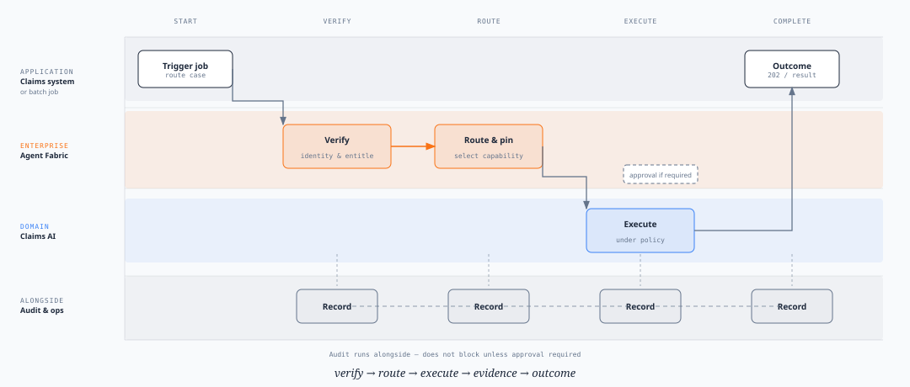
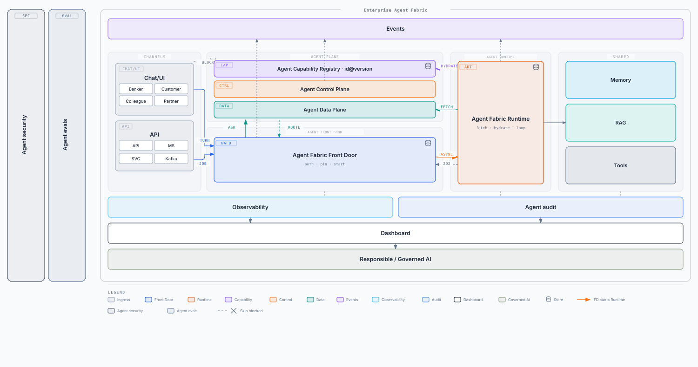
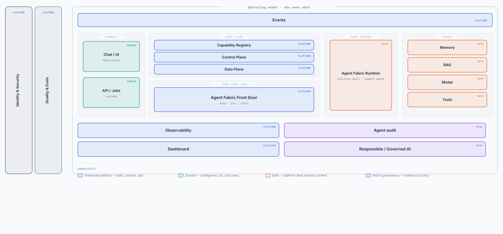

# Enterprise Agent Fabric — the idea

**Say this first:** The Fabric is the shared front door and control plane for acting AI. At portfolio scale — hundreds of routes and agents — identity, routing, policy, approval, and proof run **once**. Domains keep the intelligence. What you get at that scale is auditability, observability, and governance without rebuilding them per capability.

One door. Controls once. Specialised AIs underneath.

---

## The operating-model idea

AI that **answers** can live as a chatbot. AI that **acts** — money, customer data, regulated process — needs shared enterprise plumbing.

Every acting capability needs the same answers:

- Who may use it
- Which specialist should run
- What it may touch, and how a high-risk step is approved
- How we prove what happened

Do that plumbing **once**, and the organisation can answer three questions from one place:

1. Who was allowed to use this?
2. What was it permitted to do?
3. Why this capability, and what did it actually do?

One door. Controls once. Domains keep the intelligence.

---

## The idea

**Centralise controls. Keep intelligence in domains.**

| Once, for the whole portfolio | Still owned by the domain |
| --- | --- |
| Identity and entitlement | The business problem |
| Routing to the right capability | Knowledge, models, prompts |
| Policy, approval, kill switch | Specialist runtime (including Bedrock or other activations) |
| Audit and ops view | Outcomes and UX |
| A release bar for misroutes | |

People and systems never dial Legal, payments, or KYC URLs. They come in **one front door**. The fabric verifies, routes, runs, and records. The domain AI does the work.

---

## One request (the whole pitch in one picture)

Chat and jobs are the **same idea**. Only how the path is chosen differs.

1. **Ask** — a person or a system arrives at the door.
2. **Verify** — are they entitled for this channel?
3. **Route** — pick a governed path, ask a clarifying question, or refuse. Jobs name the path; they still must be entitled. A refusal never starts work.
4. **Pin & start** — lock the version and the agent identity, then start the runtime.
5. **Execute** — domain AI runs with approved knowledge and tools.
6. **Record** — outcome back; evidence kept.

_Caption: Verify → route → execute → record. One path for a human turn and for a system job._

If you remember one sequence, remember that. Architecture is only names for those steps.

---

## Architecture (names for the jobs)

_Caption: One ingress spanning the plane. Runtime beside it. Shared memory, retrieve, model, and tools. Audit and observability underneath._

| Job in the idea | Name in the picture |
| --- | --- |
| The only way in — entitle, lock the path, start work | **Front Door** |
| Which governed capability, at which version | **Plane** (catalogue, decide, operator view) + **Registry** (published tools) |
| Do the work | **Runtime** — ours, or another activation behind the pin |
| Memory, grounding, model, dual-checked actions | **Shared** |
| Prove it and see it | **Audit** and **Observability** |

Three identities stay distinct: the **user**, the **agent** (software acting), the **runtime** (the box that runs). Pin the path **before** minting the agent token. Channels never skip the door.

---

## Who does which job

_Caption: Same fabric, colored by owner. Platform runs the path. Domains keep the intelligence. Risk owns evidence and policy._

| | Owns | Does not own |
| --- | --- | --- |
| **Front Door** | Ingress, entitlement, pin, start | Choosing the specialist; running the loop |
| **Plane + Registry** | Catalogue, decide, published capabilities | Pinning, starting, invoking tools |
| **Runtime** | The work after the pin | Being a second front door |
| **Shared** | Memory, retrieve, model, tool permit (user **and** agent) | Routing |
| **Audit / observability** | Evidence and ops signal | Blocking the request path |
| **Domain** | Intelligence, tools, outcomes, which runtime | Rebuilding enterprise plumbing |

---

## The sentence to leave in the room

> One front door. Controls once. Intelligence stays in the domain. Every request — chat or job — is verify, route, execute, record.
