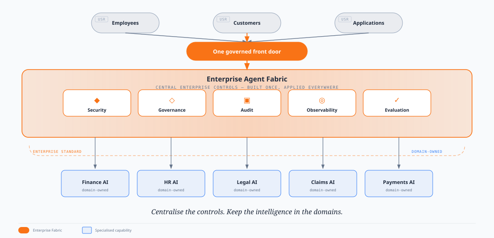

# Enterprise Agent Fabric — Executive discussion brief

**Purpose:** A short walkthrough for leadership — four pictures, what the Fabric solves, and who owns what.

**Companion reading:** [Executive TL;DR](./enterprise-agent-fabric-executive-deck-enhanced.mdx) · [Technical design](./enterprise-agent-fabric-architecture.mdx) · [Box packs index](./index.mdx)

---

## 1. Architecture (what we are building)

One governed ingress. Chat and jobs enter only through **Agent Fabric Front Door**. The **Agent Fabric Plane** (Control + Data Plane + Capability Registry) decides the path. **Agent Fabric Runtime** does the work. **Shared** holds Memory, RAG, and Tools. **Audit** and **Observability** sit under every run.

_Caption: Boxes and trust boundaries — channels never dial domain runtimes directly._

---

## 2. One request — interactive (chat)

Same operating path every turn: authenticate → entitle → decide → (on `route`) freeze → start Runtime → slim reply. Clarify / abstain never start work.

_Caption: Human turn — Front Door owns pin and start; Plane owns classify; Runtime owns the work._

---

## 3. One request — automated (jobs)

Systems and batch callers use the same contract with an explicit `route_id`. No classifier contest, no clarify — still entitle and fail closed.

_Caption: Automated path — same Fabric gates, thinner decide (named route + claims)._

---

## 4. Operating model (one line)

One front door → central security, governance, audit, observability, evaluation → many domain-owned specialised AIs.

_Caption: Centralise controls. Keep intelligence in domains._

---

## 5. What it solves

Drawn from the [executive TL;DR](./enterprise-agent-fabric-executive-deck-enhanced.mdx).

### Problem

AI is moving from pilots to a **portfolio of acting capabilities** (customer data, money, regulated processes). Without a common operating model we get:

- Duplicated platform plumbing per assistant
- Inconsistent security, approval, and audit
- No single place to answer who was allowed, what ran, and why

### Proposal

Build an **Enterprise Agent Fabric** — one governed front door that applies central security, policy, audit, and observability while **domains retain** specialised AI, knowledge, and outcomes.

### What the Fabric standardises

| Control | Outcome |
| --- | --- |
| **Security** | Identity, entitlement, least-privilege for users and agent principals |
| **Governance** | Policy, approval gates, rules for high-risk actions |
| **Audit** | Evidence of who asked, what was decided, what ran, who approved |
| **Observability** | Central ops view across capabilities |
| **Evaluation** | Pre-release checks (routing goldens, adversarial cases) before ship |

### What domains keep

- Business problems, domain knowledge, models, and outcomes
- Choice of runtime / specialist logic behind the Fabric contract (`activation_target`)

> Centralise controls. Keep intelligence in domains.

### Why leadership should care

If every division builds its own entry point, we do not get more innovation — we rebuild the same enterprise plumbing many times, with different gaps. The Fabric makes the **safe path the easy path**.

### Decision framing (from TL;DR)

Approve a V1 reference pilot with executive sponsor, platform/security SMEs, and success measures such as: onboard pilot domains quickly, high central audit coverage, and fewer duplicated control components.

---

## 6. Roles and responsibilities (by component)

| Component | Owns | Does **not** own |
| --- | --- | --- |
| **Agent Fabric Front Door (AFD)** | Only public ingress. Authenticate channel caller, entitle, call decide, **freeze** route pin, **async-start** Runtime, return slim chat / `202` jobs. Two fleets at scale (Chat + API), one contract. | Classify logic; run the agent loop; host catalogue UI |
| **Agent Data Plane (ADP)** | Versioned catalogue + **decide** (`route` / `clarify` / `abstain`). Eligible set = claims ∩ channel (chat-visible for chat). Eval golden surface for misroutes. | Pin; start Runtime; tool invoke |
| **Agent Control Plane (ACP)** | Operator catalogue **UI** / control surface. Policy and version visibility for humans. | Hot-path decide API; start Runtime; channel traffic |
| **Agent Fabric Capability Registry** | Immutable published capabilities `id@version`. Manifests AR hydrates at pin. Agent-start tools point at API AFD, not callee Runtime URLs. | Decide; pin; PEP permit at invoke time |
| **Agent Fabric Runtime (AR)** | Pin hydrate, Patterns 0–3 loop, call Shared (Memory / RAG / Tools). Workload identity ≠ user ≠ agent robot. May be Fabric AR **or** another activation (e.g. Bedrock Agent) behind `activation_target`. | Channel ingress; re-decide mid-run against `active`; widen scopes after freeze |
| **Shared (Memory, RAG, Tools / PEP)** | Durable memory, retrieval, and **tool dual-check** (user entitlements + agent scopes). | Route choice; mint freeze; classify |
| **Agent Audit (AADP + AACP)** | Append-only evidence chain; examiner UI by `correlation_id`. Default-deny sensitive payload fields. | Block the hot path; replace ops dashboards |
| **Observability (OTLP / LGTM)** | Traces, metrics, logs for runs and journeys. | Compliance evidence store (that is Audit) |
| **Domain teams** | Route rows, prompts, workflows, tools, domain outcomes, choice of runtime behind activation. | Building a second enterprise front door |
| **Platform / Risk** | Fabric build & run; policy and evidence requirements; eval release bar. | Owning every domain model and prompt |

### Locked operating rules (for the room)

1. **Four jobs.** AFD entitles, pins, starts. Data Plane classifies. ACP is control. AR runs.
2. **Only `route` starts work.** Clarify / abstain never pin.
3. **Jobs name `route_id`.** Skip classifier; do **not** skip entitle.
4. **Three principals.** User ≠ agent (`agent_client_id`) ≠ AR workload.
5. **Channels never dial `activation_target`.** Front Door is the only way in.

---

## Next steps

- Walk diagrams 1–4 in the room (architecture → chat turn → jobs → proposition).
- Confirm what we standardise vs what domains keep (§5).
- Agree component owners for the pilot (§6).
- Decision package: [Executive TL;DR](./enterprise-agent-fabric-executive-deck-enhanced.mdx) · [Full pitch](./enterprise-agent-fabric-pitch.mdx)
