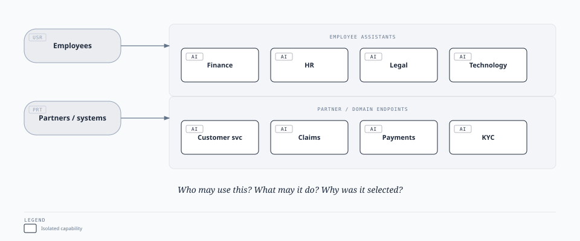
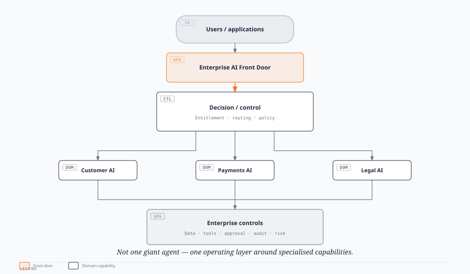
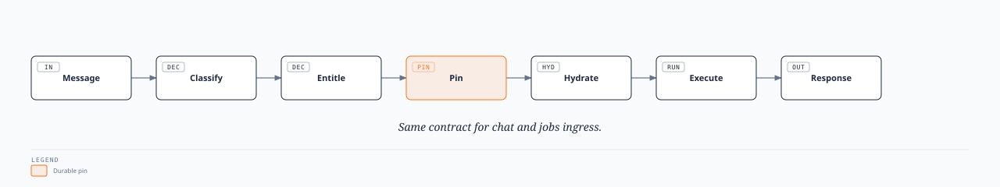
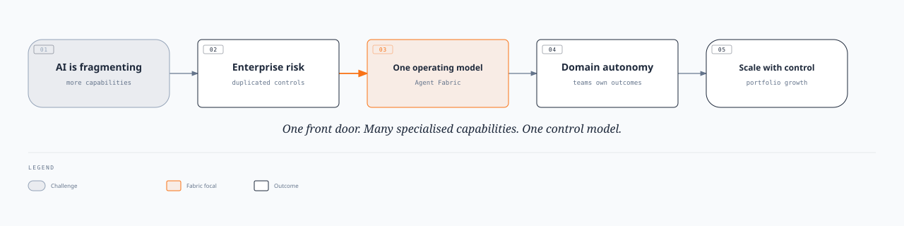

# Enterprise Agent Fabric V1

## Executive Decision Paper

**One governed front door for enterprise AI**

**Status:** Draft · **Date:** 2 September 2026

Technical design: [Enterprise Agent Fabric](./enterprise-agent-fabric-architecture.mdx)

---

## 1. Executive decision requested

Endorse the **Enterprise Agent Fabric** as the strategic enterprise pattern for accessing, governing, and operating AI capabilities, and support V1 as the foundation for onboarding priority AI capabilities across business domains.

Specifically, this decision establishes that:

- The Enterprise Agent Fabric becomes the common enterprise pattern for AI capability access and orchestration.
- Business and domain teams retain ownership of their specialised AI capabilities, while common enterprise controls are provided by the Fabric.
- New enterprise AI capabilities should, where appropriate, be onboarded through the Fabric rather than implemented as disconnected AI applications.
- V1 should proceed toward production hardening and onboarding of selected priority capabilities.
- Enterprise governance, security, risk, and technology teams establish the control model and standards for the Fabric.

The strategic choice is whether we scale AI as a portfolio of governed enterprise capabilities, or continue scaling individual AI applications independently. The Enterprise Agent Fabric provides the foundation for the former.

---

## 2. Executive summary

Enterprise AI is moving from a small number of assistants and experiments to a portfolio of specialised capabilities across Finance, HR, Legal, Customer Service, Payments, Claims, KYC, Operations, and Technology. The challenge is no longer simply building an agent. It is operating many AI capabilities as one enterprise capability while maintaining security, entitlement, governance, auditability, resilience, and accountability.

The Enterprise Agent Fabric addresses this by providing:

- **One front door** — users and applications interact with the enterprise AI capability rather than individual agents.
- **Many specialised capabilities** — business domains retain specialised AI for their own processes, data, and expertise.
- **One control model** — identity, entitlement, policy, monitoring, audit, evaluation, and governance apply consistently across capabilities.

Users and applications do not need to understand the underlying AI landscape. They enter through a common interface; the Fabric determines the appropriate capability, verifies entitlement and policy, and connects the request to the relevant specialised capability. The capability remains domain-owned and independently evolvable. The enterprise controls remain consistent.

---

## 3. Why now

Enterprise AI is moving from answering questions toward performing work and taking actions. That changes the architectural and governance problem. A standalone chatbot can operate with relatively limited integration. A portfolio of AI capabilities may interact with enterprise data, customer information, financial systems, operational platforms, APIs, workflow systems, human approval processes, and external services.

Without a common operating model, each new capability can introduce another implementation of authentication, authorisation, routing, integration, monitoring, audit, and risk controls. The result is:

- Technology duplication and operational complexity
- Inconsistent controls and security risk
- Governance overhead and user confusion
- Difficulty demonstrating accountability

The organisation therefore needs to move from “how do we build another AI application?” to “how do we add another governed AI capability to the enterprise?”

---

## 4. The problem

Today, AI capabilities naturally emerge independently across business domains.

- **Employee** — Finance Assistant → HR Assistant → Legal Assistant → Technology Assistant
- **Customer** — Customer Service AI → Claims AI
- **Partner** — Payments AI → KYC AI

This creates a fragmented AI landscape. Employees, customers, and partners each face a different set of assistants and endpoints. Users need to know which capability to use. Applications need to know which endpoint to call. Teams independently implement authentication, entitlement, routing, tool access, data access, monitoring, audit, approval, governance, and resilience.

The organisation loses a single answer to three fundamental questions:

- Who may use this capability?
- What is the capability allowed to do?
- Why was this capability selected and what did it do?

---

## 5. The proposition

The Enterprise Agent Fabric provides a common operating layer for enterprise AI.

- **One front door** — users and applications interact with the enterprise AI capability rather than individual agents.
- **Many specialised capabilities** — business domains retain specialised AI for their own processes, data, and expertise.
- **One control model** — identity, entitlement, policy, monitoring, audit, evaluation, and governance apply consistently across capabilities.

The model is one experience → governed decision → specialised capability → controlled action → auditable outcome.

---

## 6. Target state

The key principle is that the Fabric does not become one giant agent. It provides the enterprise operating layer around specialised capabilities.

---

## 7. How the Fabric works

A request moves through a consistent set of stages:

- **Front Door** — establish identity and receive the request
- **Decision layer** — understand intent, determine the appropriate capability, and verify entitlement
- **Capability** — execute the specialised AI workflow using approved knowledge, data, and tools
- **Controls** — apply security, policy, monitoring, governance, audit, and evaluation throughout the lifecycle
- **Outcome** — return the result or initiate an approved business action

Chat interactions and automated jobs use the same underlying contract: entitle → decide → pin → start → execute → audit. Different ingress channels can operate independently while maintaining a consistent enterprise control model. Production splits chat and API ingress into separate fleets; the contract stays the same.

---

## 8. What changes for the business

The Fabric shifts how the enterprise builds and consumes AI:

- Users choose individual AI applications → users access one enterprise AI experience
- Multiple AI gateways → common enterprise front door
- Domain-specific authentication and controls → reusable enterprise control model
- Agents deployed independently → capabilities registered and governed
- Inconsistent auditability → consistent audit and evidence model
- Limited operational visibility → shared observability across Front Door, Plane, and Runtime
- Quality checked after incidents → routing and capability evaluation before production
- Difficult to understand the AI landscape → central capability catalogue
- Adding AI creates another application → adding AI becomes onboarding another capability
- Shared infrastructure can create large failure domains → capabilities and ingress can be independently scaled and isolated

The desired shift is from many AI applications to one enterprise AI capability ecosystem.

---

## 9. Least-privilege AI

A fundamental principle of the Fabric is that user access does not automatically translate into unlimited AI access. Three identities and permissions must be considered independently:

- **The user** — who initiated the request?
- **The capability** — what is this AI capability authorised to do?
- **The executing platform** — what infrastructure and services is the runtime allowed to access?

This separation enables least-privilege AI. For example, a user may be entitled to a Payments capability without the executing agent being authorised to directly perform every payment operation. The Fabric provides a control point for user entitlement, capability permissions, tool permissions, data access, action policies, and approval requirements. Technical detail: [three principals](./enterprise-agent-fabric-architecture.mdx#three-principals).

---

## 10. Human control by design

Enterprise AI must maintain a clear distinction between answering and acting. Human control is built in as first-class workflow patterns:

- **Process gate** — pause the run before a risky action (for example, a refund requiring approval)
- **Async handoff** — transfer work to a human process (for example, escalate a customer case)
- **LLM signal** — produce structured evidence for downstream decisioning (for example, a risk assessment used by a later workflow)

These are not exceptions. The platform can record what control was triggered, why, who approved, which policy applied, and which catalogue version was active.

---

## 11. Governance and accountability

As AI moves toward autonomous action, organisations need to demonstrate not only what happened, but why it happened. The Fabric is designed to provide evidence for:

- Who initiated the request
- Which capability was selected and why
- Whether the user was entitled
- Which capability and catalogue versions were active
- What data and tools were accessed
- What actions were performed and what approvals were required
- Which controls and policies applied
- Which AI identity performed downstream actions — distinct from the user and from the runtime workload

This creates a consistent enterprise evidence model across AI capabilities. Evaluation complements that model by testing whether routing and capability behaviour remain correct before change reaches production.

---

## 12. Audit and observability

Audit and observability are both required, but they serve different audiences and must not be collapsed into one path.

**Audit** is the evidence path. Fabric components emit append-only events asynchronously so decide, freeze, pin, and start never wait on evidence commit. Reviewers reconstruct a run by correlation — route selected, entitlement snapshot, frozen contract, stage outcomes, approvals, and terminal state — without putting raw transcripts, tokens, or PII on the chat wire. Technical design: [Agent Fabric Audit](./agent-fabric-audit.mdx).

**Observability** is the operations path. Traces, metrics, and logs show latency, errors, saturation, and recovery for Front Door, Plane, Runtime, and shared services. Operators use this to keep the platform healthy; risk and compliance use audit to prove what a capability did under which controls.

Together they answer different questions:

- **Observability** — is the Fabric healthy, and where is it failing?
- **Audit** — for this request, what was decided, allowed, executed, and approved?
- **Evals** — before and after change, does routing and capability behaviour still meet the golden and adversarial bar?

Evals sit beside both: routing golden sets and adversarial cases gate misroutes in CI, while production audit and observability show whether live behaviour matches that contract.

---

## 13. Operating model

Ownership is split so domains can move quickly without rebuilding the platform:

- **Enterprise platform** — Front Door, security, common controls, governance, monitoring, audit, reliability, standards, and evaluation gates for the common pattern
- **Domain teams** — specialised AI capabilities, domain workflows, knowledge, domain-level evaluation, and business outcomes
- **Risk and governance** — AI risk, independent oversight, control requirements, compliance, and evidence

Domain teams innovate independently without rebuilding the enterprise AI platform. Their responsibility is to publish and operate capabilities within the agreed framework. The platform responsibility is to make the safe path the easy path.

---

## 14. What this is not

The Enterprise Agent Fabric is not:

- One giant enterprise agent
- A replacement for domain-specific AI capabilities
- A central team that owns every AI use case
- A requirement for every AI workload to use the same model
- A single runtime for every workload
- A replacement for existing domain platforms

Instead, the Fabric provides the common enterprise operating model while allowing capabilities to remain specialised and independently evolvable.

---

## 15. Resilience and scale

Enterprise AI capabilities will have different traffic profiles and failure characteristics. Conversational workloads and automated job workloads should not necessarily operate within the same failure domain.

For production:

- Chat and API ingress can operate as separate fleets
- Capabilities can be independently scaled
- Runtime failures can be isolated
- High-volume workloads can be controlled independently
- The common contract remains consistent across ingress paths

The principle is that a failure in one AI capability should not become an enterprise-wide AI outage.

---

## 16. V1 scope

V1 establishes the foundational operating pattern rather than attempting to solve every enterprise AI problem.

**V1 includes:**

- Governed enterprise ingress
- Capability discovery and routing
- Entitlement and policy enforcement
- Durable run initiation
- Capability registry and standard capability contract
- Audit and observability as separate evidence and ops paths
- Routing evaluation gates for the common pattern
- Human approval and handoff patterns
- Separation of user, capability, and runtime identities

**V1 does not attempt to:**

- Centralise all AI workloads
- Replace domain AI teams
- Force a single LLM or model provider
- Create one runtime for every capability
- Eliminate existing domain platforms
- Replace domain-owned evaluation of specialised capability quality

The objective is to establish the enterprise pattern, not create a monolithic AI platform.

---

## 17. Proof point

A working V1 reference implementation demonstrates the complete lifecycle:

**Message → classify → entitlement → pin → hydrate → execute → response**

The reference implementation currently demonstrates:

- Agent Fabric Front Door, Control Plane, Data Plane, Runtime, and Capability Registry
- A route catalogue with multiple autonomy patterns
- Chat and jobs ingress
- LangGraph-based runtime execution
- Foundations for audit evidence and operational observability alongside the request path

This is a proof point for the architecture and operating model, not the final production topology. Implementation status and behaviour truth: [status](../../02-understand/status.md) · [catalogue matrix](../../03-catalogue/README.md) · [technical design](./enterprise-agent-fabric-architecture.mdx).

---

## 18. Success measures

Success should be measured by business and control outcomes, not by the number of platform components built.

- **Adoption** — priority capabilities onboarded through the Fabric; percentage of new enterprise AI using the common pattern
- **Speed** — time to onboard a new governed capability; reduction in duplicated platform engineering
- **Reuse** — percentage of capabilities using common enterprise controls; shared services reused across domains
- **Control** — AI actions covered by entitlement and policy; capabilities with complete audit evidence; high-risk actions with appropriate approval
- **Quality** — routing and capability changes covered by evaluation gates; reduction in misroutes caught only in production
- **Reliability** — independent scaling of major workloads; capability-level failure isolation; platform availability and recovery
- **Transparency** — ability to reconstruct who asked, what was requested, why the capability was selected, what the AI did, what controls applied, and what the outcome was

---

## 19. Strategic value

The Fabric delivers strategic value across experience, delivery, and control:

- **One AI experience** — simpler interaction for employees, customers, and applications
- **Reusable platform** — faster deployment of new AI capabilities
- **Consistent controls** — reduced security, governance, and operational risk
- **Specialised capabilities** — better domain outcomes than a generic enterprise agent
- **Enterprise visibility** — clear accountability through audit, and operational clarity through observability
- **Evaluated change** — routing and capability behaviour gated before production, not only inspected after incidents
- **Failure isolation** — reduced blast radius of AI incidents
- **Domain autonomy** — business teams retain ownership and speed

Taken together, the Fabric allows the organisation to scale AI adoption without scaling fragmentation at the same rate.

---

## 20. Key risks and proposed responses

- **Fabric becomes a central bottleneck** — standard contracts and decentralised capability ownership
- **Platform becomes a monolithic agent runtime** — separate Fabric control plane from domain execution
- **Domain teams bypass the platform** — make the common path easier and faster than building independently
- **Excessive centralisation** — platform owns common controls; domains own business capabilities
- **AI actions become over-privileged** — separate user, capability, and runtime permissions
- **One capability impacts others** — independent scaling and failure isolation
- **Misroutes reach production unnoticed** — routing golden sets, adversarial cases, and CI evaluation gates
- **Evidence gaps after an incident** — append-only audit beside the request path; observability for ops, audit for accountability
- **Governance slows innovation** — embed controls, audit, and evals into the platform rather than manual gates everywhere
- **Fabric becomes another abstraction layer** — keep the enterprise contract simple and implementation-neutral

---

## 21. Roadmap

**V1 — Establish the pattern.** Prove the enterprise operating model with Front Door, capability registry, routing and entitlement, durable execution, a common audit and observability model, routing evaluation gates, human-control patterns, and initial priority capabilities.

**V1 → Production.** Harden the platform for enterprise operation:

- Production security integration
- Resilience and failure isolation
- Operational monitoring, observability SLOs, and capacity management
- Production-grade audit retention and examination workflows
- Expanded evaluation coverage for priority routes and capabilities
- Governance integration and production onboarding model

**V2 — Scale the ecosystem.** Make onboarding AI capabilities repeatable across the enterprise through self-service capability onboarding, expanded policy controls, capability lifecycle management, standardised evaluation across domains, cost and usage optimisation, and broader domain adoption.

---

## 22. The executive story

Five beats:

1. **AI is fragmenting** — more teams are building more AI capabilities.
2. **Fragmentation creates enterprise risk** — every capability can independently introduce security, governance, integration, and operational complexity.
3. **The Fabric creates one operating model** — one front door, common controls, and specialised capabilities.
4. **Domains keep their autonomy** — business teams own their AI capabilities and outcomes.
5. **The enterprise gets scale with control** — AI can grow as a portfolio without an equivalent increase in fragmentation, risk, and complexity.

---

## 23. Final recommendation

The Enterprise Agent Fabric should be adopted as the strategic enterprise pattern for governed AI capability access and operation.

The organisation should not attempt to centralise every AI capability. Instead, it should centralise what needs to be consistent:

- Identity, entitlement, routing, policy
- Governance, audit, observability, and evaluation standards
- Reliability standards

And decentralise what benefits from domain ownership:

- Business capability and domain knowledge
- Workflows, models, and tools
- Implementation and domain-level evaluation of specialised quality

This creates a scalable operating model for enterprise AI: one experience, one front door, many specialised capabilities, one control model. The Enterprise Agent Fabric becomes the operating foundation that allows the organisation to scale AI as an enterprise capability portfolio rather than a collection of disconnected applications.

---

**[Technical design](./enterprise-agent-fabric-architecture.mdx)** · [Agent Fabric Front Door](./agent-fabric-front-door.mdx) · [Agent Fabric Plane](./agent-fabric-plane.mdx) · [Agent Fabric Runtime](./agent-fabric-runtime.mdx) · [Agent Fabric Capability Registry](./agent-fabric-capability-registry.mdx) · [Agent Fabric Audit](./agent-fabric-audit.mdx)
