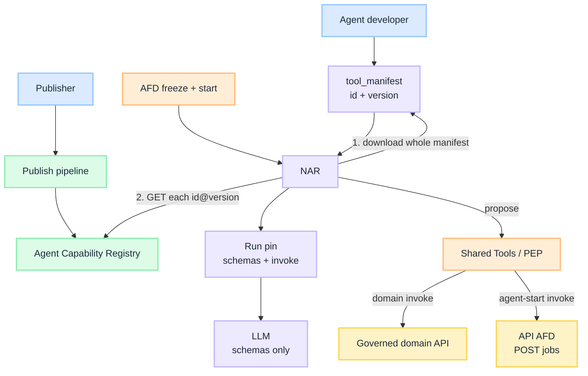

import Details from '@theme/Details';

# Agent Capability Registry

Parent: [Enterprise Agent Fabric](/intent/enterprise-agent-fabric) · Sibling: [Agent Front Door](/intent/enterprise-agent-fabric/agent-front-door) · [Agent Plane](/intent/enterprise-agent-fabric/agent-plane) · [Agent Runtime](/intent/enterprise-agent-fabric/agent-runtime)

**Publishers publish versions. Agent developers refer. NAR hydrates once, then calls `invoke`.**

The registry sits in **Shared**, next to Tools / PEP. It is a catalog, not a third AFD, not MCP `list_tools`, and not a client the loop calls on every turn. How-to for manifests: [Manifest registry](/playbooks/agents/manifests/manifest-registry) · [Manifest lifecycle](/playbooks/agents/manifests/manifest-lifecycle). Route pointer: [Route contract reference](/playbooks/agents/intent-router/route-contract-reference).

---

## 1. Job

Three objects, two writers. The route row still has no `tools[]`.

| Object | Who writes it | What it holds |
| --- | --- | --- |
| **Capability version** | Publisher (API owner, or the team that owns a callee route) | One immutable release: schema, `invoke`, snippet. `ocr_extract@1.2.0` or `start_contract_review@1.0.0` |
| **Tool manifest** | Agent developer | References for this route: `id` + `version` + `pdp_action` + `risk_tier` |
| **Route row** | Platform / domain | `tool_manifest` pointer. Still no inlined tools |

Three moments. Only the last one is the NAR loop.

| Moment | Who | What happens |
| --- | --- | --- |
| **Publish** | Publisher | Pipeline puts one version in the registry. Append-only. |
| **Refer** | Agent developer | Copies `{ "id", "version" }` into their `tool_manifest`. They do not republish the API or the callee route. |
| **Call** | NAR | After freeze: download the **whole** pinned manifest, hydrate every ref onto the run pin, then schemas only to the LLM. `invoke` runs after PEP. |



<br/>

**Same freeze vs new route.** A summarizer helper is a domain capability on this manifest. A call to Legal MSA review is an **agent-start** capability on this manifest. Both are refs. The second one's `invoke` is the [API AFD](/intent/enterprise-agent-fabric/agent-front-door) jobs URL, not Legal's `activation_target`.

---

## 2. What a capability version is

Treat a capability like a package, not like a live `list_tools` session.

| Field | Why it exists |
| --- | --- |
| `id` | Stable name: `ocr_extract` or `start_contract_review`. Product, not vendor. |
| `version` | Immutable semver. `1.2.0` never changes once published. |
| `kind` | `domain` (business API) or `agent` (start another catalogue row). |
| `description` | What the agent developer (and later the model) reads. |
| `input_schema` / `output_schema` | JSON Schema. Becomes the tool schema on the run pin. |
| `invoke` | How to call after PEP. Domain: method, path, auth to the **governed business API**. Agent-start: `POST` `{jobs_url}` with a fixed `route_id`. Not an MCP server URL. Not a NAR URL. |
| `snippet` | Copy-paste example for the developer. Documentation, not runtime. |
| `owner` | The team that may publish the next version. |
| `status` | `draft` / `published` / `deprecated`. Manifests may reference `published` only. |

Breaking the contract is a **new major**. Adding an optional field is a minor. Overwriting `1.2.0` is not a version.

The **manifest** does not store "whatever is latest." It stores a reference. Publishing `2.0.0` does not move `fraud_investigate_v1`. The agent developer changes the reference when they are ready.

<Details summary="Domain capability version (JSON)">

```json
{
  "id": "ocr_extract",
  "version": "1.2.0",
  "kind": "domain",
  "description": "Extract text from a document id.",
  "input_schema": {
    "type": "object",
    "required": ["doc_id"],
    "properties": {
      "doc_id": { "type": "string" }
    }
  },
  "output_schema": {
    "type": "object",
    "required": ["text"],
    "properties": {
      "text": { "type": "string" }
    }
  },
  "invoke": {
    "method": "POST",
    "url": "https://api.internal/ocr/extract",
    "auth": "domain-oauth"
  },
  "snippet": "POST /ocr/extract { \"doc_id\": \"...\" }",
  "owner": "document-intel",
  "status": "published"
}
```

</Details>

<Details summary="Agent-start capability version (JSON)">

Legal owns this version. Fraud does not invent a Legal URL. `route_id` is fixed on the capability, not chosen by the model.

```json
{
  "id": "start_contract_review",
  "version": "1.0.0",
  "kind": "agent",
  "description": "Start governed Legal MSA review as a jobs run.",
  "input_schema": {
    "type": "object",
    "required": ["document_id"],
    "properties": {
      "document_id": { "type": "string" },
      "matter_id": { "type": "string" }
    }
  },
  "output_schema": {
    "type": "object",
    "required": ["correlation_id"],
    "properties": {
      "correlation_id": { "type": "string" }
    }
  },
  "invoke": {
    "method": "POST",
    "url": "https://api-afd.internal/v1/jobs",
    "auth": "calling-agent-oauth",
    "body": {
      "route_id": "contract_review"
    }
  },
  "snippet": "POST /v1/jobs { \"route_id\": \"contract_review\", \"payload\": { \"document_id\": \"...\" } }",
  "owner": "legal-agents",
  "status": "published"
}
```

</Details>

---

## 3. Call another route {#call-another-route}

If this run needs a **separate catalogue row**, that callee is a named tool on the **parent** manifest. The model may only propose that name. The tool's `invoke` is API AFD, same jobs contract as partners and Kafka.

Two gates, in order:

1. **Manifest + PEP** (this freeze). `fraud_investigate` may start `contract_review`. No `invoke_any_agent`. A tool not on the pinned manifest never fires.
2. **API AFD** (the child start). Look up `contract_review`, entitle the **user** (claims or stored approval) and record. Freeze Legal's `agent_client_id`. Async-start Legal NAR. `202` + a **new** `correlation_id`.

The LLM never sees `{jobs_url}` or `activation_target`. Parent NAR never `POST`s Legal's NAR. Chat AFD stays for humans. This caller is software, so it is the jobs fleet.

Parent freeze stays `fraud_investigate`. Child freeze is `contract_review`. Two tickets. Parent waits or continues, then reads the child like any job (`GET` or `{runs_topic}`).

If Legal is only a stage on the **same** row (`workflow_id`), that is not this path. Stay in parent NAR. Use an agent-start capability only when the callee is its own route.

Identity: jobs `Authorization` is the **calling** agent token. After freeze, Legal mints **its** robot. Dual check on Legal tools: user plus Legal's `agent_client_id`. Do not copy the fraud bearer downstream. Do not use NAR workload identity as the jobs caller. [Three principals](/intent/enterprise-agent-fabric#three-principals).

---

## 4. How a reference lands in the manifest

| Step | What they do |
| --- | --- |
| 1. Find | Search the registry. Copy references. Domain and agent-start look the same here: `id` + `version`. |
| 2. Write | Edit the manifest file. `tools[]` is name, `capability_id`, `capability_version`, `pdp_action`, `risk_tier`. No inlined OpenAPI. |
| 3. PR | Reviewers see which catalog versions moved. CI checks each ref exists and is `published`. It does not bake schemas. |
| 4. Pin | AFD freezes the route. **First** NAR downloads that whole `tool_manifest`, hydrates every ref onto the run pin, then talks to the LLM. |
| 5. Call | Proposal must match a hydrated name. PEP. Then `invoke` from the pin: domain API, or API AFD. |

First version is the same path with an empty file. Adding a tool or bumping `ocr_extract` from `1.2.0` to `1.3.0` is a **new manifest version**, not an edit in place. Keep `tool_manifest: fraud_investigate_v1` if the id is stable. Bump the **route row** only when the pointer itself changes.

<Details summary="Parent manifest with domain tools and one agent-start (JSON)">

`pdp_action` and `risk_tier` stay on the manifest. They are agent-policy, not publisher API contract.

```json
{
  "manifest_id": "fraud_investigate_v2",
  "manifest_version": "2026.08.1",
  "description": "Fraud investigate: domain tools plus Legal start",
  "tools": [
    {
      "name": "search_transactions",
      "capability_id": "search_transactions",
      "capability_version": "1.4.0",
      "pdp_action": "search_transactions",
      "risk_tier": "low"
    },
    {
      "name": "start_contract_review",
      "capability_id": "start_contract_review",
      "capability_version": "1.0.0",
      "pdp_action": "start_contract_review",
      "risk_tier": "high"
    }
  ]
}
```

</Details>

---

## 5. APIs {#apis}

Module or internal RPC in Shared. Agent Plane and NAR are not public URLs. The registry is not a channel API. UI, pipeline, and **one hydrate at pin** call it. The loop does not.

| Box | Public / channel | Internal |
| --- | --- | --- |
| **Agent Capability Registry** | None | Publish, get version, list, search. Called by pipeline, registry UI, and NAR at pin |
| **Tools / PEP** | None | Dual check, then execute hydrated `invoke`. NAR only |

| Method | Path | Who / when |
| --- | --- | --- |
| `PUT` | `/internal/capabilities/{id}/versions/{version}` | Pipeline (publish). UI (draft save). Existing `published` `(id, version)` returns conflict |
| `GET` | `/internal/capabilities/{id}/versions/{version}` | UI detail. NAR hydrate after it has downloaded the pinned manifest (every ref, once) |
| `GET` | `/internal/capabilities/{id}/versions` | UI version history |
| `GET` | `/internal/capabilities?q=` | UI search of `published` |

Publish is append-only. Humans draft. CI sets `status=published`.

NAR start still goes to `{activation_target}` from the [Runtime](/intent/enterprise-agent-fabric/agent-runtime#apis). Agent-start `invoke` is a later `POST` to `{jobs_url}` on the [API AFD](/intent/enterprise-agent-fabric/agent-front-door#apis), with the calling-agent bearer and user claims or approval id. That POST is the jobs row on the [call map](/intent/enterprise-agent-fabric/agent-front-door#call-map). The caller happens to be parent NAR.

---

## 6. Scaling {#scaling}

Hydrate is pin-time, not turn-time. Scale with new starts and catalog reads, not with loop steps.

| Axis | Grows with | Does not grow with | Scale signal |
| --- | --- | --- | --- |
| **Registry** | Publish rate + pin hydrates (refs per new run) | Tokens in the loop, SSE | Hydrate p99, catalog QPS |
| **Tools / PEP** | In-flight invokes (domain and agent-start) | Decide RPS | Per-capability latency / deny rate |
| **API AFD** (agent-start only) | Child job `POST` RPS from NAR | Chat SSE, Layer ② | Same jobs signals as partners |

Cache hydrated `(manifest_id, manifest_version)` if many runs share a pin. Do not resolve `latest`. Do not `GET` a capability when the model first names it.

---

## Anti-patterns

- NAR `POST`s the callee `activation_target` (channel dials Legal).
- `invoke_any_agent` or a model-chosen `route_id` on agent-start.
- Chat AFD for A2A (SSE, classify, chips). Software callers use jobs.
- Manifest allowlist without AFD entitle (user cannot use Legal; child still starts).
- Build-time hydrate. The route is pinned at session start.
- Lazy tool fetch, or the loop calling the registry on the turn.
- `latest` as a reference.
- MCP server per internal API that already has a governed `invoke`.
- Mixing `retrieval.scope` (corpora) with this catalog.
- A third capability `kind` for retrieve, prompts, workflow, memory, or MCP. Two kinds only.
- Treating a published capability as permission. Proposal, then PEP, then AFD entitle for `agent`.
- User bearer as the jobs `Authorization`, or NAR workload identity as the jobs caller.
- Copying the parent agent token into the child run.

---

## Read next

**[Agent Runtime](/intent/enterprise-agent-fabric/agent-runtime)** · [Agent Front Door](/intent/enterprise-agent-fabric/agent-front-door) · [Three principals](/intent/enterprise-agent-fabric#three-principals) · [Manifest registry](/playbooks/agents/manifests/manifest-registry) · [Manifest lifecycle](/playbooks/agents/manifests/manifest-lifecycle) · [Route contract reference](/playbooks/agents/intent-router/route-contract-reference) · [Wire agentic app](/playbooks/agents/intent-router/wire-agentic-app) · [PGAR boundary](/playbooks/governance/runtime/boundary)
