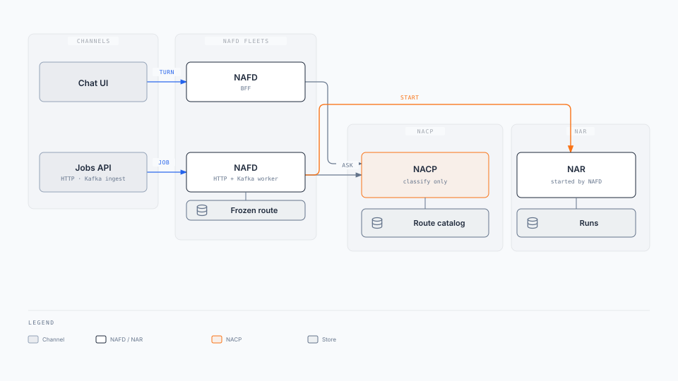
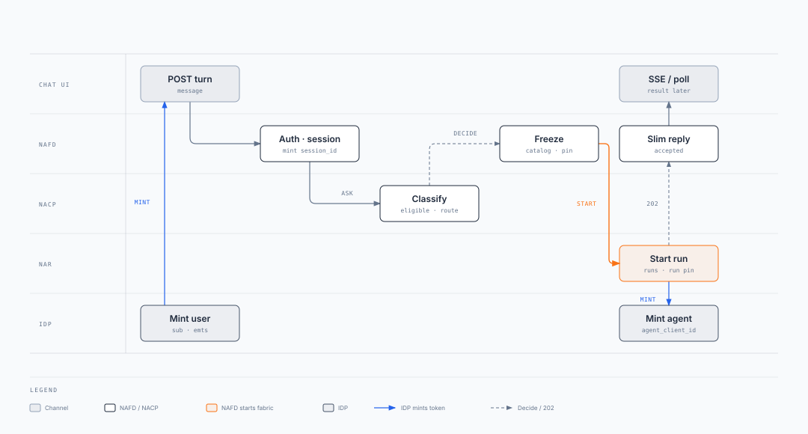

import Details from '@theme/Details';

# Agent Front Door (AFD)

Parent: [Enterprise Agent Fabric](/intent/enterprise-agent-fabric) · Sibling: [Agent Plane](/intent/enterprise-agent-fabric/agent-plane) · [Agent Runtime](/intent/enterprise-agent-fabric/agent-runtime) · [Agent Capability Registry](/intent/enterprise-agent-fabric/agent-capability-registry)

**Two fleets. One contract. Only way in.**

Chat AFD is BFF-shaped (Chat/UI). API AFD is handler-shaped (HTTP jobs + Kafka ingest). They share [Agent Plane](/intent/enterprise-agent-fabric/agent-plane), the frozen-route/session store, and the start contract. They do not share a process (FR-9). Kafka `{runs_topic}` is [NAR](/intent/enterprise-agent-fabric/agent-runtime) return, not a third AFD.

**Pin split:** Agent Front Door **calls** the Agent Data Plane (catalogue + classify). On `route`, this AFD **pins** `route_id` + versions and async-starts NAR. Playbooks still put the pin on the ACP. Treat this page as the proposal until they catch up.

How-to: [Wire agentic app](/playbooks/agents/intent-router/wire-agentic-app).

---

## 1. Two fleets, one contract

These are two **fleets**, not two public ways to hit the Agent Control Plane, and not two policies. Kafka is not a third AFD.

| Layer | Count | Why |
| --- | --- | --- |
| **Agent Plane** | One per trust domain | Same eligible set, entitlements, eval, audit |
| **Ingress contract** | One | Entitle → classify → freeze → start. Callers never dial NAR |
| **AFD fleets** | Two | Chat/UI is connection-bound (SSE/poll, hints, clarify). Jobs are bursty and skip classify |
| **Kafka** | Return path, or jobs ingest | `{runs_topic}` is how NAR talks back. A Kafka **worker that starts a job** is the API AFD for that message |

| # | Ingress | Who is the AFD | How the route is chosen | Typical response |
| --- | --- | --- | --- | --- |
| **1. UI** | Chat/UI, copilot, portal, Teams, mobile, generic `POST /v1/assistant/turns` | Shared BFF-style **Chat AFD** (own fleet) | Eligible prune, then layered classify (unless a chip / slash command hits Layer ①) | Slim message; SSE/poll for async |
| **2. Jobs** | Configurable jobs URL (working default `POST /v1/jobs`); Kafka / queue **job start** | **API AFD** (own fleet): that service's HTTP handler, or the Kafka worker for that topic | Explicit `route_id` in the body or Layer ① topic bind | `202` + `correlation_id`, or Pattern 0 body. No user: fail closed or `escalate_human` |

A generic `POST /v1/assistant/turns` with free text is shape **1**, even if another service sends it. Explicit `route_id` is for job start, not a chat pipe. The jobs path is config, not one URL per capability.

**Share vs split**

| Share (one fabric) | Split (two fleets) |
| --- | --- |
| Agent Plane (ACP + data plane), route/workflow catalogue, frozen-route/session store, start contract, decision audit, Shared | Auth surface (cookie/BFF vs service identity), OpenAPI, response fan-out (SSE vs `GET` job / Kafka consume), scale signal, failure domain |

If they share a process, chat sockets steal capacity from jobs, and a down BFF takes the jobs URL with it. If Kafka is a third public start, partners invent dispatch.

<div className="gain-diagram-wrap">



</div>

Agent Data Plane: eligible / classify / catalogue. Pin and start sit on the AFD that received the call. If a service already authenticated the caller, that handler is the API AFD. If a Kafka worker already bound the topic to `route_id`, that worker is the API AFD.

| If they skip the AFD | What breaks |
| --- | --- |
| Browser or partner → Data Plane | Auth leaks into Plane ① |
| Caller waits for the memo | Decide SLO dies |
| `route_id` without entitle | Side door |
| Caller starts NAR | Channel dials Legal / payments |
| Kafka as a third public start | Dispatch outside Plane ① |

**API AFD:** body or topic bind names `route_id`. No classifier, no clarify. Still entitle and record. Missing claims: do not start. `{runs_topic}` consume is result fan-out, not job start.

**Hints (UI only):** eligible + chat-visible chips. Refresh when claims or `route_table_version` change. Do not pin a catalogue in the browser. Event-only rows stay off chips. Free text still classifies.

**Chat AFD** is BFF-shaped: auth, session, hints, SSE/poll. Callers inside Chat/UI: banker, customer, colleague, partner. It does not aggregate domain APIs.

**API AFD** is handler-shaped: `{jobs_url}` plus the Kafka worker that starts a job. Callers inside API: API, MS, SVC, Kafka, and parent **NAR** when a hydrated `kind=agent` capability fires ([Agent Capability Registry](/intent/enterprise-agent-fabric/agent-capability-registry#call-another-route)). Same contract, no clarify UX. `{runs_topic}` is return, not entry.

**Default start is async.** After `route`, that AFD `POST`s the freeze. NAR returns `202 { "correlation_id" }`. Sync wait is Pattern 0 only.

---

## 2. Frozen route/session {#frozen-route-session}

The AFD stores the **frozen route/session** so `"yes"` or a jobs retry keeps the same `route_id`, versions, and `agent_client_id`. Pin miss: **NAR API**, not NAR Postgres. `session_id` is the chat thread. User identity is the ingress IdP token. Agent identity is the pinned `agent_client_id`. See [Three principals](/intent/enterprise-agent-fabric#three-principals).

| Record | Who writes it | Lives where | Job |
| --- | --- | --- | --- |
| **Frozen route/session** | Agent Front Door (AFD) | AFD store, keyed by `session_id`, TTL | This session plus the pinned route (`route_id`, versions, `activation_target`, `agent_client_id`, `correlation_id`) |

Field dictionary: [Session custody](/playbooks/agents/orchestration/session-custody). Decision records live on [Agent Plane](/intent/enterprise-agent-fabric/agent-plane). Run pins live on [NAR](/intent/enterprise-agent-fabric/agent-runtime).

---

## 3. APIs {#apis}

Working path names. Agent Plane and NAR are not public URLs. Channels never dial `activation_target`. Both AFDs call decide, catalogue row, and start. They do not share OpenAPI or a process (FR-9).

JSON examples are collapsed.

### Who exposes what (this box)

| Box | Public / channel | Internal (AFD, Agent Plane, NAR only) |
| --- | --- | --- |
| **Chat AFD** (BFF) | Chat/UI turn, hints, SSE/poll. Cookie `session_id` | Calls decide, catalogue row, start/resume, open-run |
| **API AFD** | Configurable jobs URL. Kafka job-start worker is this AFD. `route_id` in the body or topic bind. `202` + `correlation_id`, or Pattern 0 body on HTTP. Optional job status (poll GET, or consume NAR's Kafka) | Decide with `route_id`. Catalogue row on `route`. Start. Status from NAR HTTP or Kafka. No eligible, resume, or open-run |

Operator read of the decision record is platform-auth only (FR-5). It is not a channel API.

Plane and NAR APIs: [Agent Plane](/intent/enterprise-agent-fabric/agent-plane#apis) · [Agent Runtime](/intent/enterprise-agent-fabric/agent-runtime#apis).

### Chat AFD (BFF)

Auth is the IdP bearer. AFD mints `session_id` on a new chat. The UI never sees `route_id`, `run_id`, `agent_client_id`, `confidence`, or `router_layer`.

**On launch:** `GET /v1/assistant/hints` (chips), not classify and not start. Mint `session_id` if missing. Identity stays the IdP bearer.

| Method | Path | When / response |
| --- | --- | --- |
| `POST` | `/v1/assistant/turns` | Free text, hint tap, or clarify pick (`option_id` the AFD maps back to `route_id`). Slim message. `clarify` returns prompt + opaque options. `abstain` returns a refuse / handoff. On `route`, accepted; result arrives on SSE/poll |
| `GET` | `/v1/assistant/hints` | Empty state on chat launch (after login). Eligible, **chat-visible** labels + opaque `hint_id`s. Mints `session_id` if missing. Refresh when claims or `route_table_version` change |
| `GET` | `/v1/assistant/sessions/{session_id}/events` | After accepted turn. SSE (or poll). Slim tokens / final message. AFD reads the **NAR** HTTP status API or `{runs_topic}`. Not catalog JSON |

Continuation (`"yes"`, `"$500"`): same `POST` turns. Skip decide. Resume NAR.

<Details summary="UI turn request (JSON)">

```json
{
  "session_id": "sess-88",
  "message": "Why was I charged $42?",
  "hint_id": null,
  "option_id": null
}
```

</Details>

<Details summary="UI turn responses (JSON)">

Slim to the browser. AFD keeps `route_id` server-side.

```json
{
  "session_id": "sess-88",
  "status": "accepted"
}
```

```json
{
  "session_id": "sess-88",
  "status": "clarify",
  "prompt": "Did you want a fee explanation or recent transactions?",
  "options": [
    { "id": "opt-1", "label": "Explain a fee" },
    { "id": "opt-2", "label": "Show recent transactions" }
  ]
}
```

</Details>

### API AFD

One configurable jobs URL (default `/v1/jobs`). Body names `route_id`. Skip classifier and clarify. Still entitle, freeze, start. Kafka ingest is this AFD. `{runs_topic}` consume is return, not start.

| Method | Path | When / response |
| --- | --- | --- |
| `POST` | `{jobs_url}` (default `/v1/jobs`) | Partner / system job start. `route_id` in the body. `202 { "correlation_id" }`. Pattern 0 may return the body instead of `202` |
| `GET` | `{jobs_url}/{correlation_id}` | Caller poll. Status / slim result. AFD reads the **NAR** HTTP status API. It does not SQL the NAR DB |
| `consume` | `{runs_topic}` (configurable) | AFD reads what the **NAR** published. Same slim status / result as `GET`. Not a start. Does not call the data plane. Ack is the Kafka commit |

`POST` still calls the Agent Data Plane decide with that `route_id`, then catalogue row, freeze, start. `GET` job and Kafka consume do not call the data plane. Missing claims: do not start.

<Details summary="Product API start (JSON)">

```json
{
  "route_id": "contract_review",
  "idempotency_key": "job-4412:v1",
  "payload": {
    "document_id": "doc-19",
    "matter_id": "m-88"
  }
}
```

```json
{
  "correlation_id": "corr-9f3c"
}
```

</Details>

### Call map {#call-map}

| Ingress | AFD exposes | AFD → Data Plane | AFD → NAR | NAR returns |
| --- | --- | --- | --- | --- |
| **UI** | `POST` turns, `GET` hints, SSE/poll | Decide (unless frozen continuation). Eligible for chips. Catalogue row on `route` | Start on `route`. Resume on continuation. Open-run on cache miss | HTTP `202` / `GET` run, and Kafka `{runs_topic}`. AFD fans out SSE/poll |
| **Jobs HTTP** | `POST` `{jobs_url}`, `GET` job | Decide with explicit `route_id`. Catalogue row on `route` | Start | HTTP `202` / `GET` run, and Kafka `{runs_topic}`. AFD polls `GET` or consumes Kafka |
| **NAR agent-start** | Same `{jobs_url}`. Caller is parent NAR (calling-agent bearer). Not a third AFD | Decide with explicit `route_id` from the hydrated capability | Start **callee** NAR | Same as jobs HTTP. Parent consumes `GET` / `{runs_topic}` like any jobs caller |
| **Jobs Kafka ingest** | Worker on the bound topic (same jobs fleet) | Decide with explicit `route_id` or Layer ① topic bind. Catalogue row on `route` | Start | Same as jobs HTTP. `{runs_topic}` is still return, not this ingest |
| **Not an AFD** | `{runs_topic}` consume | Does not call the data plane | Does not start | NAR already published. AFD fans out only |

Field dictionary: [Session custody](/playbooks/agents/orchestration/session-custody) · [Route contract reference](/playbooks/agents/intent-router/route-contract-reference). Playbooks still show pin + start on the ACP. This table follows the pin split at the top of this page.

---

## 4. Swim lanes

Same five actors: channel, that path's AFD, Agent Data Plane, NAR, and **IDP**. IDP mints the tokens every principal uses: the user or caller bearer on the turn, then the agent bearer after pin. Orange starts a run. UI classifies. Jobs name `route_id` (entitle only). Clarify is not drawn. `{runs_topic}` is not ingress.

### UI turn

`POST /v1/assistant/turns` → auth and session → classify → freeze → start. Slim accepted reply, then SSE or poll. The Chat UI carries an IDP user bearer. After pin, NAR asks the IDP to mint the route-scoped agent token.

<div className="gain-diagram-wrap">



</div>

### Jobs API

`POST` to the configurable jobs URL with `route_id` in the body → auth → entitle (no classifier, no clarify) → freeze → start. Caller gets `202` plus `correlation_id`, then polls `GET` job. The caller carries an IDP service bearer. After pin, NAR asks the IDP to mint the route-scoped agent token.

<div className="gain-diagram-wrap">


</div>

---

## 5. Scaling the AFD fleets {#scaling}

Decide capacity is turns/s × (entitle + classify + pin + start-ack). Run capacity is a different fleet. Scale Chat AFD, API AFD, and Agent Plane as three fleets. Do not put UI SSE and jobs start on one autoscaler (FR-9). Numbers: [Enterprise Agent Fabric §3](/intent/enterprise-agent-fabric#nfrs).

| Axis | Grows with | Does not grow with | Scale signal |
| --- | --- | --- | --- |
| **Chat AFD** | Concurrent chats, SSE/poll, hint refresh, `{runs_topic}` fan-out | Layer ② CPU, NAR workers | Connections + turn RPS |
| **API AFD** | Job `POST` RPS, Kafka ingest, `{runs_topic}` consume for caller status | Chat SSE, classifier | HTTP RPS + ingest lag + result-consumer lag |
| **Frozen-route/session store** | Sessions with a live pin (TTL 30-60 min) | Tokens in the loop | Active keys, not QPS |

Two fleets (FR-9). Kafka job-start workers scale with API AFD. `{runs_topic}` consumers scale with fan-out, not decide.

**Stateless handlers.** Do not keep the freeze in replica memory.

**Common frozen-route/session store.** Keyed by `session_id`. TTL 30-60 min. Pin miss: NAR open-run API, not NAR DB.

**Chat AFD:** SSE is connection-bound. Decide is request-bound. Split fan-out from the turn/start pool if sockets dwarf turn rate.

**API AFD:** cheaper per request, burstier. Idempotency is on **start**, not classify. `{runs_topic}` consume is result fan-out.

**Start edge.** Wait only for `202` + `correlation_id`, never the memo.

**Catalogue row.** After `route` only, at the pinned version. Cache it. Clarify does not read the table.

**Continuation** skips decide. **Hints** cache per `(claims-hash, channel, route_table_version)`.

Plane and NAR scale: [Agent Plane](/intent/enterprise-agent-fabric/agent-plane#scaling) · [Agent Runtime](/intent/enterprise-agent-fabric/agent-runtime#scaling). Fabric isolation and anti-patterns: [Enterprise Agent Fabric](/intent/enterprise-agent-fabric#isolation-and-shed).

---

## Read next

**[Agent Plane](/intent/enterprise-agent-fabric/agent-plane)** · [Agent Runtime](/intent/enterprise-agent-fabric/agent-runtime) · [Agent Capability Registry](/intent/enterprise-agent-fabric/agent-capability-registry) · [Wire agentic app](/playbooks/agents/intent-router/wire-agentic-app) · [Session custody](/playbooks/agents/orchestration/session-custody)
