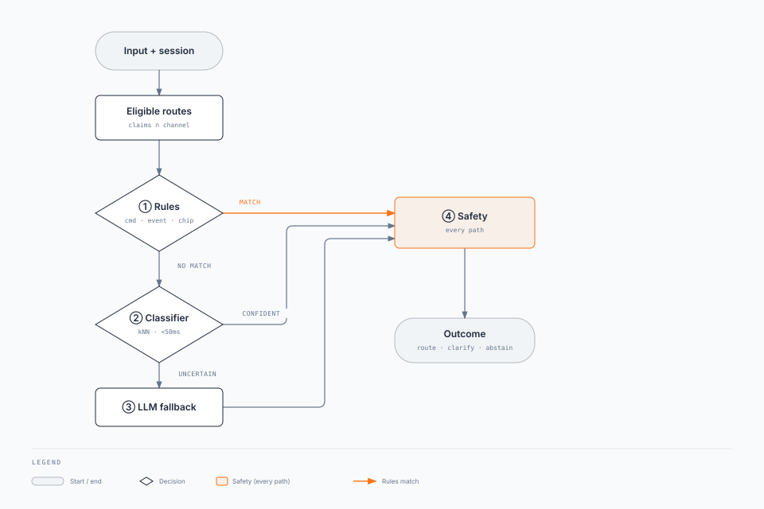

import Details from '@theme/Details';

# Agent Plane (AP)

Parent: [Enterprise Agent Fabric](/intent/enterprise-agent-fabric) · Sibling: [Agent Front Door](/intent/enterprise-agent-fabric/agent-front-door) · [Agent Runtime](/intent/enterprise-agent-fabric/agent-runtime) · [Agent Capability Registry](/intent/enterprise-agent-fabric/agent-capability-registry)

**One plane per trust domain. Two boxes inside it. Does not do the work.**

[Agent Front Door](/intent/enterprise-agent-fabric/agent-front-door) **calls** the **Agent Data Plane** (catalogue + classify). **ACP** is the sibling **control** box (policy, versions, decision audit). Neither box pins. Neither box starts NAR. Playbooks still put the pin on the ACP. Treat this page as the proposal until they catch up.

How-to: [Layered classifier](/playbooks/agents/intent-router/layered-classifier) · [Route contract reference](/playbooks/agents/intent-router/route-contract-reference).

---

## 1. Two boxes

| Box | Owns | Does not own | Scale unit | If it dies |
| --- | --- | --- | --- | --- |
| **Agent Control Plane (ACP)** | Policy, versions, decision audit | Pin, start, loop, AFD hot-path classify | Stateless replicas | Audit lags; in-flight runs continue |
| **Agent Data Plane** | Eligible set, classify, route/workflow catalogue. Called by Agent Front Door | Pin, start, loop | Versioned table + decide replicas | Classify fails closed |
| **Decision audit** | Async `router_layer`, `outcome`, `eligible_routes` | Chat transcript | Independent queue | Decide still succeeds |

| Layer | Count | Why |
| --- | --- | --- |
| **Agent Plane** | One per trust domain | Same eligible set, entitlements, eval, audit |
| **Agent Control Plane (ACP)** | One inside that plane | Control + decision record |
| **Agent Data Plane** | One inside that plane | Route/workflow catalogue + classify |

Agent Plane and NAR are not public URLs. Only the two AFDs call decide.

### Three routers (do not collapse)

| Router | Question | Who calls it |
| --- | --- | --- |
| **Agent Data Plane** | Which workflow / manifest / app? | Agent Front Door (Chat AFD or API AFD) |
| **Agent planner** (inside NAR) | Which tool / step next? | NAR |
| **Model router** | Which LLM endpoint for this inference? | NAR |

### Data this plane owns

| Record | Who writes it | Lives where | Job |
| --- | --- | --- | --- |
| **Decision** | Agent Control Plane (ACP) | Audit store | Why this turn routed, clarified, or abstained |
| **Route/workflow catalogue** | Platform / domain teams | Agent Data Plane | Versioned rows the data plane classifies over. Includes `agent_client_id` per row. Field dictionary: [Route contract reference](/playbooks/agents/intent-router/route-contract-reference). |

Frozen route/session is on the [AFD](/intent/enterprise-agent-fabric/agent-front-door#frozen-route-session). Run pin is on [NAR](/intent/enterprise-agent-fabric/agent-runtime).

---

## 2. Classify

The Agent Data Plane **classifies**. Agent Front Door **calls it**, then **freezes and starts**. NAR **runs**. `202` comes from NAR, not from the data plane.

**Decide =** active table ∩ `required_claims` ∩ channel. Explicit `route_id` still looks up, entitles, and records.

Outcomes: `route`, `clarify`, `abstain`. Only `route` starts NAR. Jobs with no user fail closed or `escalate_human`.

Classification runs only over eligible routes. Cheap layers first, safety on every path. The jobs API skips Layer ② / ③. It does not skip eligible, safety, or the decision record.

<div className="gain-diagram-wrap">



</div>

Pipeline: [Layered classifier](/playbooks/agents/intent-router/layered-classifier). Catalogue: [Agents Blueprint](/blueprints/agents-blueprint) · [Route contract reference](/playbooks/agents/intent-router/route-contract-reference).

| Layer | Who sees it | Contents |
| --- | --- | --- |
| **ACP decision** | AFD | `outcome`, and on `route` only: `route_id`, `intent_label`, `route_table_version`, `confidence` |
| **Decision record** | ACP / ops / eval | Full trace: `intent_label`, `route_id`, `confidence`, `router_layer`, `eligible_routes`, `safety_flags`, `outcome`, `latency_ms`, `route_table_version` |

Chat/UI never sees `route_id`, `run_id`, `confidence`, or `router_layer`. Decision record is server-side (FR-5).

---

## 3. APIs {#apis}

Module or internal RPC. Agent Front Door is the only caller. Classify and entitle against the route/workflow catalogue. Do **not** pin. Do **not** start NAR. Do **not** mint `correlation_id`.

JSON examples are collapsed.

| Box | Public / channel | Internal |
| --- | --- | --- |
| **Agent Control Plane (ACP)** | None. Not OpenAPI, not API keys | Control / audit. Not the AFD ASK |
| **Agent Data Plane** | None | Decide and eligible: Agent Front Door only. Catalogue row at `route_table_version`: NAR after start (and AFD if it needs `activation_target` to pick the NAR) |

| Method | Path | When / response |
| --- | --- | --- |
| `POST` | `/internal/intent/decide` | Every new decide. Chat: message + claims + `session_id`. Jobs API: explicit `route_id` + claims. Hint tap or clarify pick: `route_id` as Layer ①. Returns `route`, `clarify`, or `abstain`. Writes the decision record async |
| `GET` | `/internal/intent/eligible` | UI hints. Chat-visible ∩ claims ∩ channel. Event-only rows omitted |
| `GET` | `/internal/catalog/routes/{route_id}` | After `outcome=route` only. Row **pointers** at `route_table_version` (`activation_target`, manifest, policy, model, memory). Not the authored blob the UI must never see. **NAR** reads this after start. AFD may read `activation_target` so it knows which NAR to `POST` |

Chat with a frozen route/session and a continuation **does not** call decide.

<Details summary="Decide request: chat vs jobs (JSON)">

```json
{
  "ingress": "chat",
  "channel": "web",
  "session_id": "sess-88",
  "message": "Why was I charged $42?",
  "route_id": null,
  "claims": {
    "sub": "jane",
    "emts": { "accounts:read": true }
  }
}
```

```json
{
  "ingress": "jobs",
  "channel": "api",
  "route_id": "contract_review",
  "claims": {
    "sub": "svc-legal-jobs",
    "emts": { "legal:msa_review": true }
  }
}
```

</Details>

<Details summary="Decide response: route vs clarify (JSON)">

On `route`, commits are filled. On `clarify`, those commits are null. `candidates[]` are options. `eligible_routes` is the entitlement set (may be larger than candidates). The jobs API never returns `clarify`.

```json
{
  "outcome": "route",
  "intent_label": "fee_explain",
  "route_id": "fee_explain",
  "route_table_version": "2026.08.1",
  "confidence": 0.91,
  "eligible_routes": ["fee_explain", "account_history", "policy_qa"]
}
```

```json
{
  "outcome": "clarify",
  "intent_label": null,
  "route_id": null,
  "route_table_version": null,
  "confidence": null,
  "clarify_prompt": "Did you want a fee explanation or recent transactions?",
  "candidates": [
    {
      "intent_label": "fee_explain",
      "route_id": "fee_explain",
      "confidence": 0.62,
      "label": "Explain a fee"
    },
    {
      "intent_label": "account_history",
      "route_id": "account_history",
      "confidence": 0.58,
      "label": "Show recent transactions"
    }
  ],
  "eligible_routes": ["fee_explain", "account_history", "policy_qa"]
}
```

</Details>

AFD channel APIs and the call map: [Agent Front Door](/intent/enterprise-agent-fabric/agent-front-door#apis).

---

## 4. Scaling {#scaling}

Scale Chat AFD, API AFD, and Agent Plane as three fleets. Decide must not wait on a 12-step loop. Numbers: [Enterprise Agent Fabric §3](/intent/enterprise-agent-fabric#nfrs).

| Axis | Grows with | Does not grow with | Scale signal |
| --- | --- | --- | --- |
| **Agent Control Plane (ACP)** | New decide RPS (Layer ①-②) | Open SSE sockets, loop length | Decide RPS + Layer ② latency |
| **Agent Data Plane** | Catalogue reads at pinned version | Tokens in the loop | Version bump, not turn rate |
| **Decision audit** | Decide RPS (async) | Decide p99 | Queue depth. Lag is OK |

### Agent Control Plane (ACP)

Stateless replicas. AFD is the only caller. No session affinity.

**Hot path.** In-memory catalogue ∩ claims ∩ channel, then Layer ①, then Layer ② (&lt;50ms). Scale on Layer ② CPU, not SSE.

**Catalogue.** Whole eligible set in replica memory (Agent Data Plane). Unreadable: fail closed.

**Layer ③.** Separate pool. If saturated, `clarify` / `abstain`, not a slower ACP.

**Audit.** Async. Decide SLO does not include "audit committed."

**Jobs vs chat.** Explicit `route_id` still entitles and records. Provision classifier capacity from chat decide RPS.

### What saturates first (this domain)

Working order at hundreds of turns/s:

1. UI SSE connections on Chat AFD.
2. Layer ② CPU on ACP for free-text chat.
3. Start-ack to a hot `activation_target`.
4. Frozen-route/session KV (unlikely at this size).
5. Layer ③ only if you put it on the hot path. Do not.

AFD and NAR scale: [Agent Front Door](/intent/enterprise-agent-fabric/agent-front-door#scaling) · [Agent Runtime](/intent/enterprise-agent-fabric/agent-runtime#scaling). Fabric isolation: [Enterprise Agent Fabric](/intent/enterprise-agent-fabric#isolation-and-shed).

---

## Read next

**[Agent Runtime](/intent/enterprise-agent-fabric/agent-runtime)** · [Agent Capability Registry](/intent/enterprise-agent-fabric/agent-capability-registry) · [Agent Front Door](/intent/enterprise-agent-fabric/agent-front-door) · [Layered classifier](/playbooks/agents/intent-router/layered-classifier) · [Routing eval CI](/playbooks/agents/intent-router/routing-eval-ci)
