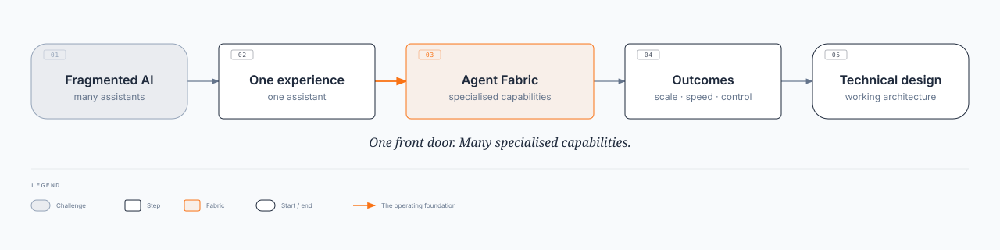

# Enterprise Agent Fabric V1

**One governed front door for enterprise AI**

Technical design: [Enterprise Agent Fabric](/intent/enterprise-agent-fabric) · **Status:** Draft · **Date:** 2026-08-20

---

## The proposition

As organisations move from a few assistants to hundreds of specialised agents, the hard problem is no longer building agents. It is operating them as one enterprise capability, with **one front door** and specialised agents behind it.

- How does someone reach the **right** AI capability?
- How do we limit them to what they are **entitled** to use?
- How do we stop every team building its own AI gateway?
- How do we add agents without another pile of disconnected apps?
- How do we show that AI decisions and actions are **controlled, auditable, and safe**?

---

## The problem

AI capabilities appear independently (Finance, HR, Legal, Customer Service, Payments, Claims, and more). Users must know which assistant to open. Systems must know which capability to call. Teams rebuild auth, routing, security, and monitoring each time. The organisation loses a single answer to who may use which capability, what it may do, and why it was selected.

---

## The vision

One front door. Many specialised capabilities. One set of enterprise controls. Users and systems should not have to understand the AI landscape. They hit one entry point; the platform connects them to the right capability.

The front door answers:

- Who is asking, and what they want to accomplish
- Which capability is appropriate, and whether they are entitled
- What that capability is allowed to do
- How the interaction is monitored and governed

> **Users interact with the enterprise AI capability, not with individual agents.**

---

## What the business gets

People ask for what they need. The platform picks the capability. A new agent is added behind the front door instead of launched as another standalone app: from "build another AI application" to "add another governed AI capability."

- **Today:** Employee → Finance / HR / Legal / Payments assistants
- **Future:** Employee → **Enterprise AI Front Door** → the right capability
- **Controls in the operating model:** entitlement, permissions, approved actions, data access, human approval, monitoring, audit
- **Least-privilege AI:** the person, the capability, and the executing platform are three different questions. User access does not grant the AI unlimited access.

---

## How it works

Think of the Fabric as an **airport for AI**.

- **Front Door:** one trusted entry. Establish who they are and what they are asking.
- **Decision layer:** pick the capability and check entitlement. Clarify if ambiguous. Stop if not permitted.
- **AI capability:** specialised agent does the work with approved data, knowledge, and services.
- **Enterprise controls:** security, permissions, monitoring, and governance stay on for the whole path.
- **Outcome:** the user gets the result without knowing which capability ran.

---

## What this is not

This is **not one giant agent** with access to every business capability.

- One enterprise experience, many specialised and governed capabilities behind it
- Customer Service, Payments, Fraud, Legal, HR, Finance, Operations, Technology
- Each capability evolves on its own, inside the same framework

---

## Why the platform matters

Without a common platform, every domain rebuilds authentication, selection, permissions, integration, monitoring, audit, risk, and resilience. That is duplication and inconsistent control. The Fabric builds those once and reuses them.

- **From:** many AI applications with duplicated controls
- **To:** one enterprise AI platform, reusable controls, specialised capabilities

Conversational load and automated job bursts should not share one pool. **A problem in one capability should not take down the whole enterprise AI experience.**

---

## Governance you can show

As AI moves from answering questions to taking actions, every interaction should be able to show:

- Who asked, which capability ran, and why it was selected
- Whether the user was entitled, and which version was used
- What the AI did, which approvals were required, and which controls applied

---

## Operating model

Business teams innovate without reinventing the platform.

- **Enterprise platform:** front door, security, governance, monitoring, standards, reliability
- **Domain teams:** specialised capabilities (Finance, Legal, HR, Customer, Payments, and others)
- **Risk and governance:** independent oversight of use cases, AI risk, controls, evidence, and compliance

---

## Strategic value

| Outcome | Business value |
| --- | --- |
| **One AI experience** | Simpler employee and customer interaction |
| **Reusable platform** | Faster deployment of new capabilities |
| **Consistent controls** | Lower security and operational risk |
| **Specialised capabilities** | Better domain outcomes than one generic agent |
| **Enterprise visibility** | Clear accountability and auditability |

**End state:** one experience for users, one entry point for applications, specialised capabilities for domains, one control model for risk, one foundation for technology.

---

## The story

---

## Takeaway

The Enterprise Agent Fabric is the **operating foundation** for enterprise AI: from isolated experiments to a connected portfolio of governed capabilities. Scale AI without scaling fragmentation, risk, and complexity at the same rate.

- One front door for enterprise AI
- Many specialised capabilities behind it
- Consistent security, governance, and accountability across all of them

**[Technical design](/intent/enterprise-agent-fabric)** · [Agent Front Door](/intent/enterprise-agent-fabric/agent-front-door) · [Agent Plane](/intent/enterprise-agent-fabric/agent-plane) · [Agent Runtime](/intent/enterprise-agent-fabric/agent-runtime) · [Agent Capability Registry](/intent/enterprise-agent-fabric/agent-capability-registry)
