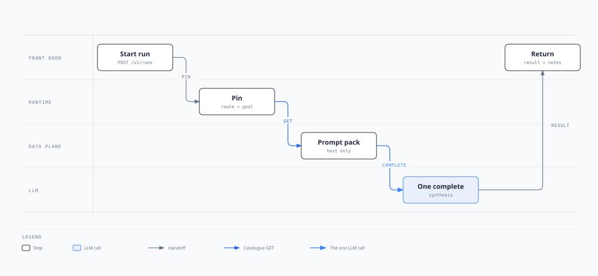

# Single inference (Pattern 0)

Nobody picks the next step. The route points at a **prompt pack** only. Runtime makes **one LLM call** (`host` as a single `synthesis` node) and returns the completion.

No tools. No workflow. No `CALL` / `DONE`. No `retrieval.mode=tool`.

Optional rows around that call:

- **Prefetch** — `dataplane.retrieval` with `mode=deterministic_prefetch` and corpus ids in `scope`. The app packs those corpora **before** generate. The model does not search and cannot skip.
- **Memory** — `dataplane.memory_profiles` with `conversation=session` and `working=session`. The next turn sees prior utterances and scratch notes.

Jobs vs chat is ingress, not a composition. A job is one-shot by channel. Chat without a memory row is still a fresh one-shot each utterance (Front Door freeze may keep the route; it is not a transcript).

```
                 ┌─────────────┐
                 │  (optional) │
 request  ───►   │  prefetch   │  ───►  one LLM call  ───►  answer
                 │  corpora    │         (host prompt)
                 └─────────────┘
                        │
                 ┌─────────────┐
                 │  (optional) │
                 │  memory     │  ← prior turns / notes
                 └─────────────┘
```

## How it is hooked together

The route row has `autonomy_mode=0` and `prompt_id`. It has no `tool_manifest` and no `workflow_id`.

```
Front Door POST /v1/runs
        │
        ▼
   pin  route_id + route_version     goal ← job payload / chat utterance (immutable)
        │
        ▼
   hydrate  ADP GET prompt pack      agent-runtime/app/agents/hydrate.py
            one node: { id, llm_role: synthesis, llm_prompt: host, invoke: {} }
            no ACR GET — no tools
        │
        ▼
   graph    START → synthesis → END  build_tool_graph
            _run_stage: synthesis → llm.complete; empty invoke → skip HTTP
        │
        ▼
   attachments around that same node
            prefetch (optional): pack retrieval.scope before generate
            memory (optional): extra lines in the user blob
```

Jobs vs chat is ingress only: same pin, same node, same call. Data that moves: the LLM reads `goal` plus `notes`. The completion is `result` and is appended to `notes`. Nothing POSTs a domain API. See [data](../02-understand/data.md).

This Runtime: prefetch does not POST corpora; `conversation=session` has no transcript store. Gaps: [status](../02-understand/status.md). How this binary hydrates: [patterns](../02-understand/patterns.md).

## Swimlane



Front Door starts. Runtime pins. Data Plane returns the pack. Runtime makes **one** synthesis call. [Open as a page](diagrams/pattern-0-swimlane.html).

## How the LLM is called

Exactly **one** `llm.complete(system, user)` in `_run_stage` (`agent-runtime/app/graph/workflow.py`). Never `CALL` / `DONE`. Never a second generate.

| Message | Source |
| --- | --- |
| **system** | Node `llm_prompt` = pack `host`. If `host` is empty, hydrate falls back to the first `by_llm_role` text. |
| **user** | `_user_blob`: `goal: {…}` then, when `notes` exist, `prior stage outputs:` one line each. Prefetch chunks and memory lines are intended to land here **before** this call. |

`llm_role=synthesis` skips HTTP even if a url were present. Pattern 0 also has empty `invoke`, so there is no domain POST. Prefetch is packing around this call, not a retrieve tool. Memory is extra **user** lines, not a second node. Prompt packs: [prompts](../02-understand/prompts.md).

Four compositions. Same graph. Two optional rows.

| # | Prefetch | Memory | Product | Seed illustration |
| --- | --- | --- | --- | --- |
| 1 | no | no | Prompt only | `email_summarize`, `agent-chat` |
| 2 | yes | no | Grounded one-shot | `agent-policy-qa` |
| 3 | no | yes | Multi-turn, no index | `chat_session` |
| 4 | yes | yes | Grounded multi-turn | `policy_chat` |

Escalate to [autonomous](autonomous.md) when the model must **choose** a tool. Escalate to [deterministic](deterministic.md) when you want a **fixed stage list** (several LLM stages, or prefetch as an explicit `none` stage then `synthesis`).

---

## 1. Prompt only

**Prefetch: no. Memory: no.**

The LLM sees the prompt pack `host` plus this request’s `goal`. Nothing is fetched. Nothing is remembered.

**Possible behaviour**

- Jobs: POST once with the whole task in the payload (email body, pasted text). One completion. Done.
- Chat: each utterance is a new one-shot. Prior turns are not in the prompt.

**Use when** the whole task is in the payload: summarize, rewrite, classify, extract, translate, cheap intent labels.

**Do not** add a manifest, a workflow, or a retrieval row.

Seed: `email_summarize` (jobs: `email_id`, `text`), `agent-chat` (chat: `message`).

---

## 2. Prompt + prefetch

**Prefetch: yes. Memory: no.**

Same one LLM call. Before generate, pack every corpus in `retrieval.scope`. The model must answer from those chunks and cite chunk ids. It never chooses a retrieve tool. If it could skip search, this would be Pattern 1.

**Possible behaviour**

1. Resolve each corpus id to a published gateway.
2. POST the gateway (one call per id, then merge).
3. Pack chunks into the generate prompt (and optionally into `working` for this call only).
4. One completion.

**Stateless on purpose.** “What is the overdraft fee?” and a later “what about for students?” are two independent grounded Q&As. Turn 2 does not know turn 1.

**Use when** the answer must be grounded and the user is not continuing a thread.

**Do not** put a retrieve capability on a manifest. Pattern 0 has no manifest.

Seed: `agent-policy-qa` — `deterministic_prefetch` over `policy-engine`, `product-faq`.

---

## 3. Prompt + memory

**Prefetch: no. Memory: yes.**

Same one LLM call. No index. Session policy injects history around the call.

**Possible behaviour**

- `conversation=session` — next utterance includes prior user/assistant text (Shared Memory, keyed by tenant/user/session).
- `working=session` — scratch notes from this run (packed fields, prior completions) reload on the next turn.
- Prove it: turn 1 “my account is acc-42”, turn 2 “what was my account id?”

Multi-turn chat is still Pattern 0. Nobody picks a tool. You inject history around the same single call.

**Use when** the product is a conversation over provided context, with no corpus and no tools.

`loop=checkpoint` and `long_term=retrieve_only` do not belong here: there is no tool loop, and there is no retrieve.

Seed: `chat_session`.

---

## 4. Prompt + prefetch + memory

**Prefetch: yes. Memory: yes.**

Same one LLM call, with both attachments: pack `scope` every turn (or reuse packed chunks in `working`), and keep the session.

**Possible behaviour**

Turn 1: “What’s the overdraft fee?” → pack policy → cited answer.  
Turn 2: “Does that apply to my student account?” → pack (or reuse) policy **and** see that turn 1 was about overdraft.

Without prefetch this is composition 3 (chatty, ungrounded). Without memory this is composition 2 (grounded, amnesiac). This row is grounded **and** sticky.

**Use when** grounded Q&A must follow up.

Seed: `policy_chat` — prefetch `policy-engine` plus `conversation`/`working`.

---

## Not single inference

| Shape | Where it lives |
| --- | --- |
| Several LLM stages in a fixed order, still no tools | [deterministic](deterministic.md) LLM-only (`llm_pipeline`, `policy_memo`) |
| Model chooses a retrieve or domain tool | [autonomous](autonomous.md) |
| Fixed stages, model chooses tools inside a stage | [guided](guided.md) |
