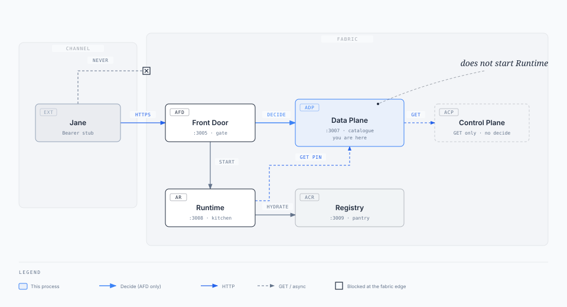
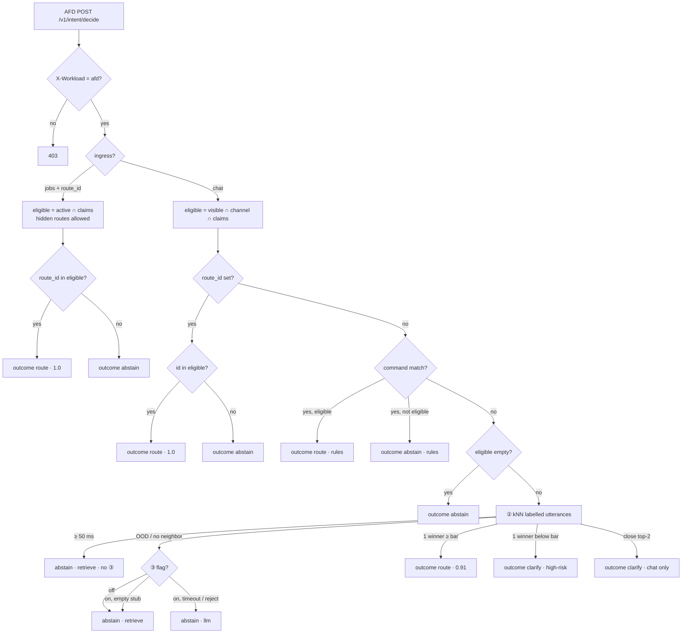

# Agent Data Plane

**This box does not run agents. It names them.**

Front Door is the door. Runtime is the kitchen. Registry is the pantry. **Data Plane is the menu** — versioned, entitled, and the only place that answers *which route is this turn?*

Channels never dial this process. Jane talks to Front Door. Front Door (and, after a pin, Runtime / Control Plane) talks to **:3007**.

## Job

Own the versioned catalogue and classify/entitle (`POST /v1/intent/decide`). Return `route` / `clarify` / `abstain`. Do **not** start Runtime, store decision audit, or hydrate tool schemas.

## Port / stack

| | |
| --- | --- |
| Port | **3007** |
| Stack | Java 21, Spring Boot 3.5, Flyway |
| Database | `adp` (schema `dataplane`) |
| Compose | `agent-data-plane` |
| Auth | Workload only. `Authorization: Bearer fabric-internal` + `X-Workload` |
| Decide caller | **`afd` only.** Anyone else → **403**. Channel bearer → **401**. |

Docs map: [docs/README.md](../../agent-fabric-docs/README.md). Frozen decide bodies: [docs/05-reference/](../../agent-fabric-docs/05-reference/README.md). Box pack (may be ahead of this binary): [docs/04-architecture/agent-plane.mdx](../../agent-fabric-docs/04-architecture/agent-plane.mdx). Intent track: [agent-fabric-docs/tasks/intent-plan.md](../../agent-fabric-docs/tasks/intent-plan.md) (Layer ③ **on** is [I12 future enhancement](../../agent-fabric-docs/tasks/future-enhancement.md#i12-layer-3-llm-fallback)).

---

## You are here



Jane never dials this process. Front Door is the only decide caller. Runtime and Control Plane may GET rows. Data Plane does not start Runtime.

A down catalogue **fails closed** (no new starts). A down Runtime does not stop classify.

---

## What it owns

1. **Catalogue** — routes, manifests, prompt packs, workflows, corpora. Pointers and policy. Not tool schemas (Registry). Not memories (Runtime / stores the route names).
2. **Decide** — active ∩ claims ∩ channel, then either bind a named `route_id` or retrieve-classify the utterance.
3. **Eligible chips** — chat-visible routes the identity may see.

Three outcomes. Only **`route`** is startable, and **Front Door** starts Runtime.

| Outcome | Meaning | Jobs? |
| --- | --- | --- |
| `route` | Bind this `route_id` @ `route_version` | Yes, if entitled |
| `clarify` | Close top-2 retrieve neighbors, or a unique hit below the route's risk bar. Ask Jane. | **Never** |
| `abstain` | No eligible row, or no retrieve neighbor, or named id not entitled | Fail closed |

### How decide actually chooses

The tree below runs **only when Front Door POSTs decide** (first chat turn, hint/clarify pick, jobs). A live freeze never reaches this process.


Non-`afd` is rejected before this tree (403). Chat with a named `route_id` binds inside eligible — same entitle shape as jobs, omitted on the drawing.

Keywords on a route row are **not** scored. Layer ② retrieves over labelled seed utterances (`retrieve/utterances.json`). Whole-token tokenize so `"hi"` does not steal `"this"`, while `"$42"` still hits `"42"`.

#### Chat vs jobs

Decide never creates a route. It **binds one catalogue row** (`route_id` @ `route_version`) or it does not. `DecideService` prunes eligible, then ① rules → ② classifier (utterance kNN) → ③ LLM (**off**). First present result wins. Jobs stop after ①.

`router_layer` and `latency_ms` are on the **decide JSON to Front Door** and on decide events. Chat assistant JSON still omits them (**FR-5**). Front Door strips `route_id`, `run_id`, `agent_client_id`, `confidence`, and `router_layer`. Present vs remaining: [intent-plan.md](../../agent-fabric-docs/tasks/intent-plan.md).

| Layer | File | Today | You replace later |
| --- | --- | --- | --- |
| 0 prune | `DecideService.pruneEligible` | jobs: entitled active rows; chat: visible ∩ channel ∩ claims | keep |
| ① rules | `layers/RulesLayer.java` | named `route_id` bind / abstain; chat commands from `dataplane.intent_rules` (`/hr` → `agent-chat`) | topic maps (I6) |
| ② classifier | `layers/ClassifierLayer.java` | in-process kNN over labelled utterances + per-route risk bar; shed at 50 ms | small model later — do not train on `keywords[]` |
| ③ LLM | `layers/LlmFallbackLayer.java` + `LlmFallbackPool.java` | **off**; 2-thread pool, 500 ms timeout, no queue | structured JSON over eligible ids (I12) |

| | Chat | Jobs |
| --- | --- | --- |
| Ingress | `chat` | `jobs` |
| Eligible | active ∩ `chat_visible` ∩ channel ∩ claims | active ∩ claims (**hidden OK**) |
| Named `route_id` | Chip tap: bind inside eligible, or abstain | Always: bind if entitled, else abstain |
| Chat command (`/hr`) | First matching `intent_rules` row, eligible only | **Never** (body slash is ignored) |
| Free text | kNN over labelled utterances, then the winner's risk bar | **Never** (no ② / ③) |
| `clarify` | Close top-2, or unique hit below the bar (ask Jane) | **Never** |
| Confidence on `route` | `1.0` named · `0.91` retrieve if ≥ bar | `1.0` |



Layer ② confidence is still `0.91` for a unique retrieve winner. The **bar** is per `policy_profile` (`RouteRow.riskClass()`):

| `policy_profile` | Risk | Unique-route bar | Unique retrieve (`0.91`) |
| --- | --- | --- | --- |
| `low_risk_chat` | low | `0.60` | `route` |
| `read_only_standard` | mid | `0.85` | `route` (`fee_explain` / `$42`) |
| `high_risk_step_up` | high | `0.95` | `clarify` (freeze / pay / KYC writes) |

Ties still `clarify` regardless of risk. Jobs never reach ②.

Layer ② budget is **50 ms** (`DecideService.LAYER_TWO_BUDGET_MS`). If retrieve takes 50 ms or more, decide returns `abstain` with `router_layer=retrieve` and does **not** call ③ to finish the turn. `latency_ms` is still the whole decide.

Layer ③ is **off** (`fabric.decide.llm.enabled`, env `FABRIC_DECIDE_LLM_ENABLED`, default `false`). Decide does not HTTP a model and does not start Runtime to classify. When the flag is on, ③ runs on a 2-thread pool with **no queue** (`LlmFallbackPool`) and a **500 ms** deadline (`fabric.decide.llm.timeout-ms`, env `FABRIC_DECIDE_LLM_TIMEOUT_MS`). Timeout or rejection returns `abstain` with `router_layer=llm` and does not retry. Flag off and jobs never submit to that pool. The live JSON call is I12.

Only **`route`** is startable. Front Door freezes that pin and starts Runtime. This binary does **not** pin, start Runtime, mint `correlation_id`, store transcripts, or serve a decision-audit API (`GET /v1/decisions` is 404 on purpose).

#### Session stickiness is Front Door, not decide

Playbook Layer ① includes stay-on-pin (`"yes"` / `"$500"`). This fabric already does that in **Front Door freeze**: a live `session_id` with a `correlation_id` **does not call decide**. Follow-ups resume the run (`AssistantService` → Runtime turns). TTL miss uses Runtime `GET /v1/runs?session_id=`, still without decide.

Data Plane never reads `frontdoor.freeze`. Decide-side continuation re-entitle is **out** until a seed case needs `"yes"` / `"$500"` to re-entitle without a new contest. Source: [intent-plan.md](../../agent-fabric-docs/tasks/intent-plan.md) session stickiness. I4–I12 must not copy freeze into `DecideService`.

---

## Business events

Data Plane emits ingress-prefixed intent outcomes from `DecideService` after the outcome is known (`BusinessEvents.emit`). Not Kafka. No utterance, tokens, or claims.

| Event | When |
| --- | --- |
| `chat.intent.routed` / `job.intent.routed` | Outcome is `route` |
| `chat.intent.clarified` / `job.intent.clarified` | Outcome is `clarify` |
| `chat.intent.abstained` / `job.intent.abstained` | Outcome is `abstain` |

Chat/jobs start, hydrate, and run complete are Front Door and Runtime, not this box. Same Event / When layout: [Front Door](../../agent-fabric-front-door/README.md#business-events). Full journey: [root README — Business events](../../README.md#business-events).

---

## Auth

Every path except `GET /health`:

```http
Authorization: Bearer fabric-internal
X-Workload: afd
```

`X-Workload` is one of `afd` · `adp` · `acp` · `ar` · `acr`. Anything else, or a channel `Bearer stub`, is **401**.

| Caller | `X-Workload` | Decide | Catalogue GET | Eligible |
| --- | --- | --- | --- | --- |
| Front Door | `afd` | yes | yes | yes |
| Control Plane | `acp` | **403** | yes | yes |
| Runtime | `ar` | **403** | yes (pinned row) | yes |
| Registry / self | `acr` / `adp` | **403** | yes | yes |

Eligible also reads **`X-Stub-Claims`** (JSON). Decide reads **`claims` in the JSON body**. Same shape:

```json
{ "sub": "jane", "emts": { "accounts:read": true } }
```

Only `emts` keys whose value is `true` count. Missing header / body → empty entitlements → empty eligible / abstain.

Optional: send `X-Request-Id`; this process echoes it (or mints `req-…`).

---

## APIs

Base: `http://localhost:3007`. All catalogue list endpoints default to the **live** cut. Pass `?include=all` to see drafts, retired, and every version.

### Health

| Method | Path | Auth | Response |
| --- | --- | --- | --- |
| `GET` | `/health` | none | `{"status":"UP"}` |

### Intent

| Method | Path | Who | What |
| --- | --- | --- | --- |
| `POST` | `/v1/intent/decide` | **`afd` only** | Classify or entitle. Body below. |
| `GET` | `/v1/intent/eligible?channel=web` | any workload | Chat-visible ∩ channel ∩ `X-Stub-Claims`. Default channel `web`. |

#### `POST /v1/intent/decide`

Chat ([frozen](../../agent-fabric-docs/05-reference/decide-chat-request.json)):

```json
{
  "ingress": "chat",
  "channel": "web",
  "session_id": "sess-88",
  "message": "Why was I charged $42?",
  "route_id": null,
  "claims": { "sub": "jane", "emts": { "accounts:read": true } }
}
```

Jobs ([frozen](../../agent-fabric-docs/05-reference/decide-jobs-route.json)): `ingress: "jobs"`, `route_id` set, `message` null. Still entitle. Never `clarify`.

| Field (response) | `route` | `clarify` | `abstain` |
| --- | --- | --- | --- |
| `outcome` | `"route"` | `"clarify"` | `"abstain"` |
| `intent_label` | from row | null | null |
| `route_id` / `route_version` | bound | null | null |
| `confidence` | `1.0` jobs / `0.91` chat (unique retrieve ≥ bar) | null | null |
| `eligible_routes` | ids considered | ids considered | ids considered (maybe `[]`) |
| `clarify_prompt` | omitted | string | omitted |
| `candidates` | omitted | up to 2 `{intent_label,route_id,confidence,label}` | omitted |
| `router_layer` | `rules` / `retrieve` / `llm` (omit when eligible is empty) | same | same |
| `latency_ms` | whole decide | whole decide | whole decide |

These two fields are for AFD and operators. They must not appear on chat JSON (FR-5).

### Catalogue — routes

| Method | Path | Default |
| --- | --- | --- |
| `GET` | `/v1/catalog/routes` | **Active** rows (`?include=all` → every version) |
| `GET` | `/v1/catalog/routes/{routeId}` | Active row. Pin with `?route_version=2026.08.1` |
| `GET` | `/v1/catalog/routes/{routeId}/versions` | `{ "route_id", "versions": [ … ] }` |

Route body (pointers, not blobs): `route_id`, `route_version`, `active`, `status`, `intent_label`, `autonomy_mode`, `description`, `activation_target`, `agent_client_id`, `tool_manifest` + version, nested `manifest`, `policy_profile`, `model_profile`, `retrieval`, `memory_profile`, `workflow_id`, `prompt_id`, `output_schema_id`, `eval_suite_id`, `max_loop_steps`, `fallback`, `required_claims`, `channels`, `chat_visible`.

`retrieval` is omitted when mode is blank / `none` / `omit`.

### Catalogue — manifests, prompts, workflows

Same four-shape on each resource. List = latest (manifests, workflows) or **published** (prompts). `?include=all` lists every version.

| Resource | List | Latest / published | All versions | One version |
| --- | --- | --- | --- | --- |
| Manifests | `GET /v1/catalog/manifests` | `GET /v1/catalog/manifests/{id}` | `…/{id}/versions` | `…/{id}/versions/{version}` |
| Prompts | `GET /v1/catalog/prompts` | `GET /v1/catalog/prompts/{id}` | `…/{id}/versions` | `…/{id}/versions/{version}` |
| Workflows | `GET /v1/catalog/workflows` | `GET /v1/catalog/workflows/{id}` | `…/{id}/versions` | `…/{id}/versions/{version}` |

Wrappers: `{ "manifests": […] }`, `{ "prompts": […] }`, `{ "workflows": […] }`. Version lists: `{ "manifest_id"|"prompt_id"|"workflow_id", "versions": […] }`.

| Resource | Body highlights |
| --- | --- |
| Manifest | `manifest_id`, `manifest_version`, `description`, `status`, `tools[]` (`name`, `capability_id`, `capability_version`, `pdp_action`, `risk_tier`) |
| Prompt | `prompt_id`, `prompt_version`, `host`, `status`, `owner`, `by_llm_role` (`{llm_role: {task_type, text}}`). One pack per `prompt_id`. Runtime sends **one** system string per LLM step: role `text` if present, else `host` — not both. `task_type` is not sent. |
| Workflow | `workflow_id`, `workflow_version`, `description`, `status`, `stages[]` (`id`, `tool`, `type`, `llm_role`, `corpus`, `side_effect`, `requires_approval`, `branch`, `allowlist`, `max_tool_calls`) |

Prompt `GET /{id}` prefers the latest **published** pack, then any version. Manifest/workflow `GET /{id}` is the latest version on file.

### Catalogue — corpora

No version path. One row per index. Runtime looks up each `retrieval.scope` id, then POSTs `url`.

| Method | Path |
| --- | --- |
| `GET` | `/v1/catalog/corpora` (published; `?include=all` for drafts) |
| `GET` | `/v1/catalog/corpora/{corpusId}` |

Body: `corpus_id`, `display_name`, `url`, `collection`, `auth`, `owner`, `status`, `region`, `updated_at`.

Each row’s `url` is an independent POST target (shared gateways like `/v1/search/legal` or dedicated `/corpora/{corpus_id}/search`). Local seed uses three shared hosts plus per-corpus paths on agent-fabric-mocks; browse values at Control Plane `http://localhost:3006/corpora`. Override by updating `dataplane.corpora.url` or re-running `create-seed-data.sql` (includes `UPDATE` for Flyway baseline rows).

### Errors

| Status | When |
| --- | --- |
| **401** | Missing/wrong bearer or `X-Workload` |
| **403** | Non-`afd` posted decide |
| **404** | Unknown id/version `{ "error": { "code": "NOT_FOUND", "message": "…" } }` |

Unknown jobs `route_id` is **200 `abstain`**, not 404. Catalogue miss is 404.

---

## Contracts

- [`agent-fabric-docs/05-reference/decide-chat-request.json`](../../agent-fabric-docs/05-reference/decide-chat-request.json)
- [`agent-fabric-docs/05-reference/decide-chat-route.json`](../../agent-fabric-docs/05-reference/decide-chat-route.json)
- [`agent-fabric-docs/05-reference/decide-jobs-route.json`](../../agent-fabric-docs/05-reference/decide-jobs-route.json)
- [`agent-fabric-docs/05-reference/stub-auth.md`](../../agent-fabric-docs/05-reference/stub-auth.md)

## Tables / schema

Flyway on `adp` creates schema `dataplane`. Catalogue tables only — routes, memory profiles, retrieval, corpora, prompt packs, workflows, intent rules, and related pointers. **No** `decisions` / audit table and **no** `GET`/`POST /v1/decisions`.

Operational seed: `./agent-fabric-scripts/stack/add-seed-data.sh`. Pin lint / routing evals use in-memory twins of that seed.

## Sibling calls

| Direction | Who | Notes |
| --- | --- | --- |
| In | Front Door (`afd`) | Decide + catalogue GET + eligible |
| In | Runtime (`ar`) | Catalogue GET for pinned row / workflow / prompt / corpora — **not** decide |
| In | Control Plane (`acp`) | Eligible + catalogue GET — **not** decide (403) |
| Out | — | Does not call AR, ACR, or AFD |

---

## Curl (stack up)

```bash
HDR=(-H 'Authorization: Bearer fabric-internal' -H 'X-Workload: afd')

curl -sf localhost:3007/health && echo

curl -sf "${HDR[@]}" localhost:3007/v1/catalog/routes | jq '.routes[].route_id'

curl -sf "${HDR[@]}" \
  -H 'X-Stub-Claims: {"sub":"jane","emts":{"accounts:read":true}}' \
  'localhost:3007/v1/intent/eligible?channel=web'

curl -sf "${HDR[@]}" -H 'Content-Type: application/json' \
  -d '{"ingress":"chat","channel":"web","session_id":"sess-88","message":"Why was I charged $42?","route_id":null,"claims":{"sub":"jane","emts":{"accounts:read":true}}}' \
  localhost:3007/v1/intent/decide

curl -sf "${HDR[@]}" \
  'localhost:3007/v1/catalog/routes/fee_explain?route_version=2026.08.1'
```

Control Plane browse: same URLs, `X-Workload: acp`. Swap `afd` → `ar` on decide and watch **403**.

---

## Hexagonal layout

| Package | Role |
| --- | --- |
| `domain` | Rows, decide records, `NotFound` / `Forbidden`. No Spring. |
| `application` | Catalogue, decide, stores (ports) |
| `adapters.in.http` | Controllers, workload filter, stub claims |
| `adapters.out.jdbc` | Flyway-backed stores |

Tests seed **in-memory** twins of the stack route packs. Keep them aligned; `SeedCatalogueSqlTest` guards against Flyway accidentally re-seeding routes.

---

## Tests

Image build runs `mvn test`. No Compose required for unit tests:

```bash
mvn -q -B test
```

`RoutingEvalTest`, `JobsEntitleEvalTest`, and `CataloguePinLintTest` still run when their fixtures are present in the test classpath.

---

## Non-goals

- A public URL or channel `Bearer stub` on these APIs
- Pin, freeze, `correlation_id`, or `POST` to Runtime
- Copying `frontdoor.freeze` into decide / re-entitle on `"yes"` / `"$500"` (Front Door skip-classify owns that)
- Layer ③ LLM classify **on** ([I12 future enhancement](../../agent-fabric-docs/tasks/future-enhancement.md#i12-layer-3-llm-fallback); flag stays off)
- Decision audit store / `GET /v1/decisions`
- Hydrating tool schemas (Registry) or executing a workflow (Runtime)
- Serving Jane a `route_id` on the chat JSON (Front Door strips it)
