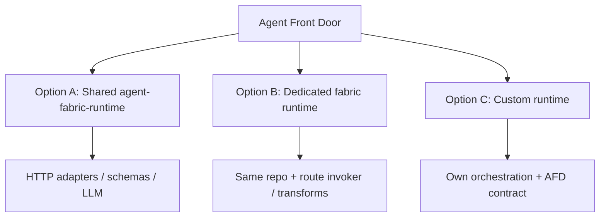

# Runtime options — deployment, transforms, and observability alignment

How domain teams can run work **after** Agent Front Door (AFD) has decided and pinned a route. Covers shared vs dedicated vs custom runtime, where transformations belong, and what to emit so **business events**, **audit**, and **OpenTelemetry** stay aligned.

**Related:** [technical-implementation.md](./technical-implementation.md) · [README.md](./README.md) · [agent-runtime architecture](../agent-fabric-docs/04-architecture/agent-runtime.md) · [audit plan](../agent-fabric-docs/tasks/audit-plan.md)

---

## 1. Two axes (do not confuse)

| Axis | Question | Catalogue field | Today |
| --- | --- | --- | --- |
| **Autonomy pattern 0–3** | *Inside a run*, who picks the next step? | `autonomy_mode` | Implemented — [`build_tool_graph`](./app/graph/workflow.py) / [`build_agent_loop`](./app/graph/workflow.py) |
| **Runtime deployment** | *Which box* executes this route? | `activation_target` | **Metadata only** — AFD uses fixed `RUNTIME_URL` |

Any autonomy mode can run on shared or dedicated runtime. Per-route AR is **deployment isolation**, not Pattern 4.

---

## 2. Three runtime models



### Option A — Shared runtime (default today)

| | |
| --- | --- |
| **What** | One `agent-runtime` deployment; all routes use [`agent-fabric-runtime`](./) |
| **Catalogue** | `activation_target: http://agent-runtime:3008/v1/runs` (stored; same URL for all seeds) |
| **AFD routing** | All HTTP to `RUNTIME_URL` ([`HttpRuntimeClient`](../../agent-fabric-front-door/src/main/java/com/fabric/afd/adapters/out/http/HttpRuntimeClient.java)) |
| **Custom code** | **None** per route in AR — transforms via adapters, schemas, or LLM |
| **When** | Demos, homogenous routes, small teams, simple integrations |

### Option B — Dedicated fabric runtime (intended future)

| | |
| --- | --- |
| **What** | Separate deploy of **same** `agent-fabric-runtime` codebase (e.g. `dispute-runtime`) |
| **Catalogue** | `activation_target: http://dispute-runtime:3008/v1/runs` |
| **AFD routing** | **Future:** POST/status/resume to freeze `activation_target` (not implemented today) |
| **Custom code** | Route package in **that image only** — wrapped [`ToolInvoker`](./app/tools/invoker.py), custom [`create_app()`](./app/api/app.py) wiring |
| **When** | Legacy glue, PCI/isolation, domain-owned release cadence, deterministic in-process maps |
| **Keeps** | Hydrate (ADP + ACR), patterns 0–3, pins, gates, audit helpers |

Example boot (conceptual):

```python
create_app(
    store=PersistentRunStore(engine()),
    tool_invoker=DisputeToolInvoker(base=HttpToolClient()),  # A→B map here
    ...
)
```

### Option C — Fully custom runtime

| | |
| --- | --- |
| **What** | Domain-owned service at `activation_target` URL |
| **Contract** | Must implement AFD run API (see [§5](#5-afd-run-contract-all-models)) |
| **Custom code** | Anything — own agent stack, LangGraph or not |
| **When** | Mature existing agent platform; only worth it if fabric AR is a poor fit |
| **You own** | Pin store, hydrate, patterns, subagent integration unless reimplemented |
| **You must still align** | Business events + audit envelope + OTel spans (see [§6–§8](#6-business-events-loki--metrics)) |

---

## 3. Per-route AR — today vs future

| Capability | Today | Future |
| --- | --- | --- |
| `activation_target` on catalogue / freeze / pin | Stored | Same |
| AFD POST to target URL | **No** — fixed `RUNTIME_URL` | Yes — dynamic from freeze |
| Status / turns / open-run to same target | **No** | Yes — run affinity via freeze |
| Multiple AR in Compose | One `agent-runtime` | N services / K8s deployments |
| Route-specific Python in AR | **No** (shared binary) | Yes on dedicated deploy (Option B) |

**Bottom line:** Per-route AR is **designed** in the data model but **not routed** yet. Dedicated deploy alone does not help until AFD uses `activation_target` as the HTTP base URL.

---

## 4. Transformations — where and how (by scenario)

Legacy services return fixed shapes; the next tool expects different fields. **Transformation is often required** — the choice is **where** it runs, not **whether** it happens.

### 4.1 Summary matrix

| Scenario | Option A (shared) | Option B (dedicated AR) | Option C (custom) | Generic AR map stage |
| --- | --- | --- | --- | --- |
| Field rename A→B, deterministic | Adapter or schema alignment | `ToolInvoker` wrapper | Your code | Future `input_map` / `stage_type: map` |
| Fuzzy mapping from utterance | LLM stage / Pattern 1 `CALL` | Same | Your LLM | LLM stage |
| Stable multi-field logic | Adapter or composite API | Route Python in invoker | Your code | Map stage or adapter |
| Legacy + no adapter control | LLM (non-deterministic) | **Dedicated AR** | Custom runtime | Adapter strongly preferred |
| PCI / isolation + transforms | Adapter (still shared AR) | **Dedicated AR** | Custom runtime | Per-route deploy |

### 4.2 Mechanisms in detail

#### Schema alignment (no transform layer)

- Tool A **`output_schema`** and tool B **`input_schema`** share field names.
- AR [`merge_http_payload()`](./app/graph/payload.py) copies matching keys from **`slots`** automatically.
- **Works on:** A, B (if schemas published accordingly).
- **Best for:** Greenfield capabilities you control.

#### HTTP adapter (recommended for shared runtime + legacy)

- ACR capability `invoke.url` → **your adapter**, not legacy API directly.
- Adapter calls legacy service, returns body shaped to `output_schema`.
- **Works on:** A, B, C (if custom runtime calls same capabilities).
- **Best for:** 90% of legacy integration on shared AR.

#### LLM middle stage (Pattern 2)

- Workflow stage with `llm_role: classify` / `query_formulation` / `synthesis`.
- Reads prior **`notes`** / **`slots`** via [`_user_blob()`](./app/graph/workflow.py).
- **Works on:** A, B (fabric runtime).
- **Best for:** Fuzzy transforms; avoid when audit requires deterministic mapping.

#### Pattern 1 — `CALL` with JSON args

- Autonomous loop: `CALL tool_b {"customer_id": "CUS-1"}` after prior tool in **notes**.
- Args merge via [`merge_http_payload(..., call_args)`](./app/graph/payload.py).
- **Works on:** A, B.
- **Best for:** Chat agents (ShopAssist-style).

#### Dedicated invoker transform (Option B)

- Subclass/wrap [`HttpToolClient`](./app/tools/invoker.py): map response before slot write or request before HTTP.
- **Works on:** B only (that deployment’s image).
- **Best for:** Deterministic legacy glue without polluting shared AR.

#### Composite domain API

- One capability does lookup + dispute in backend.
- **Works on:** A, B, C.
- **Best for:** A→B always used together.

#### Subagent (`kind=agent` + `join`)

- Child route owns sub-flow; [`project_child_goal()`](./app/graph/payload.py) passes subset of goal ∪ slots.
- **Works on:** A, B.
- **Best for:** Delegate to another pinned route, not simple field rename.

#### Platform map stage (not built)

- Future `stage_type: map` or `input_map` in workflow — declarative JSONPath/template.
- **Works on:** Future A/B.
- **Best for:** Many routes, many legacy shapes, cannot deploy adapters per tool.

### 4.3 Decision flow

```text
Can you deploy an adapter in front of legacy API?
  YES → adapter (Option A) — default
  NO  → Can you dedicate a fabric runtime image for this route?
          YES → Option B invoker wrapper (future: AFD routes to it)
          NO  → Is mapping deterministic?
                  YES → push for adapter or composite API
                  NO  → LLM stage (A/B) or fully custom runtime (C)
```

### 4.4 What is NOT possible today (shared AR)

| Need | Possible? |
| --- | --- |
| Route-private Python transform in shared binary | No |
| jq / template stage in graph | No |
| Invoker middleware from catalogue | No |
| Cross-stage field aliases without schema overlap | No (without LLM/CALL/adapter) |
| AFD routing to per-route `activation_target` | No |

---

## 5. AFD run contract (all models)

Any runtime at `activation_target` must satisfy what AFD expects. Reference: [`run-start.json`](../agent-fabric-docs/05-reference/run-start.json), [`HttpRuntimeClient`](../../agent-fabric-front-door/src/main/java/com/fabric/afd/adapters/out/http/HttpRuntimeClient.java).

### Ingress auth

```http
Authorization: Bearer fabric-internal
X-Workload: afd
```

Only AFD may call runtime (fabric AR also accepts other workloads on `/health` only paths — custom runtimes should match fabric policy).

### Endpoints

| Method | Path | Response |
| --- | --- | --- |
| `POST` | `/v1/runs` | **202** `{ "correlation_id" }` after pin durable (hydrate before 202 for fabric AR) |
| `GET` | `/v1/runs/{correlation_id}` | `{ "correlation_id", "status", "result"? }` |
| `POST` | `/v1/runs/{correlation_id}/turns` | Slim status after resume |
| `GET` | `/v1/runs?session_id=` | Open-run / session lookup |
| `GET` | `/health` | `{ "status": "UP" }` |

### Start body (fabric AR)

| Field | Required |
| --- | --- |
| `mode` | `"new"` |
| `idempotency_key`, `session_id` | Yes |
| `route_id`, `route_version` | Yes |
| `goal` | Yes (dict) |
| `activation_target`, `agent_client_id` | Stored on pin |
| `contract` | Optional manifest override |

Custom runtimes may skip hydrate if they resolve tools another way — but AFD still sends the same start shape; document deviations with platform owners.

---

## 6. Business events (Loki + metrics)

**Purpose:** Journey breadcrumbs for ops — **not** audit, not Kafka. Same contract across producers: structured log line (body = event name) + counter `fabric_journey_outcome_total`.

**Rules:** No utterance text, tokens, or claims in fields or metric labels. Use `session_id`, `correlation_id`, `route_id`, `outcome`, `reason_class`.

### 6.1 End-to-end chat sequence

```text
chat.turn.received          (AFD)
intent.decide.*             (ADP)
chat.run.accepted           (AFD)
run.hydrate.succeeded|failed (Runtime)
run.started                 (Runtime)
run.waiting                 (Runtime, if gate)
run.completed|failed        (Runtime)
run.terminal                (Audit — parallel)
chat.events.delivered       (AFD)
```

Jobs: `job.entitle.*` → `job.run.accepted` → same `run.*` family.

### 6.2 What each model must emit

#### Option A & B — `agent-fabric-runtime` (built-in)

Use [`telemetry.emit()`](./app/telemetry.py). Implementation: [`agent_core.py`](./app/core/agent_core.py), [`execution.py`](./app/core/execution.py).

| Event | When | Key fields |
| --- | --- | --- |
| `run.hydrate.succeeded` | After hydrate, before 202 | `journey_id`, `session_id`, `route_id`, `route_version`, `outcome=hydrate_ok` |
| `run.hydrate.failed` | HydrateError | + `reason_class` (`not_found`, `missing_pin`, `upstream`) |
| `run.started` | Pin inserted, graph scheduled | `correlation_id`, `outcome=started` |
| `run.completed` | Graph success | `correlation_id`, `outcome=completed` |
| `run.waiting` | Gate pause | `correlation_id`, `outcome=waiting` |
| `run.failed` | Graph error | `outcome=failed` or `failed_recoverable` |

**`journey_id` convention:**

| Session | `journey_id` |
| --- | --- |
| Chat | `chat.{route_id}` or `chat.turn` |
| Jobs | `job.{route_id}` or `job.turn` |

Dedicated runtime (B): same events; set `OTEL_SERVICE_NAME` / `service.name` to distinguish deploy (e.g. `dispute-runtime`).

#### Option C — custom runtime

Emit the **same event names and fields** from your service when equivalent lifecycle points occur:

| Lifecycle point | Emit |
| --- | --- |
| Run accepted / pinned | `run.started` |
| Tool list frozen | `run.hydrate.succeeded` or skip if no hydrate — document choice |
| Terminal | `run.completed` / `run.failed` / `run.waiting` |

Use `telemetry.emit` pattern or equivalent structured JSON log + `fabric_journey_outcome_total` counter with labels `journey_id`, `outcome`, `channel`.

**Do not** invent parallel event names (`dispute.run.done`) if you want Grafana dashboards and journey queries to work unchanged.

### 6.3 What AFD / ADP emit (for alignment)

You do **not** re-emit these from runtime — but custom runtimes should **not break** correlation ids so these join in Loki:

| Producer | Events |
| --- | --- |
| **AFD** | `chat.turn.received`, `chat.run.accepted`, `chat.events.delivered`, `job.entitle.*`, `job.run.accepted` |
| **ADP** | `intent.decide.routed`, `intent.decide.clarified`, `intent.decide.abstained` |

Full list: [root README — Business events](../README.md#business-events).

---

## 7. Audit events (evidence chain)

**Purpose:** Append-only exam trail via **agent-audit-data-plane** (AADP). Async, non-blocking. **Separate from Loki** — same ids may link both.

**Transport:** `POST {AUDIT_DATA_PLANE_URL}/v1/audit/events`  
**Headers:** `Authorization: Bearer fabric-internal`, `X-Workload: ar`  
**Reference:** [`audit_client.py`](./app/agents/audit_client.py), [audit plan](../agent-fabric-docs/tasks/audit-plan.md)

### 7.1 Envelope (all producers)

| Field | Role |
| --- | --- |
| `event_id` | UUID |
| `event_type` | See tables below |
| `occurred_at` | ISO-8601 UTC |
| `producer` | `afd` \| `adp` \| `ar` \| `acr` |
| `correlation_id` | Run key |
| `session_id` | `chat-*` / `job-*` / `sub-*` |
| `decision_id` | Optional (decide join) |
| `payload` | Allowlisted — **digests**, not raw secrets/utterances |

Custom runtimes compatible with fabric evidence should use **`producer: "ar"`** (or agree a new producer code with platform — not in v1 enum).

### 7.2 Runtime audit events (Option A & B — built-in)

| `event_type` | When | Payload gist |
| --- | --- | --- |
| `hydrate.snapshot` | After successful pin | `route_id`, `route_version`, `manifest_id`, `manifest_version`, `capabilities[]` with `capability_id`, `capability_version`, `invoke_url_digest`, schema digests |
| `stage.completed` / `stage.failed` | After each graph stage | `stage_id`, `llm_role`, `latency_ms`, `request_digest`, `response_digest` |
| `run.terminal` | completed / failed / waiting | `status`, `route_id`, `route_version`, optional `reason_code` |

Helpers: [`hydrate_snapshot()`](./app/agents/audit_client.py), [`stage_completed()`](./app/agents/audit_client.py), [`run_terminal()`](./app/agents/audit_client.py).

**When emitted today:**

| Trigger | Audit |
| --- | --- |
| Pin + hydrate OK | `hydrate.snapshot` |
| Each stage (`on_stage`) | `stage.completed` |
| Run reaches terminal observation | `run.terminal` |

### 7.3 Custom runtime (Option C) — minimum audit alignment

| Event | Required? | Notes |
| --- | --- | --- |
| `hydrate.snapshot` | **Recommended** | List frozen tools/caps with digests — even if hydrate logic is custom |
| `stage.completed` | **Recommended** per external call | Hash request/response bodies — include **transform steps** as synthetic `stage_id` if you map in-process |
| `run.terminal` | **Required** | Same statuses: `completed`, `failed`, `waiting` |

If you transform between tools in custom code, emit an extra `stage.completed` with `stage_id: "map_{from}_to_{to}"` and digests of in/out — keeps audit chain continuous.

### 7.4 Upstream audit (AFD — not runtime’s job)

| `event_type` | Producer |
| --- | --- |
| `freeze.written` | AFD |

Custom runtime does not emit freeze events.

---

## 8. OpenTelemetry (Tempo + metrics)

**Purpose:** Ops traces and RED metrics — complements business events and audit.

### 8.1 Fabric runtime spans (A & B)

| Span | Where |
| --- | --- |
| `hydrate` | [`RunService.start`](./app/core/agent_core.py) |
| `graph.invoke` | [`run_loop`](./app/core/execution.py) |
| `tool.invoke` | [`HttpToolClient`](./app/tools/invoker.py) |
| `agent.start_job` / `agent.job_status` | [`HttpJobsClient`](./app/agents/jobs_client.py) |

**Attributes:** `correlation_id`, `session_id`, `route_id`, `request_id`, `waiting_for`, `stage_id` (on gate pause).

**Env:** `OTEL_EXPORTER_OTLP_ENDPOINT`, `OTEL_SERVICE_NAME` (default `agent-runtime`).

Dedicated deploy: use distinct `OTEL_SERVICE_NAME` (e.g. `dispute-runtime`) so dashboards split shared vs domain.

### 8.2 Custom runtime (Option C)

| Span | Recommendation |
| --- | --- |
| Root run span | Name e.g. `run.execute`; attr `correlation_id`, `route_id` |
| Per tool / transform | Child spans mirroring `tool.invoke` + optional `transform.apply` |
| Propagate | `X-Request-Id` from AFD on outbound legacy HTTP |

Forward W3C trace context on calls to ADP/ACR if custom runtime hydrates from fabric catalogue.

---

## 9. Three-model alignment checklist

Use this when standing up **Option B** or **Option C**:

| Checkpoint | Business event | Audit | OTel |
| --- | --- | --- | --- |
| Run pinned / started | `run.started` | — | span start |
| Tools frozen | `run.hydrate.succeeded` | `hydrate.snapshot` | `hydrate` span |
| Each legacy / tool call | — | `stage.completed` + digests | `tool.invoke` |
| In-process transform | — | `stage.completed` (`stage_id=map_*`) | `transform.apply` (optional) |
| Gate pause | `run.waiting` | `run.terminal` (`waiting`) | span OK + `waiting_for` |
| Success | `run.completed` | `run.terminal` (`completed`) | span OK |
| Failure | `run.failed` | `run.terminal` (`failed`) | span error |

**Shared ids across all three:** `correlation_id`, `session_id`, `route_id`, `route_version`, `X-Request-Id` / trace id.

---

## 10. Recommendations by team situation

| Situation | Runtime choice | Transform |
| --- | --- | --- |
| New route, clean APIs | A — shared | Schema alignment |
| Legacy APIs, one team | A — shared | HTTP adapters |
| Legacy + deterministic maps + isolation | B — dedicated (future routing) | Invoker wrapper in image |
| Existing agent platform | C — custom | Your stack + §5–§9 alignment |
| Only field renaming | A — shared | Adapter — **do not** spin dedicated AR |

---

## 11. Future platform work (tracking)

| Item | Enables |
| --- | --- |
| AFD dynamic `activation_target` routing | Real per-route AR without manual URL hacks |
| `stage_type: map` / `input_map` | Generic transforms on shared AR |
| Circuit breaker per target | Independent failure domains |
| Optional shared vs per-instance `runtime.runs` DB | Run affinity at scale |

---

## 12. Quick reference links

| Topic | Doc / code |
| --- | --- |
| End-to-end AR flow | [technical-implementation.md](./technical-implementation.md) |
| Notes / slots / working memory | [§7.3 technical-implementation.md](./technical-implementation.md#73-notes-and-slots-in-run-memory) |
| Waiting states | [§9.2 technical-implementation.md](./technical-implementation.md#92-waiting-states) |
| Audit envelope | [audit-plan.md](../agent-fabric-docs/tasks/audit-plan.md) |
| Business events | [README § Business events](../README.md#business-events) |
| Run start JSON | [run-start.json](../agent-fabric-docs/05-reference/run-start.json) |
