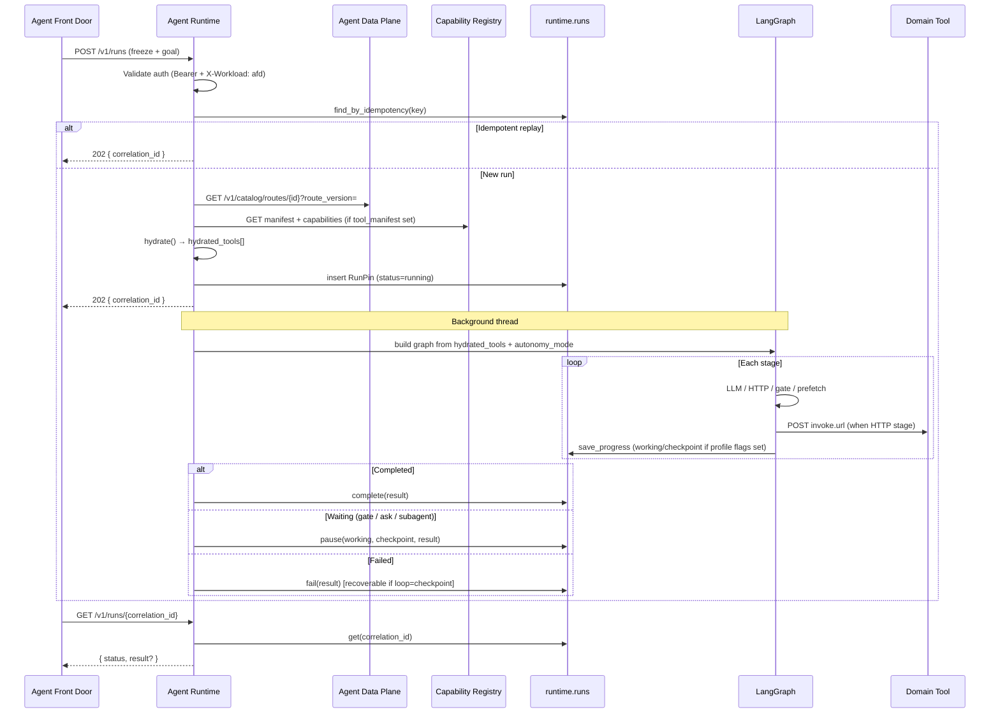
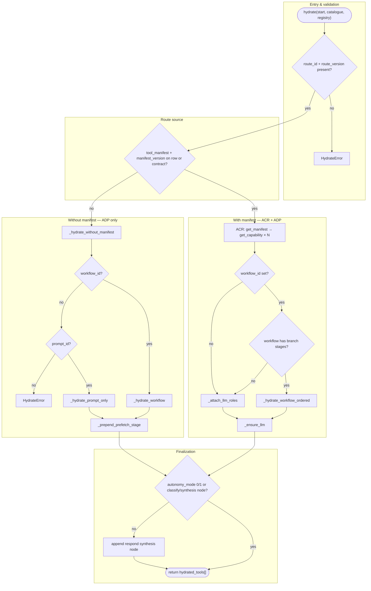
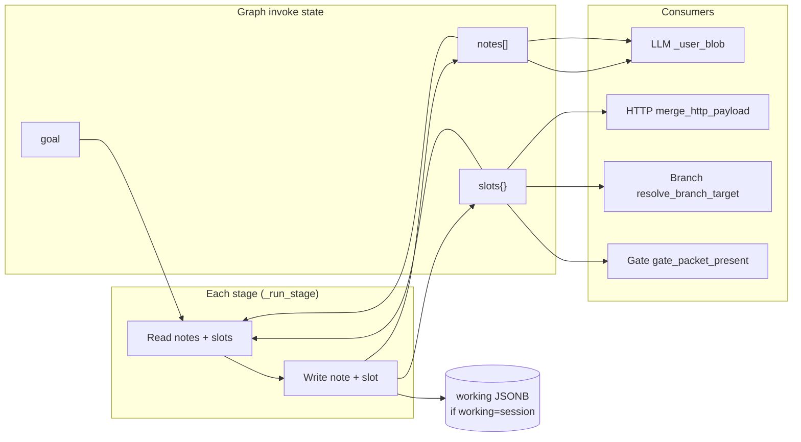

# Agent Runtime — Technical Implementation

End-to-end reference for how **agent-fabric-runtime** (AR) executes a pinned route from HTTP ingress through graph completion. AR runs **after** Agent Front Door (AFD) has decided and pinned a route; it does not classify utterances or own agent identity.

**Position in the fabric:**

```text
Channel → AFD (decide / pin) → ADP (catalogue) → AR (this service) → ACR (hydrate) → domain tools
```

Port **3008**. Stack: Python 3.12, FastAPI, SQLAlchemy 2, LangGraph, PostgreSQL (`ar` database, `runtime` schema).

---

## 1. System boundaries

| Responsibility | Owner |
| --- | --- |
| Utterance classification, route selection | Agent Data Plane (ADP) + AFD |
| Run start authorization, freeze delivery | AFD only (`X-Workload: afd`) |
| Hydrate pinned manifest → frozen tool list | AR (once per run) |
| LangGraph execution (Patterns 0–3) | AR |
| Domain HTTP tool calls | AR → capability `invoke.url` |
| Child agent jobs (`kind=agent`) | AR → AFD `/v1/jobs` |
| Conversation / long-term memory | Not in AR (future Shared Memory) |
| Mid-loop registry reads | Not supported — hydrate is frozen at pin time |

---

## 2. Hexagonal layout

| Section | Path | Role |
| --- | --- | --- |
| **Entry** | [app/main.py](./app/main.py) | FastAPI entry re-export |
| **api** | [app/api/app.py](./app/api/app.py)<br>[app/api/errors.py](./app/api/errors.py)<br>[app/api/routes/runs.py](./app/api/routes/runs.py)<br>[app/api/routes/health.py](./app/api/routes/health.py) | FastAPI ingress, auth middleware, route handlers<br>`build_app()`, workload auth, dependency wiring<br>Standard error JSON responses<br>`POST /v1/runs`, `/turns`, GET status, open-run<br>`GET /health` |
| **core** | [app/core/agent_core.py](./app/core/agent_core.py)<br>[app/core/execution.py](./app/core/execution.py)<br>[app/core/run_store.py](./app/core/run_store.py)<br>[app/core/state.py](./app/core/state.py)<br>[app/core/memory.py](./app/core/memory.py)<br>[app/core/checkpoint.py](./app/core/checkpoint.py)<br>[app/core/db.py](./app/core/db.py)<br>[app/core/session_ids.py](./app/core/session_ids.py) | `RunService`: start / resume / status / open-run<br>`run_loop()`: graph.invoke → complete / waiting / failed<br>`PersistentRunStore` → `runtime.runs`<br>`RunPin` model + `RunStore` protocol<br>Working notes/slots + loop checkpoint persistence<br>`resume_index` helpers for failed / gated runs<br>SQLAlchemy engine factory<br>`chat-` / `job-` / `sub-` session helpers |
| **agents** | [app/agents/hydrate.py](./app/agents/hydrate.py)<br>[app/agents/clients.py](./app/agents/clients.py)<br>[app/agents/jobs_client.py](./app/agents/jobs_client.py)<br>[app/agents/prefetch.py](./app/agents/prefetch.py)<br>[app/agents/prefetch_client.py](./app/agents/prefetch_client.py)<br>[app/agents/audit_client.py](./app/agents/audit_client.py) | ADP + ACR → ordered `hydrated_tools` list<br>`HttpCatalogueClient`, `HttpRegistryClient`<br>`HttpJobsClient` → AFD `/v1/jobs` (`kind=agent`)<br>`deterministic_prefetch` corpus packing<br>HTTP client for corpus search<br>Fire-and-forget audit events |
| **graph** | [app/graph/workflow.py](./app/graph/workflow.py)<br>[app/graph/payload.py](./app/graph/payload.py)<br>[app/graph/branch.py](./app/graph/branch.py)<br>[app/graph/human_gate.py](./app/graph/human_gate.py)<br>[app/graph/customer_ask.py](./app/graph/customer_ask.py)<br>[app/graph/subagent_gate.py](./app/graph/subagent_gate.py) | `build_tool_graph`, `build_agent_loop`, `_run_stage`<br>HTTP payload projection from goal + slots<br>Conditional workflow routing<br>Pause for human approval<br>Pattern 1 ASK pause<br>Pause for `kind=agent` join |
| **graph/llm** | [app/graph/llm/port.py](./app/graph/llm/port.py)<br>[app/graph/llm/factory.py](./app/graph/llm/factory.py)<br>[app/graph/llm/provider.py](./app/graph/llm/provider.py)<br>[app/graph/llm/seed_stub.py](./app/graph/llm/seed_stub.py)<br>[app/graph/llm/schema.py](./app/graph/llm/schema.py)<br>[app/graph/llm/text.py](./app/graph/llm/text.py) | `LlmPort` protocol<br>`llm_from_env()` selection<br>`ProviderLlm` (Ollama / configured backend)<br>`SeedStubLlm` deterministic test LLM<br>`llm_output_schema()` for structured LLM output<br>LLM text helpers |
| **tools** | [app/tools/invoker.py](./app/tools/invoker.py) | `HttpToolClient` → capability `invoke.url` |
| **telemetry** | [app/telemetry.py](./app/telemetry.py) | OTel spans + fabric business events |
| **db** | [db/migration/V1__runtime.sql](./db/migration/V1__runtime.sql) | Flyway-style schema for `runtime.runs` |

Dependencies are injected via protocols ([`CataloguePort`](./app/agents/hydrate.py), [`RegistryPort`](./app/agents/hydrate.py), [`GraphPort`](./app/core/execution.py), [`ToolInvoker`](./app/tools/invoker.py), [`LlmPort`](./app/graph/llm/port.py), [`JobsPort`](./app/agents/jobs_client.py), [`PrefetchPort`](./app/agents/prefetch.py), [`RunStore`](./app/core/state.py)). Tests pass fakes through [`create_app()`](./app/api/app.py) (`store=…`, `catalogue=…`, …).

---

## 3. End-to-end sequence



---

## 4. Ingress and authentication

**Source:** [app/api/app.py](./app/api/app.py) — middleware [`workload_auth`](./app/api/app.py), [`build_app()`](./app/api/app.py), [`create_app()`](./app/api/app.py)

Every path except `/health` requires:

```http
Authorization: Bearer fabric-internal
X-Workload: afd
```

Logic:

1. Missing or wrong bearer → **401** `UNAUTHORIZED`
2. Workload not `afd` → **403** `FORBIDDEN` (only AFD may call runtime)
3. `X-Request-Id` is bound to OTel context via `telemetry.bind_request_id()` and forwarded on all outbound HTTP (ADP, ACR, tools, jobs, audit)

Production wiring ([`build_app()`](./app/api/app.py)):

- [`PersistentRunStore`](./app/core/run_store.py) → PostgreSQL via [`engine()`](./app/core/db.py)
- [`HttpCatalogueClient`](./app/agents/clients.py)(`DATA_PLANE_URL`)
- [`HttpRegistryClient`](./app/agents/clients.py)(`REGISTRY_URL`)
- [`HttpToolClient()`](./app/tools/invoker.py), [`llm_from_env()`](./app/graph/llm/factory.py), [`HttpPrefetchClient()`](./app/agents/prefetch_client.py), [`HttpJobsClient()`](./app/agents/jobs_client.py)
- Graph runs on a **daemon background thread** ([`run_in_background`](./app/core/agent_core.py))

---

## 5. Start run — `POST /v1/runs`

**Handler:** [app/api/routes/runs.py](./app/api/routes/runs.py) [`start_run()`](./app/api/routes/runs.py) → [app/core/agent_core.py](./app/core/agent_core.py) [`RunService.start()`](./app/core/agent_core.py)

### 5.1 Request contract

Required fields (see [run-start.json](../agent-fabric-docs/05-reference/run-start.json)):

| Field | Purpose |
| --- | --- |
| `mode` | Must be `"new"` |
| `idempotency_key` | Unique start key; replays return existing `correlation_id` |
| `session_id` | `chat-{uuid}`, `job-{uuid}`, or `sub-{uuid}` |
| `route_id` / `route_version` | Pinned catalogue cut (from AFD freeze) |
| `goal` | Ingress payload (e.g. `{ "utterance": "…" }`) |
| `activation_target`, `agent_client_id` | Stored on pin for audit / future token mint |
| `contract` | Optional manifest override when not on catalogue row |

Responses:

| Code | Meaning |
| --- | --- |
| **202** | Pin durable, graph scheduled |
| **400** | Validation error |
| **422** `HYDRATE_FAILED` | Catalogue/registry miss — **no pin created** |

### 5.2 Start algorithm ([`RunService.start()`](./app/core/agent_core.py))

```text
1. Validate mode=new, idempotency_key, session_id
2. find_by_idempotency(key) → return existing correlation_id if hit
3. Load catalogue row: GET /v1/catalog/routes/{route_id}?route_version=
4. hydrate(body, catalogue, registry, row) → list[hydrated_tools]
5. memory_profile(row) → { working, loop } flags
6. Mint correlation_id = "corr-" + uuid4()
7. insert RunPin(status=running, hydrated_tools frozen)
8. emit audit hydrate.snapshot (async)
9. emit telemetry run.graph.started
10. schedule_run(_execute_new_run) on background thread
11. return correlation_id (HTTP 202)
```

**Critical invariant:** Hydrate completes **before** `202`. The `hydrated_tools` JSON on the pin never changes for the life of the run.

### 5.3 Idempotency

[`PersistentRunStore.insert()`](./app/core/run_store.py) catches `IntegrityError` on `idempotency_key` unique constraint and returns the existing pin. The caller gets the original `correlation_id` without re-executing the graph.

---

## 6. Hydrate — frozen tool list

**Source:** [app/agents/hydrate.py](./app/agents/hydrate.py) — entry [`hydrate()`](./app/agents/hydrate.py), [`HydrateError`](./app/agents/hydrate.py)

Hydrate resolves a pinned route into an ordered list of graph nodes. Each node is a dict with at minimum:

- `id` — capability or stage identifier (slot key)
- `llm_role` — `none`, `query_formulation`, `classify`, `synthesis`
- `llm_prompt` — text for LLM stages
- `invoke` — `{ url, method, body? }` for HTTP capabilities (frozen from ACR)
- `input_schema` / `output_schema` — JSON Schema from ACR
- Optional: `workflow_stage_id`, `stage_type`, `branch`, `kind=agent`, `join`

### 6.1 Decision tree

Entry point: [`hydrate()`](./app/agents/hydrate.py) in [app/agents/hydrate.py](./app/agents/hydrate.py).



**Step reference by group**

#### Entry & validation

| Step | Condition | Function | Outcome |
| --- | --- | --- | --- |
| 1 | Missing `route_id` or `route_version` | — | [`HydrateError`](./app/agents/hydrate.py) |

#### With manifest — ACR + ADP

| Step | Condition | Function | Outcome |
| --- | --- | --- | --- |
| 2 | `tool_manifest` + version pinned | [`_hydrate_manifest()`](./app/agents/hydrate.py) | Resolve each capability from ACR at pinned version |
| 3 | Workflow declares branches | [`_hydrate_workflow_ordered()`](./app/agents/hydrate.py) | Nodes in workflow stage order; branch maps preserved |
| 4 | Manifest path, no branches | [`_attach_llm_roles()`](./app/agents/hydrate.py) | Stamp `llm_role` / `llm_prompt` from workflow + prompt pack |

#### Without manifest — ADP only

| Step | Condition | Function | Outcome |
| --- | --- | --- | --- |
| 5 | No manifest, has `workflow_id` | [`_hydrate_workflow()`](./app/agents/hydrate.py) | LLM-only stages (`invoke={}`) |
| 6 | No manifest, `prompt_id` only | [`_hydrate_prompt_only()`](./app/agents/hydrate.py) | Single Pattern 0 synthesis node |
| 7 | Pattern 0 + `deterministic_prefetch` | [`_prepend_prefetch_stage()`](./app/agents/hydrate.py) | Prepend `{ id: prefetch }` node before synthesis |
| 9 | No manifest, workflow, or prompt | — | [`HydrateError`](./app/agents/hydrate.py) |

#### Finalization

| Step | Condition | Function | Outcome |
| --- | --- | --- | --- |
| 8 | Pattern 2/3, no answer node | [`_ensure_llm()`](./app/agents/hydrate.py) | Append trailing `respond` synthesis node |

**Manifest vs no-manifest paths**

| Path | When | Primary ADP reads | Primary ACR reads |
| --- | --- | --- | --- |
| **With manifest** | Route pins `tool_manifest` + version | Route, workflow (optional), prompt pack | Manifest + each capability |
| **Without manifest** | Prompt-only or workflow-only route | Route, workflow or prompt pack | None |

### 6.2 Pattern-specific hydrate behavior

| Pattern | `autonomy_mode` | Hydrate outcome |
| --- | --- | --- |
| **0** Deterministic | 0 | Workflow stages or prompt-only; optional `prefetch` stage prepended when `retrieval.mode=deterministic_prefetch` |
| **1** Autonomous loop | 1 | Full manifest list; graph builder uses [`build_agent_loop()`](./app/graph/workflow.py) (not linear) |
| **2** LLM-assisted | 2 | Manifest + trailing `respond` synthesis if no classify/synthesis node |
| **3** Tool-only | 3 | Same as 2 — HTTP stages only unless [`_ensure_llm()`](./app/agents/hydrate.py) adds respond |

### 6.3 Upstream calls during hydrate

| Call | Client | On failure |
| --- | --- | --- |
| `GET /v1/catalog/routes/{id}?route_version=` | [`HttpCatalogueClient`](./app/agents/clients.py) | [`HydrateError`](./app/agents/hydrate.py) (422) |
| `GET /v1/catalog/workflows/{id}` | optional | `{}` if 404 |
| `GET /v1/catalog/prompts/{id}` | optional | `{}` if 404 |
| `GET /v1/manifests/{id}/versions/{ver}` | [`HttpRegistryClient`](./app/agents/clients.py) | [`HydrateError`](./app/agents/hydrate.py) |
| `GET /v1/capabilities/{id}/versions/{ver}` | per manifest tool ref | [`HydrateError`](./app/agents/hydrate.py) |

Outbound headers: `Authorization: Bearer fabric-internal`, `X-Workload: ar`.

---

## 7. Run pin — durable state

**Source:** [app/core/state.py](./app/core/state.py) (`RunPin`, `RunStore`), [app/core/run_store.py](./app/core/run_store.py) (`PersistentRunStore`), [db/migration/V1__runtime.sql](./db/migration/V1__runtime.sql)

Table `runtime.runs`:

| Column | Type | Role |
| --- | --- | --- |
| `correlation_id` | TEXT PK | `corr-{uuid}` — run identity |
| `idempotency_key` | TEXT UNIQUE | Start deduplication |
| `session_id` | TEXT | Chat or job session |
| `route_id` / `route_version` | TEXT | Pinned catalogue cut |
| `activation_target` | TEXT | Where AFD sent the start |
| `agent_client_id` | TEXT | Route-scoped agent identity (future token mint) |
| `hydrated_tools` | JSONB | **Frozen** capability list |
| `status` | TEXT | Run lifecycle — see [§7.2](#72-run-lifecycle-fields-status-result-working-checkpoint) |
| `result` | JSONB | Channel-facing payload — see [§7.2](#72-run-lifecycle-fields-status-result-working-checkpoint) |
| `working` | JSONB | In-run session memory — see [§7.2](#72-run-lifecycle-fields-status-result-working-checkpoint) |
| `checkpoint` | JSONB | Resume / recovery metadata — see [§7.2](#72-run-lifecycle-fields-status-result-working-checkpoint) |
| `created_at` / `updated_at` | TIMESTAMPTZ | Audit timestamps |

Index: `(session_id, status)` for open-run lookup.

### 7.1 Status transitions

```text
                    ┌──────────────┐
         start ────►│   running    │
                    └──────┬───────┘
           ┌───────────────┼───────────────┐
           ▼               ▼               ▼
    ┌────────────┐  ┌────────────┐  ┌────────────┐
    │ completed  │  │  waiting   │  │   failed   │
    └────────────┘  └──────┬─────┘  └──────┬─────┘
                           │               │
                    /turns resume     /turns resume
                           │          (loop=checkpoint)
                           ▼               │
                    ┌────────────┐         │
                    │   running  │◄────────┘
                    └────────────┘
```

### 7.2 Run lifecycle fields: `status`, `result`, `working`, `checkpoint`

These four columns drive what AFD and channels observe, and what AR reloads on `/turns`. They are **not** returned on the slim status API except `status` and `result` ([`RunPin.slim_status()`](./app/core/state.py)); `working` and `checkpoint` are internal to AR resume logic.

**Catalogue flags that control persistence** ([`memory_profile`](./app/core/memory.py) on the pinned route row):

| Catalogue flag | Value | Columns affected |
| --- | --- | --- |
| `memory_profile.working` | `session` | `working` flushed after each stage and on gate pause |
| `memory_profile.loop` | `checkpoint` | `checkpoint` flushed after each stage; failed runs become recoverable |

Both flags can be set on the same route.

---

#### `status`

| Value | Meaning | Set by | Typical `result` | Client action |
| --- | --- | --- | --- | --- |
| **`running`** | Graph executing or about to resume | [`insert()`](./app/core/run_store.py) on start; [`mark_running()`](./app/core/run_store.py) before `/turns` resume | `null` (cleared on resume) | Poll `GET /v1/runs/{id}` — no final message yet |
| **`waiting`** | Paused at a gate — human, customer ask, or subagent join | [`pause()`](./app/core/run_store.py) from [`_pause_waiting()`](./app/core/execution.py) | `{ "message": "<ask or gate prompt>" }` when the graph produced text | `POST /v1/runs/{id}/turns` with gate-specific body |
| **`completed`** | Graph finished successfully | [`complete()`](./app/core/run_store.py) from [`run_loop()`](./app/core/execution.py) | `{ "message": "<final answer>" }` | Deliver `result.message` to channel |
| **`failed`** | Unrecoverable error, or gate reject; may be recoverable when `loop=checkpoint` | [`fail()`](./app/core/run_store.py) from [`run_loop()`](./app/core/execution.py), human gate reject, or subagent join timeout | `{ "message": "<error or comment>", "recoverable": true? }` | Show error; if `recoverable` and route has `loop=checkpoint`, retry with `/turns` `{}` |

**Notes**

- Only one terminal-ish observation at a time: `waiting` is intentional pause, not failure.
- [`open_run()`](./app/core/state.py) and session index include `status` but not `result`/`working`/`checkpoint`.
- Audit [`run.terminal`](./app/agents/audit_client.py) fires when status reaches `completed`, `failed`, or `waiting`.

---

#### `result`

Channel-facing JSON. Exposed via [`slim_status()`](./app/core/state.py) whenever non-null.

| When populated | Shape | Example | Written by |
| --- | --- | --- | --- |
| **`completed`** | `{ "message": string }` | `{ "message": "Your $42 fee was a service charge." }` | [`store.complete()`](./app/core/run_store.py) |
| **`waiting`** | `{ "message": string }` (optional) | `{ "message": "Please provide order id or email." }` for customer ask | [`store.pause()`](./app/core/run_store.py) when gate state has `result` text |
| **`failed`** | `{ "message": string, "recoverable"?: boolean }` | `{ "message": "tool HTTP 503", "recoverable": true }` | [`store.fail()`](./app/core/run_store.py) |
| **`running`** | `null` | — | Cleared by [`mark_running()`](./app/core/run_store.py) on resume |

**Notes**

- AR does not store full tool HTTP bodies in `result` — only the slim message (or gate ask text).
- Stage outputs live in `working.slots` and `working.notes` when `working=session` is enabled.
- AFD projects the same slim body for job sessions (`GET /v1/jobs/{correlation_id}`).

---

#### `working`

In-run **session memory** for the current correlation id. Populated only when catalogue `memory_profile.working = "session"` ([`save_working()`](./app/core/memory.py)).

**JSON shape** ([`working_payload()`](./app/core/memory.py)):

```json
{
  "notes": [
    "Order ORD-123: widget $42.",
    "customer: ORD-123"
  ],
  "slots": {
    "lookup_order": { "order_id": "ORD-123", "item_name": "widget", "price": 42 },
    "prefetch": { "chunks": [{ "corpus_id": "faq", "id": "c1", "text": "…" }] },
    "human_gate_stage": { "decision": "approve", "comment": "ok" }
  }
}
```

| Field | Purpose | Details |
| --- | --- | --- |
| **`notes`** | Human-readable strings appended after each stage | See [§7.3 Notes and slots](#73-notes-and-slots-in-run-memory) |
| **`slots`** | Structured per-stage outputs keyed by capability / stage id | See [§7.3 Notes and slots](#73-notes-and-slots-in-run-memory) |

| Event | Action | Source |
| --- | --- | --- |
| After each graph stage | [`persist_stage()`](./app/core/memory.py) → [`save_progress(working=…)`](./app/core/run_store.py) | [`on_stage` callback](./app/core/agent_core.py) in `_graph_for()` |
| Gate pause | Same snapshot written in [`_pause_waiting()`](./app/core/execution.py) | Notes + slots at pause time |
| `/turns` resume | [`notes_from_working()`](./app/core/memory.py), [`slots_from_working()`](./app/core/memory.py) reloaded into graph state | [`RunService.resume()`](./app/core/agent_core.py) |
| Human / subagent resume | Merged slots updated before re-invoke | e.g. [`merge_subagent_packet()`](./app/graph/subagent_gate.py), gate packet into `slots[stage_id]` |

**When absent:** `working` stays `null`. Each invoke starts from ingress `goal` only; multi-turn context is not persisted on the pin.

---

#### `checkpoint`

Resume and recovery metadata. Two distinct uses share the same column:

1. **Stage checkpointing** — catalogue `memory_profile.loop = "checkpoint"` ([`save_loop()`](./app/core/memory.py))
2. **Gate pause** — always written on `waiting` ([`_pause_waiting()`](./app/core/execution.py)), even without `loop=checkpoint`

**Fields by scenario**

| Field | Stage checkpoint (`loop=checkpoint`) | Gate pause (`status=waiting`) |
| --- | --- | --- |
| `step` | Index of last **completed** stage | Index of gate stage (`gate_index`) |
| `stage_id` | Capability / workflow stage id | Gate stage id |
| `result` | Last stage text output | Gate prompt / ask text (also mirrored to `result.message`) |
| `goal` | Ingress goal at that point | Goal frozen at pause |
| `resume_index` | Next index in `hydrated_tools[]` ([`next_stage_index()`](./app/core/checkpoint.py), branch-aware) | Index to continue after gate clears |
| `waiting_for` | — | `human_gate` \| `customer_ask` \| `subagent` |
| `resume_loop_step` | — | Pattern 1 loop iteration to restart from (ASK / subagent) |
| `subagent_ids` | — | Child `corr-*` ids when `waiting_for=subagent` |

**Example — stage checkpoint after HTTP stage 1:**

```json
{
  "step": 1,
  "stage_id": "lookup_order",
  "result": "Order ORD-123: widget $42.",
  "goal": { "utterance": "Why was I charged $42?" },
  "resume_index": 2
}
```

**Example — customer ask pause (Pattern 1):**

```json
{
  "step": 0,
  "stage_id": "customer_ask",
  "resume_index": 0,
  "waiting_for": "customer_ask",
  "goal": { "utterance": "Where is my order?" },
  "resume_loop_step": 1
}
```

| Resume trigger | Reads checkpoint | Resume behaviour |
| --- | --- | --- |
| `/turns` while **`waiting`** | `waiting_for`, `resume_index`, `goal`, optional `resume_loop_step` | [`RunService.resume()`](./app/core/agent_core.py) merges turn body → `mark_running()` → graph from `start_index` |
| `/turns` while **`failed`** + `loop=checkpoint` | [`checkpoint_resume_index()`](./app/core/checkpoint.py), [`checkpoint_goal()`](./app/core/checkpoint.py) | Body must be `{}` or `{ "resume": true }` ([`parse_checkpoint_resume()`](./app/core/checkpoint.py)) |
| Subagent auto-join | `waiting_for=subagent`, `subagent_ids` | Background [`poll_subagents()`](./app/graph/subagent_gate.py) → `resume()` with subagents packet |

**When absent:** No mid-run recovery. A failure without `loop=checkpoint` is terminal; gate pauses still always write checkpoint for `/turns` routing.

---

#### How the four fields interact

| Scenario | `status` | `result` | `working` | `checkpoint` |
| --- | --- | --- | --- | --- |
| Mid-graph, no memory flags | `running` | `null` | `null` | `null` |
| Mid-graph, `working=session` | `running` | `null` | notes + slots updated each stage | `null` |
| Mid-graph, `loop=checkpoint` | `running` | `null` | optional | updated each stage |
| Customer ask (Pattern 1) | `waiting` | ask text | if `working=session` | gate blob + optional stage fields |
| Human gate reject | `failed` | reject comment | prior snapshot | last gate checkpoint |
| Success | `completed` | final message | last snapshot if enabled | last stage if enabled |
| Tool error + `loop=checkpoint` | `failed` | error + `recoverable: true` | last good snapshot | last successful stage |

### 7.3 Notes and slots — in-run memory

`notes` and `slots` are the **working memory** inside a single run. They live in LangGraph [`GraphState`](./app/graph/workflow.py) during execution and, when `memory_profile.working = "session"`, are copied to `runtime.runs.working` after each stage.

They answer two different questions:

| | **`notes`** | **`slots`** |
| --- | --- | --- |
| **Shape** | `list[str]` — ordered timeline | `dict[str, object]` — map keyed by stage / capability id |
| **Content** | Short human-readable summaries | Structured JSON per stage (schema-projected) |
| **Primary consumers** | LLM prompts ([`_user_blob()`](./app/graph/workflow.py)) | HTTP payloads, branching, gates, child jobs |
| **Typical reader** | Model (classify, synthesis, Pattern 1 loop) | Code (payload merge, branch router, gate checks) |



---

#### Lifecycle: where they live and when they update

| Phase | `notes` | `slots` | Persisted to DB? |
| --- | --- | --- | --- |
| **Run start** | `[]` | `{}` | No — only in-memory graph state |
| **After each stage** | Prior list + one new string | Prior map + one new entry under `stage_id` | Yes, if `working=session` → [`persist_stage()`](./app/core/memory.py) |
| **Gate pause** | Frozen at pause | Frozen at pause | Yes, via [`_pause_waiting()`](./app/core/execution.py) |
| **`/turns` resume** | Reloaded from `working` or carried in gate state | Reloaded / merged (gate packet, customer reply, subagent join) | Updated again on next stage |
| **Run complete** | Final list in `working` (if enabled) | Final map in `working` (if enabled) | Not exposed on slim status API |

Without `working=session`, notes and slots still accumulate **in memory for the duration of one graph invoke** but are lost between background thread start and `/turns` unless the run pauses (gate state carries a snapshot).

---

#### `notes` — how they are built and used

**Appended by** [`_run_stage()`](./app/graph/workflow.py) and the Pattern 1 [`build_agent_loop()`](./app/graph/workflow.py) after each successful step.

| Stage type | What gets appended to `notes` | Source function |
| --- | --- | --- |
| HTTP tool | Human summary of response | [`_message()`](./app/graph/workflow.py) — e.g. `"Order ORD-123: widget $42."` |
| LLM classify / synthesis | Full LLM output text | Raw completion string |
| Prefetch | Packed chunk summary line | [`packed_note()`](./app/agents/prefetch.py) |
| Subagent start | `"Started subagent {route} ({corr-id})"` | [`_run_stage()`](./app/graph/workflow.py) |
| Subagent joined | Status summary | [`RunService.resume()`](./app/core/agent_core.py) |
| Customer reply on resume | `"customer: {reply}"` | [`RunService.resume()`](./app/core/agent_core.py) — Pattern 1 uses this to infer locator |
| Tool error (Pattern 1) | `"tool error ({tool_id}): {exc}"` | Loop catch — run continues |
| Pattern 1 DONE | Final answer text | LLM `DONE` line |

**Read by** [`_user_blob(goal, notes, slots)`](./app/graph/workflow.py) when building LLM input:

```text
goal: { … }
packed chunks:          ← from slots.prefetch, not notes
- [faq:c1] …
prior stage outputs:    ← from notes
- Order ORD-123: widget $42.
- customer: ORD-123
```

**Design intent:** Notes give the model a ** chronological narrative** of what already happened. They are not schema-validated and are never sent directly as HTTP JSON (except indirectly when an LLM reads them).

**Special note prefixes**

| Prefix / pattern | Meaning | Set when |
| --- | --- | --- |
| `customer: …` | End-user supplied locator or reply | `/turns` resume after `customer_ask` |
| `tool error (…)` | Non-fatal tool failure in Pattern 1 | Agent loop catch |
| `Joined subagent …` | Subagent join completed | `/turns` with subagents packet |

---

#### `slots` — how they are built and used

**Key:** capability id or `workflow_stage_id` ([`_stage_id()`](./app/graph/workflow.py) / [`human_gate_slot_key()`](./app/graph/human_gate.py)).

**Written by** [`_write_slot(slots, stage_id, body, pinned)`](./app/graph/workflow.py) → [`project_slot()`](./app/graph/payload.py):

- HTTP response → full body or **output_schema-projected** fields only
- LLM output → [`parse_llm_slot()`](./app/graph/payload.py) — JSON object if parseable, else `{ "text": "…" }`
- Prefetch → `{ "chunks": [ … ] }`
- Human gate resume → gate packet dict at `slots[stage_id]`
- Subagent → `{ route_id, correlation_id, status, result?, … }`

| Consumer | How it uses `slots` | Source |
| --- | --- | --- |
| **Downstream HTTP** | Merges allowed `input_schema` keys from all slot dicts into POST body | [`merge_http_payload()`](./app/graph/payload.py) — skips `text` / `notes` keys |
| **Prefetch pack for LLM/HTTP** | Reads `slots.prefetch.chunks` → `packed_text` | [`prefetch_pack_text()`](./app/agents/prefetch.py) |
| **Workflow branch** | Reads branch stage's slot → picks next stage id | [`resolve_branch_target()`](./app/graph/branch.py) — looks for `risk`, `risk_tier`, `branch`, etc. |
| **Human gate** | Checks `slots[gate_id]` non-empty | [`gate_packet_present()`](./app/graph/human_gate.py) |
| **Subagent join** | Checks terminal `status` + `result` on stage slot | [`subagent_result_present()`](./app/graph/subagent_gate.py) |
| **Child job (`kind=agent`)** | Projects child goal from goal ∪ slots | [`project_child_goal()`](./app/graph/payload.py) |
| **Pattern 1 escalate** | Reads `slots.escalate_to_human.handoff_id` | [`_escalate_succeeded()`](./app/graph/workflow.py) |
| **Checkpoint resume index** | Branch-aware next stage from last slot values | [`next_stage_index()`](./app/core/checkpoint.py) |

**`merge_http_payload` rules** ([app/graph/payload.py](./app/graph/payload.py)):

1. Start from ingress `goal`
2. If capability declares `input_schema.properties` → **only those keys** are eligible
3. Walk **all** slot values; copy matching keys into payload (first wins unless CALL args override)
4. Inject `packed_text` from prefetch slot when schema requires it
5. Pattern 1 `CALL` JSON args override goal for allowed keys

This is why slots matter for **machine-to-machine** steps: stage 1's `order_id` flows into stage 2's HTTP body without the LLM re-extracting it from notes.

---

#### Per-stage write pattern

Every stage follows the same read → act → write pattern in [`_run_stage()`](./app/graph/workflow.py):

```text
1. notes  ← copy from state
2. slots  ← copy from state
3. Run stage logic (LLM / HTTP / gate / prefetch / subagent)
4. notes.append(summary_string)     ← always when stage produces output
5. slots[stage_id] = projected_body ← structured output for downstream code
6. return { result, notes, slots }  → LangGraph merges into state
7. on_stage → persist_stage → working JSONB (if working=session)
```

| `llm_role` / type | Note written? | Slot written? | Slot contents |
| --- | --- | --- | --- |
| `none` (HTTP) | Yes — `_message(response)` | Yes — projected HTTP body | e.g. `{ order_id, price, … }` |
| `query_formulation` | Yes — after HTTP | Yes — projected HTTP body | Same as HTTP |
| `classify` / `synthesis` | Yes — LLM text | Yes — parsed JSON or `{ text }` | e.g. `{ risk: "high" }` for branch |
| prefetch | Yes — packed summary | Yes — `{ chunks: [...] }` | Corpus chunks |
| `human_gate` | No new note on pause | Unchanged until resume | Gate packet on resume |
| `kind=agent` | Yes — start message | Yes — child job metadata | `{ correlation_id, status, … }` |

---

#### Example: two-stage route with notes + slots

**Goal:** `{ "utterance": "Why was I charged $42 on order ORD-123?" }`

After stage `lookup_order` (HTTP):

```json
{
  "notes": ["Order ORD-123: widget $42."],
  "slots": {
    "lookup_order": { "order_id": "ORD-123", "item_name": "widget", "price": 42 }
  }
}
```

Before stage `explain_fee` (HTTP + `query_formulation`):

- **LLM** sees `_user_blob` with goal + note list
- **HTTP** gets `merge_http_payload` → `{ "order_id": "ORD-123", "query": "<LLM-generated question>" }` (keys from `input_schema`)

After stage `respond` (synthesis LLM):

```json
{
  "notes": [
    "Order ORD-123: widget $42.",
    "Your $42 charge is a service fee on order ORD-123."
  ],
  "slots": {
    "lookup_order": { … },
    "explain_fee": { … },
    "respond": { "text": "Your $42 charge is a service fee…" }
  }
}
```

Channel receives only `result.message` from the final synthesis — not the full notes/slots map.

---

#### Notes vs slots — when to use which (implementation)

| Need | Use |
| --- | --- |
| Model needs prior context in natural language | **`notes`** → `_user_blob` |
| Next HTTP call needs structured fields from prior stages | **`slots`** → `merge_http_payload` |
| Workflow branch decision | **`slots`** on branch stage (classify output) |
| Gate already satisfied? | **`slots[gate_id]`** present |
| Audit digest of stage I/O | [`stage_completed()`](./app/agents/audit_client.py) uses slot or notes from `on_stage` |
| Multi-turn within same run (`/turns`) | Both reloaded from `working`; customer reply → **note**; gate approval → **slot** |

---

## 8. Graph execution

**Entry:** [app/core/agent_core.py](./app/core/agent_core.py) [`RunService._execute_new_run()`](./app/core/agent_core.py) → [app/core/execution.py](./app/core/execution.py) [`run_loop()`](./app/core/execution.py)

### 8.1 Graph selection ([`RunService._graph_for()`](./app/core/agent_core.py))

Reads `autonomy_mode` from catalogue row:

| `autonomy_mode` | Builder | Behavior |
| --- | --- | --- |
| **1** | [`build_agent_loop()`](./app/graph/workflow.py) | LLM chooses `CALL` / `ASK` / `DONE` up to `max_loop_steps` |
| **0, 2, 3** | [`build_tool_graph()`](./app/graph/workflow.py) | Linear or branching LangGraph over hydrated tools |

Both builders receive:

- `invoker` — HTTP tool client
- `llm` — optional for mode 0/2/3 LLM stages; required for mode 1
- `on_stage` callback — persists working/checkpoint + emits `stage.completed` audit
- `retrieval`, `prefetch`, `catalogue`, `jobs` — prefetch and subagent support
- `start_index` — slice hydrated_tools for resume (skip completed stages)

### 8.2 Graph state ([`GraphState`](./app/graph/workflow.py))

```python
{
    "result": str,           # Latest stage output / final answer
    "goal": dict,            # Ingress goal (immutable across stages unless checkpoint restores)
    "notes": list[str],      # Human-readable stage outputs for LLM context
    "slots": dict[str, Any], # Per-stage structured outputs (slot key = capability id)
    "correlation_id": str,   # For subagent idempotency keys
    "_resume_loop_step": int # Pattern 1 resume only
}
```

Full behaviour of `notes` and `slots`: [§7.3 Notes and slots](#73-notes-and-slots-in-run-memory).

### 8.3 Stage execution ([`_run_stage()`](./app/graph/workflow.py))

Each hydrated tool becomes a LangGraph node. Execution order per `llm_role`:

| `llm_role` | Steps |
| --- | --- |
| **`human_gate`** (`stage_type`) | If gate packet not in slots → raise [`HumanGateWaiting`](./app/graph/human_gate.py). If present → no-op pass-through. |
| **`classify` / `synthesis`** | LLM complete → append to notes → parse JSON slot via [`parse_llm_slot()`](./app/graph/payload.py) |
| **`query_formulation`** | LLM generates `query` field → merge into HTTP payload → POST invoke.url |
| **`none`** (HTTP) | [`merge_http_payload()`](./app/graph/payload.py) → [`validate_input_schema()`](./app/graph/payload.py) → [`invoker.call()`](./app/tools/invoker.py) |
| **`none`** (no URL) | If prefetch stage → [`run_prefetch()`](./app/agents/prefetch.py). Else pass-through last note. |
| **`kind=agent`** | POST AFD `/v1/jobs` via [`HttpJobsClient`](./app/agents/jobs_client.py) with projected child goal. If `join=true` → [`SubagentWaiting`](./app/graph/subagent_gate.py). |

### 8.4 HTTP payload construction

**Source:** [app/graph/payload.py](./app/graph/payload.py)

[`merge_http_payload()`](./app/graph/payload.py)(goal, slots, input_schema, call_args):

1. Start from `goal` dict
2. If `input_schema.properties` declared → **only those keys** are sent (never raw utterance unless schema lists it)
3. Merge matching keys from prior stage slots (skip `text`, `notes`)
4. CALL args from Pattern 1 loop override goal values
5. Inject `packed_text` from prefetch slot when schema requires it
6. `validate_input_schema()` fails closed on missing required fields

Slot writes use [`project_slot()`](./app/graph/payload.py) — only `output_schema` fields persisted.

### 8.5 Branching workflows

**Source:** [app/graph/branch.py](./app/graph/branch.py)

When a workflow stage declares `branch: { "low": "stage_a", "high": "stage_b" }`:

1. [`build_tool_graph()`](./app/graph/workflow.py) inserts a conditional edge after the branch stage
2. [`resolve_branch_target()`](./app/graph/branch.py) reads the branch stage's slot body
3. Looks for `risk`, `risk_tier`, `branch`, `level`, `tier` fields (case-insensitive)
4. Routes to the matching target stage; all branch targets merge at the next non-target stage

### 8.6 Pattern 1 — agent loop

**Source:** [app/graph/workflow.py](./app/graph/workflow.py) [`build_agent_loop()`](./app/graph/workflow.py), [`CustomerAskWaiting`](./app/graph/customer_ask.py)

System prompt instructs the LLM to reply with exactly one line:

```text
CALL <tool_id> [<json args>]
ASK <question>
DONE <answer>
```

Loop logic per iteration:

1. Build user blob from goal + prefetch pack + notes
2. LLM complete → parse action
3. **ASK** → raise `CustomerAskWaiting` (run pauses, customer must reply via `/turns`)
4. **DONE** → return final state
5. **CALL** → run `_run_stage` with `llm_role=none` (HTTP only)
   - Unknown tool → `RuntimeError`
   - HTTP error → note appended, loop continues (chat-friendly degradation)
   - `escalate_to_human` → idempotent: second call skipped; auto-DONE after handoff
6. Exceeds `max_loop_steps` → `RuntimeError`

---

## 9. Pause, resume, and memory

### 9.1 Memory profile flags

From catalogue row `memory_profile` ([`memory_profile()`](./app/core/memory.py), [`save_working()`](./app/core/memory.py), [`save_loop()`](./app/core/memory.py)):

| Flag | Value | Effect |
| --- | --- | --- |
| `working` | `session` | After each stage, flush `{ notes, slots }` to `runtime.runs.working` |
| `loop` | `checkpoint` | After each stage, write `checkpoint` with `step`, `stage_id`, `resume_index`, `goal` |

**Source:** [app/core/memory.py](./app/core/memory.py) — [`persist_stage()`](./app/core/memory.py) called from [`on_stage`](./app/core/agent_core.py) callback in [`RunService._graph_for()`](./app/core/agent_core.py).

### 9.2 Waiting states

A **`waiting`** pin means the graph stopped on purpose — not because of an error. [`run_loop()`](./app/core/execution.py) catches a gate exception, calls [`_pause_waiting()`](./app/core/execution.py), sets `status=waiting`, writes `checkpoint`, optionally persists `working`, and may set `result.message` so the channel can show a prompt.

**Shared vocabulary**

| Term | Definition |
| --- | --- |
| **Gate** | A stage that cannot proceed until external input arrives (human, customer, or child job). Implemented by raising a `*Waiting` exception — not a failed HTTP call. |
| **`waiting_for`** | String on `checkpoint` identifying which gate type must be cleared: `human_gate`, `customer_ask`, or `subagent`. |
| **`gate_index`** | Index in `hydrated_tools[]` (or Pattern 1 loop step) where the run paused. Stored as `checkpoint.step`. |
| **`resume_index`** | Index in `hydrated_tools[]` where the linear graph continues **after** the gate clears. May skip branch targets for human gates ([`resume_index_after_gate()`](./app/graph/human_gate.py)). |
| **`resume_loop_step`** | Pattern 1 only — loop iteration to restart from after ASK or subagent pause. Stored on checkpoint. |
| **Gate packet** | `/turns` body that satisfies the gate (decision, customer message, or subagents list). |

---

#### `human_gate`

| | |
| --- | --- |
| **Definition** | Workflow stage with `stage_type: human_gate` in ADP. Execution stops until an authorised human approves or rejects via `/turns`. |
| **Patterns** | 0, 2, 3 (linear/branch [`build_tool_graph()`](./app/graph/workflow.py)). Not used in Pattern 1 agent loop. |
| **Trigger** | [`HumanGateWaiting`](./app/graph/human_gate.py) when [`gate_packet_present()`](./app/graph/human_gate.py) is false for the gate stage slot. |
| **Catalogue source** | Workflow stage `{ "type": "human_gate", "id": "<stage_id>" }` — hydrated with empty `invoke`. |
| **Channel sees** | `status: waiting`; `result.message` if the graph had prior text (often empty for pure gates). |
| **Resume body** | `{ "decision": "approve" \| "reject", "comment"?: "…", … }` parsed by [`parse_gate_packet()`](./app/graph/human_gate.py). Body with **only** `{ "message" }` does **not** resume. |
| **On approve** | Packet merged into `slots[stage_id]` → graph continues from `resume_index`. |
| **On reject** | Run → `failed` with comment as `result.message`; no graph continuation. |
| **Slot key** | [`human_gate_slot_key()`](./app/graph/human_gate.py) → `workflow_stage_id` or stage `id`. |

---

#### `customer_ask`

| | |
| --- | --- |
| **Definition** | Pattern 1 autonomous loop pauses when the LLM emits `ASK <question>` instead of `CALL` or `DONE`. Used to request a missing locator (order id, customer id, email) from the end user. |
| **Patterns** | 1 only ([`build_agent_loop()`](./app/graph/workflow.py)). |
| **Trigger** | [`CustomerAskWaiting`](./app/graph/customer_ask.py) after LLM line parses as `ASK`. |
| **Catalogue source** | Not a catalogue stage — emergent from LLM behaviour + loop system prompt ([`_LOOP_SYSTEM`](./app/graph/workflow.py)). |
| **Channel sees** | `status: waiting`; `result.message` = the ask text (e.g. *"Please provide an order id, customer id, or email…"*). |
| **Resume body** | `{ "message": "<user reply>" }` — non-empty string required. |
| **On resume** | Reply appended to **`notes`** as `"customer: {reply}"`; graph re-enters loop at `resume_loop_step` (not `resume_index` slice). LLM prompt instructs inferring locator type from `customer:` notes. |
| **Slot key** | Fixed stage id `"customer_ask"` on checkpoint (not a hydrated tool). |

---

#### `subagent`

| | |
| --- | --- |
| **Definition** | Parent run started a child agent job (`kind=agent` capability with `join: true`) and must wait until the child reaches a terminal status before continuing. |
| **Patterns** | 0–3 when capability has `join: true` on pin or invoke; Pattern 1 when loop `CALL`s a join-enabled agent tool. |
| **Trigger** | [`SubagentWaiting`](./app/graph/subagent_gate.py) after [`jobs.start()`](./app/agents/jobs_client.py) returns child `correlation_id` and [`join_enabled()`](./app/graph/subagent_gate.py) is true. |
| **Catalogue source** | ACR capability `kind=agent` + `invoke.route_id`; join flag on capability or invoke body. |
| **Channel sees** | `status: waiting`; `result.message` may show *"Started subagent …"*. Parent does not expose child result until join completes. |
| **Resume body** | `{ "subagents": [{ "correlation_id", "status": "completed"\|"failed", "result" }] }` via [`parse_subagent_packet()`](./app/graph/subagent_gate.py). |
| **Auto-join** | If AFD does not POST `/turns`, AR polls [`poll_subagents()`](./app/graph/subagent_gate.py) → [`_join_subagents()`](./app/core/agent_core.py) calls `resume()` automatically. |
| **On resume** | Results merged into `slots[stage_id]` via [`merge_subagent_packet()`](./app/graph/subagent_gate.py); note appended; graph continues from `resume_index` (or loop step for Pattern 1). |
| **On timeout** | Parent → `failed` with `{ "recoverable": true }` if poll exceeds `SUBAGENT_JOIN_TIMEOUT_S`. |
| **Checkpoint extra** | `subagent_ids: ["corr-…"]` — expected child correlation ids for packet validation. |

---

#### Comparison table

| | **`human_gate`** | **`customer_ask`** | **`subagent`** |
| --- | --- | --- | --- |
| **Who unblocks** | Human operator / approver | End customer / channel user | Child job completion (or poll) |
| **Typical route** | Compliance, high-risk branch | Shop assist locator gather | Delegate to specialised child route |
| **Resume merges into** | `slots[stage_id]` (gate packet) | `notes` (`customer: …`) | `slots[stage_id]` (join result) |
| **Reject / fail path** | Explicit `decision: reject` | — (must supply message) | Child `failed` or join timeout |
| **Graph resume point** | `resume_index` in tool list | `resume_loop_step` in agent loop | `resume_index` or `resume_loop_step` |

---

#### Checkpoint blob on pause

[`_pause_waiting()`](./app/core/execution.py) always writes:

```json
{
  "step": "<gate_index>",
  "stage_id": "<stage>",
  "resume_index": "<next index in hydrated_tools[]>",
  "waiting_for": "human_gate | customer_ask | subagent",
  "goal": { "…": "frozen ingress goal" },
  "resume_loop_step": "<Pattern 1 only>",
  "subagent_ids": ["corr-…"]
}
```

When `memory_profile.loop = checkpoint`, stage fields (`result`, etc.) from [`checkpoint_payload()`](./app/core/memory.py) are merged into the same blob.

Pin `status` → **`waiting`**. Optional `result.message` exposes ask/gate prompt text to AFD for channel display.

### 9.3 Resume — `POST /v1/runs/{correlation_id}/turns`

**Source:** [app/api/routes/runs.py](./app/api/routes/runs.py) [`resume_turn()`](./app/api/routes/runs.py) → [app/core/agent_core.py](./app/core/agent_core.py) [`RunService.resume()`](./app/core/agent_core.py)

Branches on current pin status:

**`waiting`:**

1. Load checkpoint + prior working notes/slots
2. Parse resume body by `waiting_for` type
3. Merge into slots / notes
4. `mark_running()` → rebuild graph with `start_index=resume_index` (or `0` for Pattern 1 subagent/customer_ask join)
5. `run_loop()` with restored state
6. Return slim status

**`failed` + `loop=checkpoint`:**

1. Body must be `{}` or `{ "resume": true }`
2. Compute `resume_index` from checkpoint + slots (handles branch-aware next stage)
3. Restore goal from checkpoint
4. Re-invoke graph from `start_index`

**`running` / other:**

- Re-invoke with turn body as new goal (legacy path)

### 9.4 Subagent auto-join

**Source:** [app/core/agent_core.py](./app/core/agent_core.py) [`_maybe_schedule_subagent_join()`](./app/core/agent_core.py), [`_join_subagents()`](./app/core/agent_core.py); [app/graph/subagent_gate.py](./app/graph/subagent_gate.py) [`poll_subagents()`](./app/graph/subagent_gate.py)

When a parent pauses on `subagent` waiting:

1. [`_maybe_schedule_subagent_join()`](./app/core/agent_core.py) schedules background poll
2. [`_join_subagents()`](./app/core/agent_core.py) calls [`poll_subagents()`](./app/graph/subagent_gate.py) against AFD `/v1/jobs/{id}`
3. On all terminal → [`resume()`](./app/core/agent_core.py)(parent_id, `{ subagents: packet }`)
4. On timeout → fail with `recoverable: true`

Env: `SUBAGENT_JOIN_POLL_S` (default 0.5), `SUBAGENT_JOIN_TIMEOUT_S` (default 120).

### 9.5 Failed run recovery

**Source:** [app/core/checkpoint.py](./app/core/checkpoint.py) — [`checkpoint_resume_index()`](./app/core/checkpoint.py), [`parse_checkpoint_resume()`](./app/core/checkpoint.py), [`checkpoint_goal()`](./app/core/checkpoint.py)

When `loop=checkpoint` and an unhandled exception occurs mid-graph:

- [`store.fail()`](./app/core/run_store.py) with `{ message, recoverable: true }` ([`run_loop()`](./app/core/execution.py))
- Checkpoint retains last successful stage
- Client sends `/turns` with `{}` to resume from `resume_index`

Without `loop=checkpoint`, failure is terminal (exception re-raised after persist).

---

## 10. Tool invocation

**Source:** [app/tools/invoker.py](./app/tools/invoker.py) — [`HttpToolClient.call()`](./app/tools/invoker.py)

1. `method` from invoke (default POST)
2. `url` from frozen capability record
3. POST JSON payload
4. Non-2xx → exception (no retries)
5. Parse JSON body or wrap text as `{ "text": "…" }`
6. OTel span `tool.invoke` with url + status code
7. Forward `X-Request-Id`

Message extraction for notes ([`_message()`](./app/graph/workflow.py) in [app/graph/workflow.py](./app/graph/workflow.py)): prefers `text` / `message`, then order summary from `order_id` + `item_name` + `price`.

---

## 11. LLM integration

**Source:** [app/graph/llm/factory.py](./app/graph/llm/factory.py), [app/graph/llm/port.py](./app/graph/llm/port.py), [app/graph/llm/provider.py](./app/graph/llm/provider.py), [app/graph/llm/seed_stub.py](./app/graph/llm/seed_stub.py), [app/graph/llm/schema.py](./app/graph/llm/schema.py)

Selection via [`llm_from_env()`](./app/graph/llm/factory.py):

| `FABRIC_LLM_STUB` | Implementation |
| --- | --- |
| `1` / `true` / `yes` / `on` | [`SeedStubLlm`](./app/graph/llm/seed_stub.py) — deterministic test responses |
| otherwise | [`ProviderLlm`](./app/graph/llm/provider.py) — Ollama or configured provider (`OLLAMA_*`, `FABRIC_LLM_MODEL`) |

LLM calls receive:

- **system:** stage `llm_prompt` or loop system prompt
- **user:** [`_user_blob()`](./app/graph/workflow.py)(goal, notes, slots) — goal + packed chunks + prior stage outputs
- **schema:** from [`llm_output_schema()`](./app/graph/llm/schema.py) when capability declares output schema for classify/synthesis

LLM-only stages never call HTTP. `query_formulation` calls LLM first, then HTTP with generated query.

---

## 12. Prefetch (deterministic RAG)

**Source:** [app/agents/prefetch.py](./app/agents/prefetch.py), [app/agents/prefetch_client.py](./app/agents/prefetch_client.py); hydrate prepend in [app/agents/hydrate.py](./app/agents/hydrate.py) [`_prepend_prefetch_stage()`](./app/agents/hydrate.py)

When catalogue `retrieval.mode = deterministic_prefetch`:

1. Hydrate prepends `{ id: "prefetch", llm_role: "none", invoke: {} }` stage
2. At runtime, [`run_prefetch()`](./app/agents/prefetch.py) iterates `retrieval.scope` corpus IDs
3. For each corpus: [`catalogue.get_corpus()`](./app/agents/clients.py) → [`prefetch.search()`](./app/agents/prefetch_client.py)(url, collection, goal)
4. Chunks stored in slot `prefetch` as `{ chunks: [...] }`
5. Downstream LLM/HTTP stages receive packed text via [`prefetch_pack_text()`](./app/agents/prefetch.py)(slots)
6. [`require_prefetch_pack()`](./app/agents/prefetch.py) fails closed if prefetch stage expected but slot empty

---

## 13. Status and open-run APIs

**Source:** [app/api/routes/runs.py](./app/api/routes/runs.py) [`run_status()`](./app/api/routes/runs.py), [`open_run()`](./app/api/routes/runs.py) → [app/core/agent_core.py](./app/core/agent_core.py) [`RunService.status()`](./app/core/agent_core.py), [`RunService.open_run()`](./app/core/agent_core.py)

### 13.1 `GET /v1/runs/{correlation_id}`

Returns [`RunPin.slim_status()`](./app/core/state.py):

```json
{
  "correlation_id": "corr-…",
  "status": "running|waiting|completed|failed",
  "result": { "message": "…" }
}
```

`result` present when `completed`, `failed`, or `waiting` (gate ask text).

### 13.2 `GET /v1/runs?session_id=`

Returns latest pin for session (`order_by updated_at desc limit 1`):

```json
{
  "runs": [{
    "correlation_id": "…",
    "session_id": "…",
    "route_id": "…",
    "route_version": "…",
    "status": "…"
  }]
}
```

Or `{ "runs": [] }` if none.

AFD projects this as `GET /v1/jobs/{correlation_id}` for job sessions.

---

## 14. Observability

### 14.1 OpenTelemetry

**Source:** [app/telemetry.py](./app/telemetry.py)

- Spans: `hydrate`, `graph.invoke`, `tool.invoke`, `agent.start_job`, `agent.job_status`
- Waiting spans stay OK with attributes `waiting_for`, `stage_id`, `subagent_ids`
- Business events via `telemetry.emit()`:
  - `run.hydrate.succeeded` / `run.hydrate.failed`
  - `run.graph.started`, `run.graph.completed`, `run.graph.waiting`, `run.graph.failed`

### 14.2 Audit events

**Source:** [app/agents/audit_client.py](./app/agents/audit_client.py)

Fire-and-forget POST to `AUDIT_DATA_PLANE_URL/v1/audit/events`:

| Event | Builder | When |
| --- | --- | --- |
| `hydrate.snapshot` | [`hydrate_snapshot()`](./app/agents/audit_client.py) | After successful pin (capability digests, no raw URLs) |
| `stage.completed` | [`stage_completed()`](./app/agents/audit_client.py) | After each graph stage (request/response SHA256 digests) |
| `run.terminal` | [`run_terminal()`](./app/agents/audit_client.py) | On completed / failed / waiting terminal observation |

Never blocks the run path; no-op when `AUDIT_DATA_PLANE_URL` unset.

---

## 15. Error handling summary

**Source:** [app/api/errors.py](./app/api/errors.py) [`error_response()`](./app/api/errors.py)

| Condition | HTTP / outcome |
| --- | --- |
| Bad auth | 401 / 403 |
| Missing required start fields | 400 |
| Catalogue/registry miss at hydrate | 422 `HYDRATE_FAILED` |
| Unknown correlation_id | 404 |
| Invalid resume packet | 400 |
| Tool HTTP non-2xx | Exception → failed run (or loop continue in Pattern 1) |
| Human gate reject | `failed` with comment message |
| Subagent join timeout | `failed` recoverable |
| Agent loop max steps | `failed` |
| Idempotent start | 202 with original `correlation_id`, no re-execution |

---

## 16. Environment variables

| Variable | Purpose |
| --- | --- |
| `DATABASE_URL` | PostgreSQL connection for `runtime.runs` |
| `DATA_PLANE_URL` | ADP catalogue base URL |
| `REGISTRY_URL` | ACR manifest/capability base URL |
| `AFD_URL` | Child jobs + subagent status poll (default `http://localhost:3005`) |
| `AFD_JOBS_CLAIMS` | JSON stub claims for jobs API |
| `AUDIT_DATA_PLANE_URL` | Audit event sink |
| `FABRIC_LLM_STUB` | `1` = stub LLM |
| `OLLAMA_*` / `FABRIC_LLM_MODEL` | Provider LLM backend |
| `SUBAGENT_JOIN_POLL_S` | Subagent poll interval |
| `SUBAGENT_JOIN_TIMEOUT_S` | Subagent join timeout |
| `OTEL_EXPORTER_OTLP_ENDPOINT` | Trace/metric/log export |
| `OTEL_SERVICE_NAME` | Default `agent-runtime` |

---

## 17. Complete walkthrough — chat turn example

**Scenario:** Pattern 2 route with manifest, linear workflow, `working=session`. See also [Pattern docs](../agent-fabric-docs/06-patterns/).

| Step | Code |
| --- | --- |
| 1–2 Auth + idempotency | [app/api/app.py](./app/api/app.py), [RunService.start()](./app/core/agent_core.py) |
| 3 Hydrate | [app/agents/hydrate.py](./app/agents/hydrate.py), [app/agents/clients.py](./app/agents/clients.py) |
| 4 Pin insert | [app/core/run_store.py](./app/core/run_store.py) |
| 5 HTTP 202 | [app/api/routes/runs.py](./app/api/routes/runs.py) |
| 6 Graph execution | [build_tool_graph()](./app/graph/workflow.py), [run_loop()](./app/core/execution.py), [merge_http_payload()](./app/graph/payload.py), [HttpToolClient](./app/tools/invoker.py), [persist_stage()](./app/core/memory.py) |
| 6c Complete | [PersistentRunStore.complete()](./app/core/run_store.py) |
| 6d Audit | [run_terminal()](./app/agents/audit_client.py) |
| 7 Status poll | [RunService.status()](./app/core/agent_core.py) |

```text
1. AFD POST /v1/runs
   Body: { mode, idempotency_key, session_id, route_id, route_version, goal: { utterance } }

2. AR validates auth → idempotency miss

3. Hydrate:
   - GET route fee_explain@2026.08.1
   - GET manifest fee_explain_v1@2026.08.1 → [lookup_order, explain_fee]
   - GET each capability → invoke URLs frozen
   - Attach llm_roles from workflow
   - Append respond synthesis node

4. INSERT runtime.runs (corr-abc, status=running, hydrated_tools=[…])

5. HTTP 202 { correlation_id: corr-abc }

6. Background thread:
   a. build_tool_graph(tools, invoker, llm)
   b. run_loop:
      - Stage 0 lookup_order: merge_http_payload → POST mocks/tools/lookup
        → slot[lookup_order] = { order_id, … }, note appended
        → persist_stage → working saved
      - Stage 1 explain_fee: query_formulation LLM → POST explain API
        → slot updated, working saved
      - Stage 2 respond: synthesis LLM → final message
   c. store.complete({ message: "Your $42 fee was…" })
   d. audit run.terminal

7. AFD polls GET /v1/runs/corr-abc → { status: completed, result: { message } }

8. AFD delivers message to channel
```

**If human_gate in workflow:**

- Step 6 pauses at gate stage → [`HumanGateWaiting`](./app/graph/human_gate.py)
- Pin → `waiting`, result.message = gate prompt via [`_pause_waiting()`](./app/core/execution.py)
- Channel user approves → AFD `POST /v1/runs/corr-abc/turns` → [`RunService.resume()`](./app/core/agent_core.py)
- Resume from `resume_index` ([`checkpoint_resume_index()`](./app/core/checkpoint.py)), graph continues remaining stages

---

## 18. Testing hooks

```bash
cd agent-fabric-runtime && uv run pytest
```

[`create_app()`](./app/api/app.py) accepts injected fakes ([tests/conftest.py](./tests/conftest.py), [tests/in_memory_store.py](./tests/in_memory_store.py)):

```python
create_app(
    store=InMemoryRunStore(),
    catalogue=FakeCatalogue(),
    registry=FakeRegistry(),
    graph=FakeGraph(),          # skip LangGraph
    tool_invoker=FakeInvoker(),
    llm=SeedStubLlm(),
    schedule_run=run_inline,    # synchronous for TestClient
)
```

Notable test suites:

| Suite | File |
| --- | --- |
| Hydrate | [tests/test_hydrate.py](./tests/test_hydrate.py) |
| Graph (slots / branch / gate) | [tests/test_graph.py](./tests/test_graph.py), [tests/test_branch.py](./tests/test_branch.py), [tests/test_human_gate.py](./tests/test_human_gate.py) |
| Prefetch | [tests/test_prefetch.py](./tests/test_prefetch.py) |
| Checkpoint | [tests/test_checkpoint.py](./tests/test_checkpoint.py) |
| Runs + idempotency | [tests/test_runs.py](./tests/test_runs.py) |
| Memory | [tests/test_memory.py](./tests/test_memory.py) |
| LLM schema | [tests/test_llm_schema.py](./tests/test_llm_schema.py) |
| Jobs client | [tests/test_jobs_client.py](./tests/test_jobs_client.py) |
| Subagent gate | [tests/test_subagent_gate.py](./tests/test_subagent_gate.py) |
| Payload | [tests/test_payload.py](./tests/test_payload.py) |
| Health | [tests/test_health.py](./tests/test_health.py) |

---

## 19. Related documentation

- Service README: [README.md](./README.md)
- This doc: [technical-implementation.md](./technical-implementation.md)
- Architecture pack: [agent-fabric-docs/04-architecture/agent-runtime.mdx](../agent-fabric-docs/04-architecture/agent-runtime.mdx)
- Patterns 0–3:
  - [deterministic.md](../agent-fabric-docs/06-patterns/deterministic.md) (Pattern 0)
  - [autonomous.md](../agent-fabric-docs/06-patterns/autonomous.md) (Pattern 1)
  - [single-inference.md](../agent-fabric-docs/06-patterns/single-inference.md) (Pattern 2)
- Run start contract: [run-start.json](../agent-fabric-docs/05-reference/run-start.json)
- Stub auth: [stub-auth.md](../agent-fabric-docs/05-reference/stub-auth.md)
