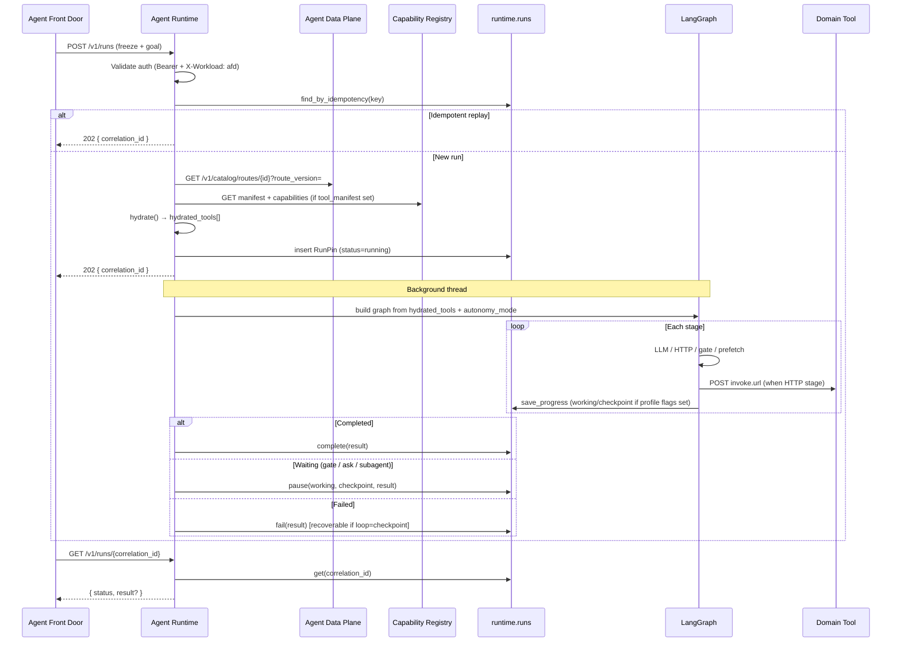

# Agent Runtime — Technical Implementation

End-to-end reference for how **agent-fabric-runtime** (AR) executes a pinned route from HTTP ingress through graph completion. AR runs **after** Agent Front Door (AFD) has decided and pinned a route; it does not classify utterances or own agent identity.

**Position in the fabric:**

```text
Channel → AFD (decide / pin) → ADP (catalogue) → AR (this service) → ACR (hydrate) → domain tools
```

Port **3008**. Stack: Python 3.12, FastAPI, SQLAlchemy 2, LangGraph, PostgreSQL (`ar` database, `runtime` schema).

---

## 1. System boundaries

| Responsibility | Owner |
| --- | --- |
| Utterance classification, route selection | Agent Data Plane (ADP) + AFD |
| Run start authorization, freeze delivery | AFD only (`X-Workload: afd`) |
| Hydrate pinned manifest → frozen tool list | AR (once per run) |
| LangGraph execution (Patterns 0–3) | AR |
| Domain HTTP tool calls | AR → capability `invoke.url` |
| Child agent jobs (`kind=agent`) | AR → AFD `/v1/jobs` |
| Conversation / long-term memory | Not in AR (future Shared Memory) |
| Mid-loop registry reads | Not supported — hydrate is frozen at pin time |

---

## 2. Hexagonal layout

```text
app/
  api/                    # FastAPI ingress, auth middleware, route handlers
    app.py                # build_app(), workload auth, dependency wiring
    routes/runs.py        # POST /v1/runs, /turns, GET status, open-run
    routes/health.py      # GET /health
  core/
    agent_core.py         # RunService: start / resume / status / open-run
    execution.py          # run_loop(): graph.invoke → complete / waiting / failed
    run_store.py          # PersistentRunStore → runtime.runs
    state.py              # RunPin model + RunStore protocol
    memory.py             # working notes/slots + loop checkpoint persistence
    checkpoint.py         # resume_index helpers for failed / gated runs
  agents/
    hydrate.py            # ADP + ACR → ordered hydrated_tools list
    clients.py            # HttpCatalogueClient, HttpRegistryClient
    jobs_client.py        # HttpJobsClient → AFD /v1/jobs (kind=agent)
    prefetch.py           # deterministic_prefetch corpus packing
    audit_client.py       # Fire-and-forget audit events
  graph/
    workflow.py           # build_tool_graph, build_agent_loop, _run_stage
    payload.py            # HTTP payload projection from goal + slots
    branch.py             # Conditional workflow routing
    human_gate.py         # Pause for human approval
    customer_ask.py       # Pattern 1 ASK pause
    subagent_gate.py      # Pause for kind=agent join
    llm/                  # LlmPort, SeedStubLlm, ProviderLlm
  tools/
    invoker.py            # HttpToolClient → capability invoke.url
  telemetry.py            # OTel spans + fabric business events
```

Dependencies are injected via protocols (`CataloguePort`, `RegistryPort`, `GraphPort`, `ToolInvoker`, `LlmPort`, `JobsPort`, `PrefetchPort`, `RunStore`). Tests pass fakes through `create_app(store=…, catalogue=…, …)`.

---

## 3. End-to-end sequence



---

## 4. Ingress and authentication

**File:** `app/api/app.py`

Every path except `/health` requires:

```http
Authorization: Bearer fabric-internal
X-Workload: afd
```

Logic:

1. Missing or wrong bearer → **401** `UNAUTHORIZED`
2. Workload not `afd` → **403** `FORBIDDEN` (only AFD may call runtime)
3. `X-Request-Id` is bound to OTel context via `telemetry.bind_request_id()` and forwarded on all outbound HTTP (ADP, ACR, tools, jobs, audit)

Production wiring (`build_app()`):

- `PersistentRunStore` → PostgreSQL
- `HttpCatalogueClient(DATA_PLANE_URL)`
- `HttpRegistryClient(REGISTRY_URL)`
- `HttpToolClient()`, `llm_from_env()`, `HttpPrefetchClient()`, `HttpJobsClient()`
- Graph runs on a **daemon background thread** (`run_in_background`)

---

## 5. Start run — `POST /v1/runs`

**Handler:** `app/api/routes/runs.py` → `RunService.start()`

### 5.1 Request contract

Required fields (see `agent-fabric-docs/05-reference/run-start.json`):

| Field | Purpose |
| --- | --- |
| `mode` | Must be `"new"` |
| `idempotency_key` | Unique start key; replays return existing `correlation_id` |
| `session_id` | `chat-{uuid}`, `job-{uuid}`, or `sub-{uuid}` |
| `route_id` / `route_version` | Pinned catalogue cut (from AFD freeze) |
| `goal` | Ingress payload (e.g. `{ "utterance": "…" }`) |
| `activation_target`, `agent_client_id` | Stored on pin for audit / future token mint |
| `contract` | Optional manifest override when not on catalogue row |

Responses:

| Code | Meaning |
| --- | --- |
| **202** | Pin durable, graph scheduled |
| **400** | Validation error |
| **422** `HYDRATE_FAILED` | Catalogue/registry miss — **no pin created** |

### 5.2 Start algorithm (`RunService.start`)

```text
1. Validate mode=new, idempotency_key, session_id
2. find_by_idempotency(key) → return existing correlation_id if hit
3. Load catalogue row: GET /v1/catalog/routes/{route_id}?route_version=
4. hydrate(body, catalogue, registry, row) → list[hydrated_tools]
5. memory_profile(row) → { working, loop } flags
6. Mint correlation_id = "corr-" + uuid4()
7. insert RunPin(status=running, hydrated_tools frozen)
8. emit audit hydrate.snapshot (async)
9. emit telemetry run.started
10. schedule_run(_execute_new_run) on background thread
11. return correlation_id (HTTP 202)
```

**Critical invariant:** Hydrate completes **before** `202`. The `hydrated_tools` JSON on the pin never changes for the life of the run.

### 5.3 Idempotency

`PersistentRunStore.insert()` catches `IntegrityError` on `idempotency_key` unique constraint and returns the existing pin. The caller gets the original `correlation_id` without re-executing the graph.

---

## 6. Hydrate — frozen tool list

**File:** `app/agents/hydrate.py`

Hydrate resolves a pinned route into an ordered list of graph nodes. Each node is a dict with at minimum:

- `id` — capability or stage identifier (slot key)
- `llm_role` — `none`, `query_formulation`, `classify`, `synthesis`
- `llm_prompt` — text for LLM stages
- `invoke` — `{ url, method, body? }` for HTTP capabilities (frozen from ACR)
- `input_schema` / `output_schema` — JSON Schema from ACR
- Optional: `workflow_stage_id`, `stage_type`, `branch`, `kind=agent`, `join`

### 6.1 Decision tree

```text
route_id + route_version required
│
├─ tool_manifest + manifest_version present (on row or contract)?
│   ├─ YES → registry.get_manifest → foreach tool ref: registry.get_capability
│   │         Load workflow from ADP if workflow_id set
│   │         If workflow has branch stages → _hydrate_workflow_ordered (stage order + branch maps)
│   │         Else → _attach_llm_roles from workflow stages
│   │         → _ensure_llm
│   └─ NO  → _hydrate_without_manifest
│             ├─ workflow_id → one node per workflow stage (invoke={})
│             ├─ prompt_id only → Pattern 0 single synthesis node
│             └─ neither → HydrateError
│
└─ _ensure_llm: Pattern 2/3 without classify/synthesis → append trailing "respond" node
```

### 6.2 Pattern-specific hydrate behavior

| Pattern | `autonomy_mode` | Hydrate outcome |
| --- | --- | --- |
| **0** Deterministic | 0 | Workflow stages or prompt-only; optional `prefetch` stage prepended when `retrieval.mode=deterministic_prefetch` |
| **1** Autonomous loop | 1 | Full manifest list; graph builder uses `build_agent_loop` (not linear) |
| **2** LLM-assisted | 2 | Manifest + trailing `respond` synthesis if no classify/synthesis node |
| **3** Tool-only | 3 | Same as 2 — HTTP stages only unless `_ensure_llm` adds respond |

### 6.3 Upstream calls during hydrate

| Call | Client | On failure |
| --- | --- | --- |
| `GET /v1/catalog/routes/{id}?route_version=` | `HttpCatalogueClient` | `HydrateError` (422) |
| `GET /v1/catalog/workflows/{id}` | optional | `{}` if 404 |
| `GET /v1/catalog/prompts/{id}` | optional | `{}` if 404 |
| `GET /v1/manifests/{id}/versions/{ver}` | `HttpRegistryClient` | `HydrateError` |
| `GET /v1/capabilities/{id}/versions/{ver}` | per manifest tool ref | `HydrateError` |

Outbound headers: `Authorization: Bearer fabric-internal`, `X-Workload: ar`.

---

## 7. Run pin — durable state

**Files:** `app/core/state.py`, `app/core/run_store.py`, `db/migration/V1__runtime.sql`

Table `runtime.runs`:

| Column | Type | Role |
| --- | --- | --- |
| `correlation_id` | TEXT PK | `corr-{uuid}` — run identity |
| `idempotency_key` | TEXT UNIQUE | Start deduplication |
| `session_id` | TEXT | Chat or job session |
| `route_id` / `route_version` | TEXT | Pinned catalogue cut |
| `activation_target` | TEXT | Where AFD sent the start |
| `agent_client_id` | TEXT | Route-scoped agent identity (future token mint) |
| `hydrated_tools` | JSONB | **Frozen** capability list |
| `status` | TEXT | `running` / `waiting` / `completed` / `failed` |
| `result` | JSONB | Slim `{ message, … }` when terminal or waiting |
| `working` | JSONB | `{ notes: [], slots: {} }` when `working=session` |
| `checkpoint` | JSONB | Resume metadata when `loop=checkpoint` or paused at gate |
| `created_at` / `updated_at` | TIMESTAMPTZ | Audit timestamps |

Index: `(session_id, status)` for open-run lookup.

### 7.1 Status transitions

```text
                    ┌──────────────┐
         start ────►│   running    │
                    └──────┬───────┘
           ┌───────────────┼───────────────┐
           ▼               ▼               ▼
    ┌────────────┐  ┌────────────┐  ┌────────────┐
    │ completed  │  │  waiting   │  │   failed   │
    └────────────┘  └──────┬─────┘  └──────┬─────┘
                           │               │
                    /turns resume     /turns resume
                           │          (loop=checkpoint)
                           ▼               │
                    ┌────────────┐         │
                    │   running  │◄────────┘
                    └────────────┘
```

---

## 8. Graph execution

**Entry:** `RunService._execute_new_run()` → `run_loop()` in `app/core/execution.py`

### 8.1 Graph selection (`RunService._graph_for`)

Reads `autonomy_mode` from catalogue row:

| `autonomy_mode` | Builder | Behavior |
| --- | --- | --- |
| **1** | `build_agent_loop()` | LLM chooses `CALL` / `ASK` / `DONE` up to `max_loop_steps` |
| **0, 2, 3** | `build_tool_graph()` | Linear or branching LangGraph over hydrated tools |

Both builders receive:

- `invoker` — HTTP tool client
- `llm` — optional for mode 0/2/3 LLM stages; required for mode 1
- `on_stage` callback — persists working/checkpoint + emits `stage.completed` audit
- `retrieval`, `prefetch`, `catalogue`, `jobs` — prefetch and subagent support
- `start_index` — slice hydrated_tools for resume (skip completed stages)

### 8.2 Graph state (`GraphState`)

```python
{
    "result": str,           # Latest stage output / final answer
    "goal": dict,            # Ingress goal (immutable across stages unless checkpoint restores)
    "notes": list[str],      # Human-readable stage outputs for LLM context
    "slots": dict[str, Any], # Per-stage structured outputs (slot key = capability id)
    "correlation_id": str,   # For subagent idempotency keys
    "_resume_loop_step": int # Pattern 1 resume only
}
```

### 8.3 Stage execution (`_run_stage`)

Each hydrated tool becomes a LangGraph node. Execution order per `llm_role`:

| `llm_role` | Steps |
| --- | --- |
| **`human_gate`** (`stage_type`) | If gate packet not in slots → raise `HumanGateWaiting`. If present → no-op pass-through. |
| **`classify` / `synthesis`** | LLM complete → append to notes → parse JSON slot via `parse_llm_slot` |
| **`query_formulation`** | LLM generates `query` field → merge into HTTP payload → POST invoke.url |
| **`none`** (HTTP) | `merge_http_payload(goal, slots, input_schema)` → validate → `invoker.call()` |
| **`none`** (no URL) | If prefetch stage → `run_prefetch()`. Else pass-through last note. |
| **`kind=agent`** | POST AFD `/v1/jobs` with projected child goal. If `join=true` → `SubagentWaiting`. |

### 8.4 HTTP payload construction

**File:** `app/graph/payload.py`

`merge_http_payload(goal, slots, input_schema, call_args)`:

1. Start from `goal` dict
2. If `input_schema.properties` declared → **only those keys** are sent (never raw utterance unless schema lists it)
3. Merge matching keys from prior stage slots (skip `text`, `notes`)
4. CALL args from Pattern 1 loop override goal values
5. Inject `packed_text` from prefetch slot when schema requires it
6. `validate_input_schema()` fails closed on missing required fields

Slot writes use `project_slot()` — only `output_schema` fields persisted.

### 8.5 Branching workflows

When a workflow stage declares `branch: { "low": "stage_a", "high": "stage_b" }`:

1. `build_tool_graph` inserts a conditional edge after the branch stage
2. `resolve_branch_target()` reads the branch stage's slot body
3. Looks for `risk`, `risk_tier`, `branch`, `level`, `tier` fields (case-insensitive)
4. Routes to the matching target stage; all branch targets merge at the next non-target stage

### 8.6 Pattern 1 — agent loop

**File:** `build_agent_loop()` in `app/graph/workflow.py`

System prompt instructs the LLM to reply with exactly one line:

```text
CALL <tool_id> [<json args>]
ASK <question>
DONE <answer>
```

Loop logic per iteration:

1. Build user blob from goal + prefetch pack + notes
2. LLM complete → parse action
3. **ASK** → raise `CustomerAskWaiting` (run pauses, customer must reply via `/turns`)
4. **DONE** → return final state
5. **CALL** → run `_run_stage` with `llm_role=none` (HTTP only)
   - Unknown tool → `RuntimeError`
   - HTTP error → note appended, loop continues (chat-friendly degradation)
   - `escalate_to_human` → idempotent: second call skipped; auto-DONE after handoff
6. Exceeds `max_loop_steps` → `RuntimeError`

---

## 9. Pause, resume, and memory

### 9.1 Memory profile flags

From catalogue row `memory_profile`:

| Flag | Value | Effect |
| --- | --- | --- |
| `working` | `session` | After each stage, flush `{ notes, slots }` to `runtime.runs.working` |
| `loop` | `checkpoint` | After each stage, write `checkpoint` with `step`, `stage_id`, `resume_index`, `goal` |

**File:** `app/core/memory.py` — `persist_stage()` called from `on_stage` callback.

### 9.2 Waiting states

`run_loop()` catches gate exceptions and calls `_pause_waiting()`:

| Exception | `waiting_for` | Resume via `/turns` |
| --- | --- | --- |
| `HumanGateWaiting` | `human_gate` | Gate packet: `{ decision, comment?, … }`. `reject` → fail run. |
| `CustomerAskWaiting` | `customer_ask` | `{ message: "<locator reply>" }` |
| `SubagentWaiting` | `subagent` | `{ subagents: [{ correlation_id, status, result }] }` or auto-join poll |

Checkpoint written on pause includes:

```json
{
  "step": <gate_index>,
  "stage_id": "<stage>",
  "resume_index": <next stage index in hydrated_tools>,
  "waiting_for": "human_gate|customer_ask|subagent",
  "goal": { … },
  "resume_loop_step": <Pattern 1 only>,
  "subagent_ids": ["corr-…"]
}
```

Pin status → `waiting`. Optional `result.message` exposes the ask text to the channel.

### 9.3 Resume — `POST /v1/runs/{correlation_id}/turns`

**File:** `RunService.resume()`

Branches on current pin status:

**`waiting`:**

1. Load checkpoint + prior working notes/slots
2. Parse resume body by `waiting_for` type
3. Merge into slots / notes
4. `mark_running()` → rebuild graph with `start_index=resume_index` (or `0` for Pattern 1 subagent/customer_ask join)
5. `run_loop()` with restored state
6. Return slim status

**`failed` + `loop=checkpoint`:**

1. Body must be `{}` or `{ "resume": true }`
2. Compute `resume_index` from checkpoint + slots (handles branch-aware next stage)
3. Restore goal from checkpoint
4. Re-invoke graph from `start_index`

**`running` / other:**

- Re-invoke with turn body as new goal (legacy path)

### 9.4 Subagent auto-join

When a parent pauses on `subagent` waiting:

1. `_maybe_schedule_subagent_join()` schedules background poll
2. `_join_subagents()` calls `poll_subagents()` against AFD `/v1/jobs/{id}`
3. On all terminal → `resume(parent_id, { subagents: packet })`
4. On timeout → fail with `recoverable: true`

Env: `SUBAGENT_JOIN_POLL_S` (default 0.5), `SUBAGENT_JOIN_TIMEOUT_S` (default 120).

### 9.5 Failed run recovery

When `loop=checkpoint` and an unhandled exception occurs mid-graph:

- `store.fail()` with `{ message, recoverable: true }`
- Checkpoint retains last successful stage
- Client sends `/turns` with `{}` to resume from `resume_index`

Without `loop=checkpoint`, failure is terminal (exception re-raised after persist).

---

## 10. Tool invocation

**File:** `app/tools/invoker.py`

`HttpToolClient.call(invoke, payload)`:

1. `method` from invoke (default POST)
2. `url` from frozen capability record
3. POST JSON payload
4. Non-2xx → exception (no retries)
5. Parse JSON body or wrap text as `{ "text": "…" }`
6. OTel span `tool.invoke` with url + status code
7. Forward `X-Request-Id`

Message extraction for notes (`_message()`): prefers `text` / `message`, then order summary from `order_id` + `item_name` + `price`.

---

## 11. LLM integration

**Files:** `app/graph/llm/factory.py`, `port.py`, `provider.py`, `seed_stub.py`

Selection via `llm_from_env()`:

| `FABRIC_LLM_STUB` | Implementation |
| --- | --- |
| `1` / `true` / `yes` / `on` | `SeedStubLlm` — deterministic test responses |
| otherwise | `ProviderLlm` — Ollama or configured provider (`OLLAMA_*`, `FABRIC_LLM_MODEL`) |

LLM calls receive:

- **system:** stage `llm_prompt` or loop system prompt
- **user:** `_user_blob(goal, notes, slots)` — goal + packed chunks + prior stage outputs
- **schema:** from `llm_output_schema()` when capability declares output schema for classify/synthesis

LLM-only stages never call HTTP. `query_formulation` calls LLM first, then HTTP with generated query.

---

## 12. Prefetch (deterministic RAG)

**File:** `app/agents/prefetch.py`

When catalogue `retrieval.mode = deterministic_prefetch`:

1. Hydrate prepends `{ id: "prefetch", llm_role: "none", invoke: {} }` stage
2. At runtime, `run_prefetch()` iterates `retrieval.scope` corpus IDs
3. For each corpus: `catalogue.get_corpus()` → `prefetch.search(url, collection, goal)`
4. Chunks stored in slot `prefetch` as `{ chunks: [...] }`
5. Downstream LLM/HTTP stages receive packed text via `prefetch_pack_text(slots)`
6. `require_prefetch_pack()` fails closed if prefetch stage expected but slot empty

---

## 13. Status and open-run APIs

### 13.1 `GET /v1/runs/{correlation_id}`

Returns `RunPin.slim_status()`:

```json
{
  "correlation_id": "corr-…",
  "status": "running|waiting|completed|failed",
  "result": { "message": "…" }
}
```

`result` present when `completed`, `failed`, or `waiting` (gate ask text).

### 13.2 `GET /v1/runs?session_id=`

Returns latest pin for session (`order_by updated_at desc limit 1`):

```json
{
  "runs": [{
    "correlation_id": "…",
    "session_id": "…",
    "route_id": "…",
    "route_version": "…",
    "status": "…"
  }]
}
```

Or `{ "runs": [] }` if none.

AFD projects this as `GET /v1/jobs/{correlation_id}` for job sessions.

---

## 14. Observability

### 14.1 OpenTelemetry

**File:** `app/telemetry.py`

- Spans: `hydrate`, `graph.invoke`, `tool.invoke`, `agent.start_job`, `agent.job_status`
- Waiting spans stay OK with attributes `waiting_for`, `stage_id`, `subagent_ids`
- Business events via `telemetry.emit()`:
  - `run.hydrate.succeeded` / `run.hydrate.failed`
  - `run.started`, `run.completed`, `run.waiting`, `run.failed`

### 14.2 Audit events

**File:** `app/agents/audit_client.py`

Fire-and-forget POST to `AUDIT_DATA_PLANE_URL/v1/audit/events`:

| Event | When |
| --- | --- |
| `hydrate.snapshot` | After successful pin (capability digests, no raw URLs) |
| `stage.completed` | After each graph stage (request/response SHA256 digests) |
| `run.terminal` | On completed / failed / waiting terminal observation |

Never blocks the run path; no-op when `AUDIT_DATA_PLANE_URL` unset.

---

## 15. Error handling summary

| Condition | HTTP / outcome |
| --- | --- |
| Bad auth | 401 / 403 |
| Missing required start fields | 400 |
| Catalogue/registry miss at hydrate | 422 `HYDRATE_FAILED` |
| Unknown correlation_id | 404 |
| Invalid resume packet | 400 |
| Tool HTTP non-2xx | Exception → failed run (or loop continue in Pattern 1) |
| Human gate reject | `failed` with comment message |
| Subagent join timeout | `failed` recoverable |
| Agent loop max steps | `failed` |
| Idempotent start | 202 with original `correlation_id`, no re-execution |

---

## 16. Environment variables

| Variable | Purpose |
| --- | --- |
| `DATABASE_URL` | PostgreSQL connection for `runtime.runs` |
| `DATA_PLANE_URL` | ADP catalogue base URL |
| `REGISTRY_URL` | ACR manifest/capability base URL |
| `AFD_URL` | Child jobs + subagent status poll (default `http://localhost:3005`) |
| `AFD_JOBS_CLAIMS` | JSON stub claims for jobs API |
| `AUDIT_DATA_PLANE_URL` | Audit event sink |
| `FABRIC_LLM_STUB` | `1` = stub LLM |
| `OLLAMA_*` / `FABRIC_LLM_MODEL` | Provider LLM backend |
| `SUBAGENT_JOIN_POLL_S` | Subagent poll interval |
| `SUBAGENT_JOIN_TIMEOUT_S` | Subagent join timeout |
| `OTEL_EXPORTER_OTLP_ENDPOINT` | Trace/metric/log export |
| `OTEL_SERVICE_NAME` | Default `agent-runtime` |

---

## 17. Complete walkthrough — chat turn example

**Scenario:** Pattern 2 route with manifest, linear workflow, `working=session`.

```text
1. AFD POST /v1/runs
   Body: { mode, idempotency_key, session_id, route_id, route_version, goal: { utterance } }

2. AR validates auth → idempotency miss

3. Hydrate:
   - GET route fee_explain@2026.08.1
   - GET manifest fee_explain_v1@2026.08.1 → [lookup_order, explain_fee]
   - GET each capability → invoke URLs frozen
   - Attach llm_roles from workflow
   - Append respond synthesis node

4. INSERT runtime.runs (corr-abc, status=running, hydrated_tools=[…])

5. HTTP 202 { correlation_id: corr-abc }

6. Background thread:
   a. build_tool_graph(tools, invoker, llm)
   b. run_loop:
      - Stage 0 lookup_order: merge_http_payload → POST mocks/tools/lookup
        → slot[lookup_order] = { order_id, … }, note appended
        → persist_stage → working saved
      - Stage 1 explain_fee: query_formulation LLM → POST explain API
        → slot updated, working saved
      - Stage 2 respond: synthesis LLM → final message
   c. store.complete({ message: "Your $42 fee was…" })
   d. audit run.terminal

7. AFD polls GET /v1/runs/corr-abc → { status: completed, result: { message } }

8. AFD delivers message to channel
```

**If human_gate in workflow:**

- Step 6 pauses at gate stage → `HumanGateWaiting`
- Pin → `waiting`, result.message = gate prompt
- Channel user approves → AFD POST /v1/runs/corr-abc/turns { decision: "approve" }
- Resume from `resume_index`, graph continues remaining stages

---

## 18. Testing hooks

```bash
cd agent-fabric-runtime && uv run pytest
```

`create_app()` accepts injected fakes:

```python
create_app(
    store=InMemoryRunStore(),
    catalogue=FakeCatalogue(),
    registry=FakeRegistry(),
    graph=FakeGraph(),          # skip LangGraph
    tool_invoker=FakeInvoker(),
    llm=SeedStubLlm(),
    schedule_run=run_inline,    # synchronous for TestClient
)
```

Notable test suites: hydrate, graph (slots/branch/gate), prefetch, checkpoint, runs + idempotency, memory, LLM schema, jobs client, subagent gate.

---

## 19. Related documentation

- Service README: [README.md](./README.md)
- Architecture pack: [agent-fabric-docs/04-architecture/agent-runtime.md](../agent-fabric-docs/04-architecture/agent-runtime.md)
- Patterns 0–3: [agent-fabric-docs/06-patterns/](../agent-fabric-docs/06-patterns/)
- Run start contract: [agent-fabric-docs/05-reference/run-start.json](../agent-fabric-docs/05-reference/run-start.json)
- Stub auth: [agent-fabric-docs/05-reference/stub-auth.md](../agent-fabric-docs/05-reference/stub-auth.md)
