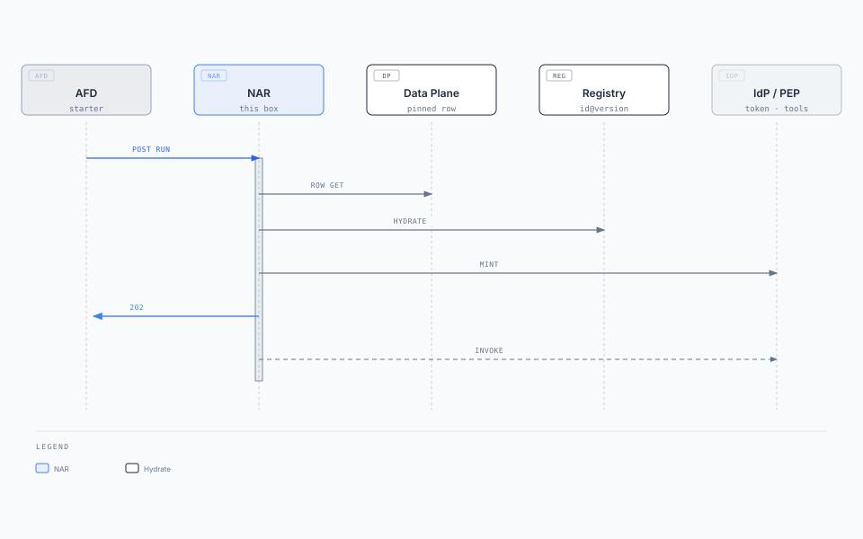

# Agent Runtime — solution architecture and design

**Box:** AR (Agent Runtime) + calls into Shared (Memory, RAG, Tools / PEP)  
**Parent:** [Enterprise Agent Fabric](./narrative/enterprise-agent-fabric.mdx) · **Behaviour source:** [agent-runtime.mdx](./narrative/agent-runtime.mdx)  
**Status:** Draft · **Date:** 2026-08-20  
**This binary:** [02-understand/status.md](../02-understand/status.md). This pack may be ahead of code.  
**Audience:** CTO / chief architect (solution on a page); platform engineer (design)

Specialized agents underneath. Does the work. Does not classify the next utterance. Does not own agent identity. Only the AFD starts AR.

---

## 1. Solution on a page

### Business problem

Routing and work share a clock, so a 12-step loop kills the decide SLO. Channels dial `activation_target` (Legal, payments) and skip entitlement. The runtime is treated as the robot: one bearer at boot with every route's scopes, or the user token as the tool-call caller. Memory, RAG, and tools get copied into every agent process.

### Key requirements

| ID | Requirement (this box) |
| --- | --- |
| FR-1 / FR-4 | Only AFD starts AR. AR fetches the catalogue row at the **pinned** version, copies the freeze into the run pin, requests a token for the pinned `agent_client_id`, returns `202 { "correlation_id" }`. Nobody re-reads `active`. |
| FR-8 | Channels never dial `activation_target`. |
| FR-10 | Three principals. User ≠ agent ≠ AR workload. Tool calls use the agent bearer plus user claims (or stored approval). AR workload identity is not the downstream caller. |
| — | Default start is async. Pattern 0 is the only sync wait. After `202`, failure is a controlled error, not a fake success. |
| — | Hydrate the **whole** pinned manifest before the LLM. Do not fetch a tool mid-loop. |

Run SLO ≠ decide SLO. Loop may take seconds to minutes.

### Architecture


[Editorial diagram](./diagrams/runtime-solution.html)

AR returns two ways: HTTP status and Kafka. Same slim body. AFD fans out.

### Key technology decisions

| Choice | Why |
| --- | --- |
| Scale per `activation_target` | Isolate the box (PCI, release, network). Omit target = shared compute. Shared compute is not a shared robot. |
| Run pin is durable | AFD freeze is TTL. Loop checkpoint, token **reference**, `run_id` live here. |
| Pin first, then mint | Catalogue `agent_client_id` on the freeze. Downscoped token after copy. Route change → new token, do not widen. |
| Shared Memory / RAG / Tools | Not inside AR. If Shared is down, routing still works; runs degrade. |
| Dual check in PEP | User (live claims or approval) **and** agent (route-scoped bearer). AR proposes; Shared enforces. |
| HTTP + Kafka return | Chat AFD needs SSE/poll. API AFD needs `GET` job or consume. One slim schema. |
| Hydrate at pin, not at turn | Registry QPS follows new runs, not tokens in the loop. |

### Expected outcomes

- Specialized routes without a mega-agent.
- A down AR is a controlled error after `202`; decide still accepts other turns.
- Examiners can show which `agent_client_id` ran, which tools fired, and that user + agent both passed.
- Parent AR starts a child via API AFD, not by POSTing Legal's AR.

### This box owns / does not own

| Component | Owns | Does not own | If it dies |
| --- | --- | --- | --- |
| AR | Run pin, Patterns 0–3, loop. Requests route-scoped agent token after freeze | Next-utterance classify, `active` lookup, Shared stores, IdP client registration, dual check | Controlled error after `202` |
| Shared | Memory, RAG, Tools | Route choice, pin, start | Runs degrade; routing still works |
| Model router | Which LLM | Which `route_id` | Inference fails; decide unaffected |

Patterns 0–3 answer **who decides the next step** inside AR. They do not answer how the run is started.

---

## 2. Context

Only AFD starts AR. AR reads Agent Data Plane and the Registry at pin, mints from the IdP, and calls Shared. Channels never see this URL.

| Actor | Relationship |
| --- | --- |
| AFD | Only starter. Sends freeze + goal. Polls status / consumes Kafka. Open-run on freeze TTL miss. |
| Agent Data Plane | Catalogue row at pinned version. Not classify. |
| Registry | Hydrate each `id@version` once at pin. |
| IdP | Mint downscoped agent token for pinned `agent_client_id`. |
| Shared Tools / PEP | Dual check, then `invoke`. |
| API AFD | `kind=agent_start` invoke. Calling-agent bearer. Not Chat AFD. |
| Channels | **None.** Never dial this URL. |

---

## 3. Container / component architecture

AR API (start, resume, open-run, status, Kafka publish) sits in front of the run pin, hydrate, mint, and planner loop. Detail: [solution diagram](./diagrams/runtime-solution.html).

| Record | Who writes it | Lives where | Job |
| --- | --- | --- | --- |
| **Run pin** | AR | Durable run store | Copy of freeze versions plus loop checkpoint, token reference, `run_id` |

AFD freeze: `route_id` + versions + `activation_target` + `agent_client_id` + (after ack) `correlation_id`. AR copies that freeze, then requests a token. Token is a **store reference**, not a god token in the run JSON.

**Three principals (AR is not the robot)**

| Principal | AR's job | AR must not |
| --- | --- | --- |
| User | Carry claims or approval id into Shared Tools / PEP | Use the user bearer as tool-call `Authorization` |
| Agent | After freeze, request a downscoped token for the pinned `agent_client_id` | Boot one token with every route's scopes, derive the client from `route_id`, or register IdP clients |
| AR workload | Prove this box may talk to Shared, IdP, model router | Call downstream APIs as the AR service account |

`activation_target` isolates the box. `agent_client_id` names the robot. A new use case is a new catalogue row and a new `agent_client_id`, not a new AR.

---

## 4. Deployment architecture

```text
  AFD (only caller) ──mesh──► AR ingress (ClusterIP)
                                    │
                    ┌───────────────┼───────────────┐
                    ▼               ▼               ▼
              AR shared      AR payments     AR pci-app
              (omit target)   (activation_     (activation_
                               target)          target)
                    │               │               │
                    └───────────────┼───────────────┘
                                    ▼
                    Run store (durable, multi-AZ)
                    Kafka {runs_topic}
                    Egress: IdP, Data Plane, Registry,
                            Shared, model router, API AFD
```

| Concern | Stance |
| --- | --- |
| Ingress | Private. AFD only. Channels never see `activation_target`. |
| Scale | In-flight runs per `activation_target`. Independent of Agent Plane decide QPS. Signal: per-fabric queue depth. |
| Isolation | One AR down: other targets still start. Do not share HPA with AFD or Plane. |
| Failover | After `202`, another replica resumes from the run pin. Pin miss for AFD is this HTTP API, not SQL. |
| Egress | Workload identity to internals. Agent bearer only to Shared Tools (and calling-agent bearer to API AFD for agent-start). |
| Shared / model router | Platform scale. Latency/error per capability. Decide unaffected. |

Loop is not on the decide clock. Do not put AR workers on the AFD autoscaler.

---

## 5. API design

Not a public URL. `202` comes from AR. AFD does not send `correlation_id` on `mode: new`; AR returns it.

### Auth

AFD workload identity on start / resume / open-run / status. Shared, IdP, Plane, Registry: AR workload identity. Tool `Authorization`: **agent** bearer.

### Endpoints

| Method | Path | When | Response |
| --- | --- | --- | --- |
| `POST` | `{activation_target}` typical `/v1/runs` | `outcome=route` after catalog read. `mode: new` | `202 { "correlation_id" }`. Pattern 0 may return the inference body |
| `POST` | `/v1/runs/{correlation_id}/turns` | Stickiness. Frozen session already has `correlation_id` | Accepted / slim. Same run, no new classify |
| `GET` | `/v1/runs?session_id=` | AFD freeze TTL miss | Open run + pin, or empty. AFD does not query the AR DB |
| `GET` | `/v1/runs/{correlation_id}` | AFD poll | Status + slim result |
| `publish` | `{runs_topic}` | Progress and completion | Same slim body as `GET`. AFD consumes. Not a decide. Not a new start |

Start body (AFD → AR):

```json
{
  "mode": "new",
  "idempotency_key": "alert-88421:v1",
  "session_id": "sess-88",
  "route_id": "fraud_investigate",
  "route_table_version": "2026.08.1",
  "activation_target": "https://assistant-app.internal/v1/runs",
  "agent_client_id": "fraud-investigate-v2",
  "contract": {
    "tool_manifest": "fraud-investigate-v2",
    "manifest_version": "2026.08.1",
    "policy_profile": "fraud_ops_read_plus_notes",
    "model_profile": "reasoning-standard",
    "max_loop_steps": 12
  },
  "goal": { "alert_id": "alert-88421", "account_id": "acct-4412" }
}
```

```json
{ "correlation_id": "corr-9f3c" }
```

Return (HTTP `GET` and Kafka, same slim body):

```json
{
  "correlation_id": "corr-9f3c",
  "status": "completed",
  "result": { "message": "Fee of $42 is the monthly account charge." }
}
```

### Idempotency, errors, rate limits

| Condition | Behaviour |
| --- | --- |
| Same `idempotency_key` | Must not start a second run. Return original `correlation_id`. |
| Hydrate failure (missing published ref) | Do not `202` a run that cannot tool. Controlled error to AFD. |
| Catalogue row miss at pinned version | Fail start. Do not load `active`. |
| IdP mint failure | Fail start (or fail the run if after `202` — controlled error). |
| Unknown `correlation_id` on resume | 404. Do not classify. |
| Loop crash after `202` | Status `failed` (or retry from checkpoint). Not a silent success. |
| Rate limit | Per `activation_target` concurrency / queue. Shed new starts with 503 to AFD. In-flight runs continue. |

---

## 6. Data architecture


| Field | Notes |
| --- | --- |
| `correlation_id` | AR-minted. Channel-visible via AFD only as opaque id on jobs. |
| `token_ref` | Pointer to secret store. Never the raw agent token in JSON. |
| `hydrated_tools` | Schemas + invoke from registry at pin. Frozen for the run. |
| `checkpoint` | Pattern 0–3 loop state. Resume after replica death. |
| `idempotency_key` | Unique where present (jobs). |

**Indexes:** PK `correlation_id`. Unique `idempotency_key`. `(session_id, status)` for open-run. `updated_at` for GC.

**Consistency:** Run pin is authoritative for the loop. AFD KV is a cache of the freeze. Open-run API is the reconciliation path.

**Retention:** Run pin retained per audit / replay policy (longer than freeze TTL). Token refs revoked on complete/fail per IdP policy. Hydrated schemas stay with the pin so exam can show what the model was allowed to propose.

**Partitioning:** by `correlation_id` or time + tenant, depending on store. Working size is in-flight runs, not decide QPS.

Memory / RAG documents live in Shared, keyed by `session_id`, not in this store.

---

## 7. Event / messaging design

| Topic | Partition key | Producer | Consumer | Schema | Semantics |
| --- | --- | --- | --- | --- | --- |
| `{runs_topic}` | `correlation_id` | AR | Chat AFD, API AFD | Slim status / result = HTTP GET | At-least-once. Progress + completion |
| Job-start topics | — | Not AR | API AFD | — | AR must not ingest starts (would be a third AFD) |

| Concern | Stance |
| --- | --- |
| Ordering | Per `correlation_id`. Monotonic status. Ignore stale `running` after `completed`/`failed`. |
| Retries | Produce until Kafka ack. HTTP GET is the catch-up path if a consumer lagged. |
| Poison | Do not publish start-shaped messages. Malformed loop output: `failed` + DLQ for ops, still a valid slim event. |
| Replay | Supported. AFD consumers idempotent on `(correlation_id, status, version)`. |
| Retention | Long enough for jobs pollers; AFD must not require infinite retention (HTTP GET remains). |
| Delivery | At-least-once. Dual path (HTTP + Kafka) is the resilience story, not exactly-once. |

Agent-start child jobs use the **API AFD** jobs contract (HTTP), not `{runs_topic}` as a start.

---

## 8. Sequence diagrams

### Happy path — start, hydrate, 202, loop



[Editorial diagram](./diagrams/runtime-seq-start.html)

### Happy path — continuation / resume

`POST /v1/runs/{correlation_id}/turns` on the same run pin. No classify. No re-hydrate.

### Failure — crash after 202

Caller already has `correlation_id`. Resume from the run pin. `GET` status is `running` or `failed` — never a fake success.

### Duplicate / idempotent start

Same `idempotency_key`. Second `POST /v1/runs` returns the original `correlation_id` and does not mint a second agent token or hydrate a second pin.

Pin miss on AFD: `GET /v1/runs?session_id=` returns the open run + pin, or empty. Never AR SQL.

---

## 9. Failure and resilience design

| Failure | Behaviour |
| --- | --- |
| AR replica death after `202` | Resume from run pin. Caller already has `correlation_id`. |
| AR down before `202` | AFD 503. Idempotent retry may start once. |
| One `activation_target` down | Other targets still start. That route: start-ack timeout or controlled error. |
| Data Plane catalogue GET fails | Do not start. Do not load `active`. |
| Registry hydrate fails | Do not `202` a tool-less run (unless the manifest is empty by design). |
| IdP mint fails | Do not run tools. Fail start or fail the run. |
| Shared down | Routing still works. Loop degrades (no memory / RAG / tools). Side effects stop. |
| Model router down | Inference fails. Decide unaffected. |
| Duplicate start | Idempotency key. |
| Poison tool proposal | PEP deny. Not on the manifest → never invoke. |
| Parent POSTs callee `activation_target` | Forbidden. Agent-start goes to API AFD. |
| Regional failure | Fail over AR fleet + run store + Kafka. In-flight loops checkpoint. Decide/AFD in another region can still accept turns for other targets. |

**Retries / backoff:** tool invoke: bounded, per risk_tier, then fail the step. Kafka produce: retry. Start hydrate: fail fast (no partial robot). Circuit-break a hot domain API without blocking other tools on the same pin.

**DLQ:** failed runs remain queryable on HTTP GET. Ops DLQ for loop poison; do not hide them as `completed`.

**DR:** run store is the RPO for work. `{runs_topic}` is reconstructible from status GET. Agent tokens are re-mintable from `agent_client_id` on the pin (pin first, then mint — same rule).

**Anti-patterns:** AR POSTs another AR; one agent token at boot; user bearer as tool caller; AR workload identity as downstream `Authorization`; re-read `active`; lazy tool fetch from the registry; new `activation_target` per route only to get a different identity; deriving `agent_client_id` from `route_id`.

---

## Read next

[Agent Front Door](./agent-front-door.md) · [Agent Plane](./agent-plane.md) · [Agent Capability Registry](./agent-capability-registry.md) · [Behaviour source](./narrative/agent-runtime.mdx)
