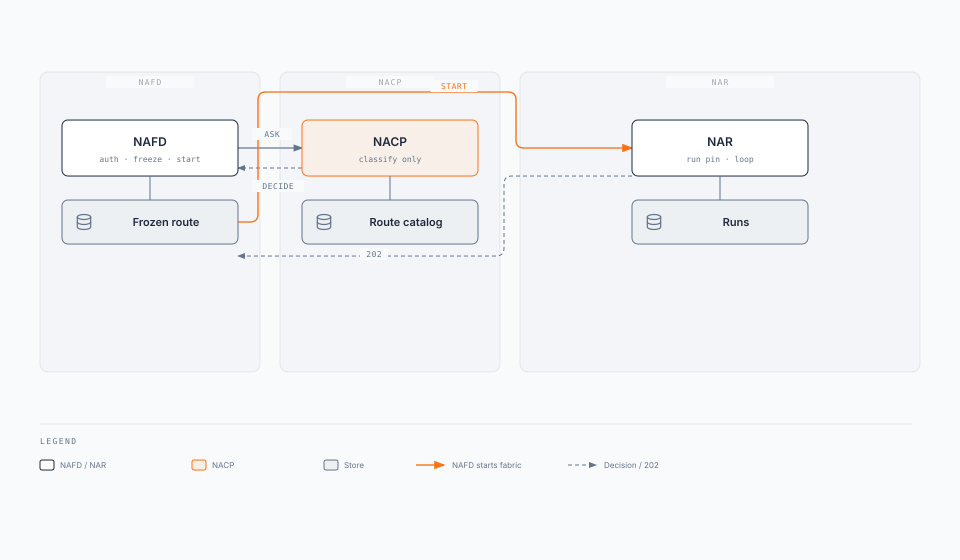

# Enterprise Agent Fabric

**Agent Front Door (NAFD) · Agent Plane · Agent Control Plane (NACP) · Agent Data Plane · Agent Runtime (NAR) · Shared**

One fabric. One front door. One agent plane. Specialized agents underneath.

**Status:** Draft for design review  
**Date:** 2026-08-19  
**Aligns with:** [Agents Blueprint](/blueprints/agents-blueprint) · [Route contract reference](/playbooks/agents/intent-router/route-contract-reference) · [Wire agentic app](/playbooks/agents/intent-router/wire-agentic-app) · [Layered classifier](/playbooks/agents/intent-router/layered-classifier) · [Session custody](/playbooks/agents/orchestration/session-custody)

Local draft. How-to stays in playbooks. This page is the working architecture: one decide contract, two NAFD fleets. APIs, fleets, and scale live on the child pages. Executive brief: [Enterprise Agent Fabric V1](/intent/enterprise-agent-fabric/v1).

**Pin split:** Agent Front Door **calls** the Agent Data Plane (catalogue + classify). Agent Control Plane is the sibling control box. NAFD **pins** `route_id` + versions and async-starts NAR. Playbooks still put the pin on the NACP. Treat this page as the proposal until they catch up.

**NAFD split:** one **contract** (entitle, classify, freeze, start). Two **fleets**: Chat NAFD (BFF, Chat/UI) and API NAFD (HTTP; Kafka job ingest is this NAFD). Kafka `{runs_topic}` is NAR return, not a third NAFD.

| Playbooks | This paper |
| --- | --- |
| Front door | **[AFD](/intent/enterprise-agent-fabric/agent-front-door)** (Agent Front Door). Entitles, freezes, starts. Only way in. |
| Intent router | **[AP](/intent/enterprise-agent-fabric/agent-plane)** (Agent Plane). Agent Front Door calls **Agent Data Plane** (catalogue + classify). **NACP** is the control box. Does not do the work. |
| Agentic app | **[AR](/intent/enterprise-agent-fabric/agent-runtime)** (Agent Runtime). Specialized agents underneath. |
| Memory / RAG / tools | **Shared**. Called from NAR. Not inside NAR. |
| Tool manifests | **[Agent Capability Registry](/intent/enterprise-agent-fabric/agent-capability-registry)**. Sits with Agent Plane, next to Control Plane and Data Plane. Publishers append `id@version`. NAR hydrates at pin. Agent-start `invoke` is API NAFD. |

---

## 1. Job of the system

Two NAFDs and one **Agent Plane** per **trust domain**. Every turn is entitled, decided, and (on `route`) async-started into NAR. Users do not pick chatbots. Channels never dial Legal or payments URLs.

**Today:** users open Finance, then HR, then Legal chatbots. Partner APIs invent dispatch. Not everyone should see Legal.

**Target:** Chat/UI hits the Chat NAFD. Partners, systems, and Kafka job starts hit the API NAFD. That NAFD's Agent Front Door calls the **Agent Data Plane** to decide which governed path owns this turn. On `route`, the **NAFD** pins it and starts NAR.

Agent Data Plane classifies against the route/workflow catalogue. NACP is the control box in the same Agent Plane. The **Agent Capability Registry** sits next to those two boxes. NAR does the work (Memory, RAG, Tools via **Shared**). NAFD freezes and starts. The two NAFDs share that contract and that Agent Plane. They do not share a process.

| With one shared Agent Plane | Without |
| --- | --- |
| One ingress decision for a shared experience | Each UI or `if/else` guesses the agent |
| Two NAFD fleets, one contract | Chat SSE and jobs share a process, or Kafka is a third start |
| One versioned route/workflow catalogue + audit | Fragmented tables, inconsistent entitlements |
| One eval surface for misroutes | Cannot gate routing quality in CI |
| Clarify / abstain / safety in one place | Side doors into high-risk agents |

**Scope:** one Agent Plane per shared UX / trust domain. Not one mega-agent. Routes stay specialized. NAFDs are separate fleets so chat sockets cannot take down job start, and the reverse.

| Audience | Cares about |
| --- | --- |
| End users | One assistant, slim replies, no routing internals |
| Platform | Chat NAFD + API NAFD (pin + start, separate fleets), Agent Plane (NACP classify + data-plane catalogue), Shared, eval CI |
| Domain teams | Route rows and agent behavior behind `activation_target` |

---

## 2. Functional requirements

Testable statements for this trust domain. Classifier layers, JSON bodies, and field dictionaries live in playbooks. Channel and internal APIs: [Front Door](/intent/enterprise-agent-fabric/agent-front-door#apis) · [Agent Plane](/intent/enterprise-agent-fabric/agent-plane#apis) · [Runtime](/intent/enterprise-agent-fabric/agent-runtime#apis).

| ID | Requirement |
| --- | --- |
| **FR-1** | Two NAFDs, one contract. Only **Chat NAFD** and **API NAFD** call **decide**. Kafka ingest is the API NAFD. `{runs_topic}` is NAR return, not a start. NAR may **GET** the catalogue row at the pinned version. Agent Plane and NAR are not public URLs. |
| **FR-2** | Decide = active table ∩ `required_claims` ∩ channel. Explicit `route_id` still looks up, entitles, and records. |
| **FR-3** | Outcomes: `route`, `clarify`, `abstain`. Only `route` starts NAR. Jobs with no user fail closed or `escalate_human`. |
| **FR-4** | On `route`, NAFD pins `route_id` + `route_table_version` + `agent_client_id`, async-starts NAR, returns `202` + `correlation_id`. NAR fetches the catalogue row at that version from the Agent Data Plane, copies the freeze, then requests a token for that `agent_client_id` (FR-10). Nobody re-reads `active`. Clarify does not pin. |
| **FR-5** | Chat/UI never sees `route_id`, `run_id`, `agent_client_id`, `confidence`, or `router_layer`. Decision record is server-side. |
| **FR-6** | Empty-state chips are eligible + chat-visible only. A tap is Layer ①, not a side door. No start until `outcome=route`. |
| **FR-7** | Generic chat still classifies. Jobs name `route_id` and skip classifier + clarify, not Plane ①. |
| **FR-8** | Channels never dial `activation_target`. UI, jobs caller, and model never pin. |
| **FR-9** | Chat NAFD and API NAFD are separate fleets (process, autoscaler, failure domain). They share Agent Plane (NACP + data plane), frozen-route/session store, and start contract. |
| **FR-10** | Three principals. User (who is asking), agent (which software is acting), NAR workload (which box runs the loop). Catalogue row carries `agent_client_id`. On `route`, NAFD freezes that pointer. NAR requests a token for **that** client, downscoped to this route. Tool calls use that bearer plus user claims (or a stored approval). NAR workload identity is not the downstream caller. Shared NAR compute is allowed; one agent bearer for every route is not. |

**Out of scope on this page:** Java hexagonal ports, Temporal plugin choices, model-gateway product pick. Those are later ADRs or playbooks.

---

## 3. Non-functional requirements {#nfrs}

**Decide SLO** and **run SLO** are different numbers. An NAFD module may sit next to Agent Plane while the domain is small. The two NAFDs may not: UI BFF and jobs must not share a process (FR-9). Decide must not wait on a 12-step loop. Chat sockets must not wait on job bursts.

| Concern | Decide path (NAFD + Agent Plane) | Run path (NAR) |
| --- | --- | --- |
| **Latency** | p99 entitle + classify + pin + start-ack. Layer ② &lt;50ms. Decide+pin+`202` p99 &lt;100ms. Pattern 0 is the only sync wait. | Loop may take seconds to minutes. Not on the decide clock. |
| **Availability** | NACP accepts turns if one NAR is down. One NAFD down does not take the other (FR-9). | Controlled error after `202`. Not a fake success. |
| **Correctness** | Adversarial routing cases pass at 100% before release. Golden set in CI. | PEP, pattern budgets, tool allowlists (not this page). |
| **Durability** | Decision record is async. Decide does not wait for audit commit. | Run pin is durable. |
| **Security** | No public Agent Plane URL. Empty eligible set: do not start. Fail closed. | Tools and PEP run only after the freeze. Dual check: user + agent. Shared is not a side door. NAR workload identity is not the API caller. |
| **Consistency** | NAFD freeze: `route_id` + versions + `activation_target` + `agent_client_id` + `correlation_id`. | NAR copies that freeze. Pin miss: NAR API, not NAR DB. |

### Capacity assumptions (this domain, for review)

Tune per trust domain.

| Assumption | Working target |
| --- | --- |
| Route/workflow catalogue | 5-8 chat-visible routes plus a few event-only rows |
| Peak decide | Hundreds of turns/s mixed chat + jobs, not millions |
| Layer ③ | Rare. If saturated, degrade to clarify/abstain, not a slower NACP |
| Route pin TTL | 30-60 min on NAFD, keyed by `session_id` |
| NAR instances | Per `activation_target`, independent of Agent Plane |

How those numbers become fleets: [Front Door scaling](/intent/enterprise-agent-fabric/agent-front-door#scaling) · [Agent Plane scaling](/intent/enterprise-agent-fabric/agent-plane#scaling) · [Runtime scaling](/intent/enterprise-agent-fabric/agent-runtime#scaling).

---

## 4. High-level architecture

**Enterprise Agent Fabric** is the outer box. **Agent security** and **Agent evals** sit on the left. **Events** sits at the top. Agent Front Door, Agent Control Plane, and Agent Runtime emit into Events. Left to right: **Agent Front Door** (Agent Front Door inside), **Agent Plane** (Agent Control Plane stacked on Agent Data Plane, Agent Capability Registry beside them), **Agent Runtime** (Agent Runtime inside), **Shared** (Memory, RAG, Tools). Do not collapse them. A small database mark on Front Door, Agent Plane, and Runtime means each owns a store (frozen route/session, catalogue, runs). NAFD is two fleets with one contract (Chat BFF and API, including Kafka ingest). NAFD, Agent Plane, NAR, and Shared emit into Observability. Observability feeds Dashboard. Dashboard feeds Responsible / Governed AI.

**Agent Front Door calls the Agent Data Plane to classify.** The data plane does **not** call or start NAR. After `outcome=route`, the **Front Door** pins the frozen route/session (`route_id` + versions), then async-starts **Agent Runtime** on a straight start. **NAR fetches** the catalogue row and route manifest pointers from the Agent Data Plane at that pinned version, **hydrates** each capability from the **Agent Capability Registry** (same Agent Plane band, not Shared), copies the run pin, and returns `202` plus `correlation_id` to the Front Door. **Memory**, **RAG**, and **Tools** sit in **Shared**.

![Enterprise Agent Fabric: Agent security and Agent evals on the left. Events at the top. Agent Plane sits above the middle with Agent Control Plane stacked on Agent Data Plane and the Agent Capability Registry beside them. Chat/UI and API enter through Agent Front Door. Front Door asks Agent Data Plane to classify, pins the route, then starts Agent Runtime. Agent Runtime fetches the route row from Agent Data Plane and hydrates tool metadata from the Agent Capability Registry. Small database marks sit inside Front Door, Agent Plane, and Runtime. Agent Data Plane does not start Agent Runtime. Shared sits to the right (Memory, RAG, Tools). Observability feeds Dashboard then Responsible / Governed AI. Direct skips to Agent Plane are blocked.](./agent-fabric-architecture.svg)

Child pages: [Front Door](/intent/enterprise-agent-fabric/agent-front-door) (fleets, channel APIs, swim lanes) · [Agent Plane](/intent/enterprise-agent-fabric/agent-plane) (classify, catalogue, decide APIs) · [Runtime](/intent/enterprise-agent-fabric/agent-runtime) (run pin, loop, Shared, three principals, return path) · [Agent Capability Registry](/intent/enterprise-agent-fabric/agent-capability-registry) (publish, refer, hydrate; agent-start invoke is API AFD).

### Roles and responsibilities

| Component | Owns | Does not own | Scale unit | If it dies |
| --- | --- | --- | --- | --- |
| **Frontends** | Chat/UI, chips, slim replies | Route table, tools, PEP | Per channel app | That UI down; API NAFD still works |
| **Agent security** | User, agent, and NAR workload identity. Least privilege, mint after pin, revoke, no side doors | Classify, pin, loop | Platform | Fabric can run; not governed |
| **Agent evals** | Routing golden set, adversarial cases, CI gate | Pin, start, loop | Platform | Fabric can run; cannot gate misroutes |
| **Chat NAFD** | Auth, session, hints, SSE, freeze, start | Classify, jobs OpenAPI, Kafka job start | Connections + turn RPS | Chat down; jobs still work |
| **API NAFD** | Partner auth, `{jobs_url}`, Kafka ingest, freeze, start | Classify, clarify UX, SSE | Job POST RPS + consume lag | Jobs down; chat still works |
| **Agent Control Plane (NACP)** | Policy, versions, decision audit | Pin, start, loop, NAFD hot-path classify | Stateless replicas | Audit lags; in-flight runs continue |
| **Agent Data Plane** | Eligible set, classify, route/workflow catalogue. Called by Agent Front Door (classify) and NAR (row at pinned version) | Pin, start, loop | Versioned table + decide replicas | Classify fails closed |
| **Decision audit** | Async `router_layer`, `outcome`, `eligible_routes` | Chat transcript | Independent queue | Decide still succeeds |
| **NAR** | Run pin, Pattern 0-3, loop. Fetches the catalogue row at the pinned version from Agent Data Plane. Requests a route-scoped agent token after freeze | Next-utterance classify, `active` lookup, Shared stores, agent IdP registration, dual check | Per `activation_target` | Controlled error after `202` |
| **Shared** | Memory, RAG, Tools | Route choice, pin, start | Platform | Runs degrade; routing still works |
| **Observability** | Traces, metrics, audit from NAFD, Agent Plane, NAR, Shared | Route choice | Platform | Runs continue; you cannot see them |
| **Dashboard** | Operator view of Observability | Pin, start, classify | Platform | Operators blind; fabric still runs |
| **Responsible / Governed AI** | Policy, model risk, exam evidence | Pin, start, classify | Platform / risk | Runs continue; cannot evidence them |
| **Memory** (in Shared) | Short / long term via `session_id` | Ingress classify | Platform | Runs degrade; routing still works |
| **RAG** (in Shared) | Corpus retrieve | Ingress classify | Platform | Grounding degrades; routing still works |
| **Tools / PEP** (in Shared) | Actions scoped by pinned manifest. Dual check: user entitlements (or approval) and agent scopes | Route choice, mint | With NAR | Side effects stop |
| **Agent Capability Registry** (with Agent Plane) | Immutable `id@version`. Domain `invoke` and agent-start `invoke`. NAR hydrates at pin | Pin, start, PEP permit | Platform | New runs cannot hydrate; in-flight pins still have schemas |
| **Model router** | Which LLM. Called by NAR | Which `route_id` | LLM gateway | Inference fails; decide unaffected |

### Three routers (do not collapse)

| Router | Question | Who calls it |
| --- | --- | --- |
| **Agent Data Plane** | Which workflow / manifest / app? | Agent Front Door (classify). NAR (catalogue row at pinned version, not classify) |
| **Agent planner** (inside NAR) | Which tool / step next? | NAR |
| **Model router** | Which LLM endpoint for this inference? | NAR |

### Data: route pin vs run pin

Two records. Field dictionary: [Session custody](/playbooks/agents/orchestration/session-custody).

| Record | Who writes it | Lives where | Job |
| --- | --- | --- | --- |
| **Frozen route/session** | Agent Front Door (NAFD) | NAFD store, keyed by `session_id`, TTL | This session plus the pinned route (`route_id`, versions, `activation_target`, `agent_client_id`, `correlation_id`) |
| **Decision** | Agent Control Plane (NACP) | Audit store | Why this turn routed, clarified, or abstained |
| **Route/workflow catalogue** | Platform / domain teams | Agent Data Plane | Versioned rows the data plane classifies over. Includes `agent_client_id` per row. |
| **Run pin** | NAR | Durable run store | Copy of those versions plus loop checkpoint, token reference, `run_id` |

The NAFD stores the **frozen route/session** so `"yes"` or a jobs retry keeps the same `route_id` and versions. Pin miss: **NAR API**, not NAR Postgres. `session_id` is the chat thread.

### Three principals (do not collapse) {#three-principals}

NAR is the executor. It is not the agent. Shared NAR is a compute choice. Identity lives on the pinned route. Token how-to: [Token and session boundary](/playbooks/governance/runtime/foundation/token-and-session-boundary) · [Session custody](/playbooks/agents/orchestration/session-custody). Principles: [G.A.I.N Identity](/frameworks/gain-identity).

| Principal | Answers | Issued / held | On the wire |
| --- | --- | --- | --- |
| **User** | Who is asking? | NAFD: IdP token, `sub`, `emts` | Claims or approval id. Not the tool-call bearer. |
| **Agent** | Which software is acting? | Catalogue `agent_client_id` (e.g. `payments-agent-v2`). After freeze: IdP token for that client, downscoped to this route. | `Authorization` bearer on Shared Tools calls |
| **NAR workload** | Which box is running the loop? | Platform: pod identity to Shared, IdP, model router | Workload auth to fabric internals. Not a downstream API principal. |

`activation_target` isolates the **box** (PCI, release, network). `agent_client_id` names the **robot**. Omit `activation_target` and routes share NAR compute. They do not share one agent bearer. A new use case is a new catalogue row and a new `agent_client_id`, not a new NAR. Field: [Agent client id](/playbooks/agents/intent-router/route-contract-reference#agent-client-id).

Mint order: **pin first, then agent token.** Route change mid-session: new downscoped token. Do not widen the existing one. Jobs use the same robot badge; only how you carry the user changes (live claims vs stored approval). Dual check is Shared Tools / PEP: may this person, and may this robot.

---

## 5. Request path

The Agent Data Plane **classifies**. Agent Front Door **calls it**, then **freezes and starts**. NAR **fetches the row** at the pin, then **runs**. `202` comes from NAR, not from the data plane.

**Chat / generic turn**

1. NAFD authenticates. Mint or reuse `session_id`.
2. Frozen route/session + continuation (`"yes"`, `"$500"`): skip classify, resume NAR.
3. Else Agent Front Door calls the Agent Data Plane (message + claims + `session_id`).
4. Data plane: eligible = catalogue ∩ claims ∩ channel. Returns `route` / `clarify` / `abstain`. Writes the decision record. Does not pin or start.
5. `clarify` / `abstain`: talk to the user (jobs: fail closed or `escalate_human`). No NAR. After a pick, back to step 3.
6. `route`: NAFD stores the freeze (`route_id` + versions + `activation_target` + `agent_client_id`), `POST`s NAR.
7. NAR fetches the catalogue row and manifest pointers from the Agent Data Plane at that pinned version, copies the run pin, requests a token for the pinned `agent_client_id`, returns `202 { "correlation_id" }`. Nobody re-reads `active`.
8. NAFD returns slim UI payload, or `202` to the jobs caller. Shared Tools / PEP dual-checks user + agent on every call.

**API NAFD:** caller already named `route_id`. Skip classifier and clarify. Still entitle and record (step 4), then freeze + start (steps 6-8). `{runs_topic}` is not this path.

Channel APIs and swim lanes: [Front Door](/intent/enterprise-agent-fabric/agent-front-door). Decide JSON: [Agent Plane](/intent/enterprise-agent-fabric/agent-plane#apis). Start / `202` / `{runs_topic}`: [Runtime](/intent/enterprise-agent-fabric/agent-runtime#apis).

---

## 6. Isolation and shed {#isolation-and-shed}

| Failure | Agent Front Door (NAFD) | Agent Control Plane (NACP) |
| --- | --- | --- |
| One NAR down | Other `activation_target`s still start. That route returns a controlled error after `202` or on start-ack timeout. | Still accepts new turns. |
| One NAFD down | The other ingress still works. | Unaffected. |
| Frozen-route/session store down | Continuations degrade to open-run on NAR. New `route` can still start if start-ack works. | Unaffected. |
| Catalogue unreadable | Do not start. | Fail closed. |
| Shared down | Routing still works. NAR degrades (no memory / RAG / tools). | Unaffected. |
| Layer ③ saturated | Serve `clarify` / `abstain`. | Do not enqueue behind Layer ②. |
| Audit lag | Decide still succeeds. | Exam trail lags. |

### Anti-patterns

- Freeze in replica memory (the next `"yes"` lands on another replica and misses the pin).
- One autoscaler for NAFD + Agent Plane + NAR workers.
- One process or autoscaler for UI BFF and jobs URL (FR-9).
- Public Agent Plane URL (then you scale auth, OpenAPI, and slim UX into Plane ①).
- Kafka ingest as a third public ingress, or `{runs_topic}` as a job start.
- Caller waits for the memo (decide SLO dies).
- Scaling Layer ② by adding Layer ③ replicas.
- Putting event-only rows on chat chips to "reduce classify load" (that is a side door, not a scale tactic).
- Re-reading `active` after pin (wrong, and it also adds origin QPS).
- NAR `POST`s another NAR's `activation_target` (A2A skips API NAFD).
- NAR workload identity as `Authorization` to downstream APIs (NAR becomes a fat `svc-agents`).
- One agent token at NAR boot with every route's scopes.
- A new `activation_target` per route only to get a different identity (that inflates fleets to fix a token problem).
- Deriving `agent_client_id` from `route_id` instead of pinning an explicit pointer.
- The user bearer as the tool-call caller, or skipping the agent check because NAFD already entitled the user.

---

## 7. What examiners and operators should be able to show

1. Which `route_table_version` was active for this session.
2. Which routes were eligible for this identity (and which were hinted).
3. Why this turn routed, clarified, or abstained (`router_layer`, confidence).
4. That adversarial routing cases pass at 100% before release.
5. That a routing incident was added to the golden set and blocked in CI.
6. That jobs HTTP and Kafka ingest still have a Plane ① decision record (explicit `route_id` is not a skip).
7. Which `agent_client_id` was frozen for this run, which agent called this tool, and that user and agent both passed (FR-10).

Eval how-to: [Routing eval CI](/playbooks/agents/intent-router/routing-eval-ci).

---

## 8. Design review checklist

- [ ] Boxes distinct: NAFD (Agent Front Door), Agent Plane (Control Plane on Data Plane, Agent Capability Registry beside them), NAR (Agent Runtime), Shared (Memory, RAG, Tools). Small database mark inside Front Door, Agent Plane, and Runtime. Agent security and Agent evals on the left. Events at the top from Front Door, Control Plane, Runtime. Observability → Dashboard → Responsible / Governed AI
- [ ] Two NAFD fleets, one contract, one Agent Plane, separate process (FR-9)
- [ ] `{runs_topic}` is NAR return; Kafka job start is the API NAFD
- [ ] Jobs name `route_id` and still entitle; generic chat still classifies
- [ ] Clarify / abstain never start NAR. Default start is async
- [ ] UI never sees `route_id` / `run_id` / `agent_client_id`. Route pin ≠ run pin. Nobody re-reads `active`
- [ ] Decide SLO ≠ run SLO. Frozen-route/session store is shared KV. Agent Plane and NAR are not public URLs
- [ ] User ≠ agent ≠ NAR workload. Catalogue `agent_client_id` on the freeze. Dual check in Shared. Shared NAR does not share one agent bearer (FR-10)

---

## Non-goals

- One mega-agent with every tool.
- One NAR bearer for every route (shared compute is not a shared robot).
- The user token as the tool-call caller.
- One process or autoscaler for chat SSE and jobs start (FR-9).
- Browser, partner, or domain MS calling the Agent Plane or the NAR directly.
- Kafka as a third public ingress into the Agent Control Plane.
- `{runs_topic}` as a job start.
- NACP waiting on Temporal / the 12-step loop.
- Event-only routes shown as chat chips.
- Entitlements stored per user in the route table (use ingress claims).
- Replacing published playbooks with this local page.

---

## Appendix: decisions locked

FRs above are the testable form.

1. **Four jobs.** NAFD (entitle, pin, start), Agent Data Plane (classify + catalogue; called by Agent Front Door), NACP (control + audit), NAR (run pin + loop; requests agent token). Pin sits on NAFD. Agent Capability Registry sits with Agent Plane. Memory, RAG, and Tools sit in Shared.
2. **Two NAFD fleets, one contract.** Separate process (FR-9). Shared Agent Plane. `{runs_topic}` is return. Kafka job start is the API NAFD.
3. **Jobs name the route.** Skip classifier and clarify. Do not skip Plane ①.
4. **Generic chat still classifies.** Hints are eligible + chat-visible. A tap is Layer ①.
5. **Clarify / abstain never start NAR.** On `route`: freeze, async-start, `202`.
6. **One Agent Plane per trust domain.** Control Plane and Data Plane stay separate boxes. Not one mega-agent.
7. **Three principals.** User, agent, NAR workload. Catalogue `agent_client_id` on the freeze. Pin first, then mint. Dual check in Shared Tools / PEP. Shared NAR is compute, not identity (FR-10).
8. **Capabilities are references.** Publishers append `id@version` next to Control Plane and Data Plane. Manifests refer. NAR hydrates the whole pinned manifest before the LLM. `kind=agent_start` `invoke` is API NAFD jobs, not the callee NAR.

---

## Read next

**[Agent Front Door](/intent/enterprise-agent-fabric/agent-front-door)** · [Agent Plane](/intent/enterprise-agent-fabric/agent-plane) · [Agent Runtime](/intent/enterprise-agent-fabric/agent-runtime) · [Agent Capability Registry](/intent/enterprise-agent-fabric/agent-capability-registry) · [Wire agentic app](/playbooks/agents/intent-router/wire-agentic-app) · [Layered classifier](/playbooks/agents/intent-router/layered-classifier) · [Session custody](/playbooks/agents/orchestration/session-custody) · [Token and session boundary](/playbooks/governance/runtime/foundation/token-and-session-boundary) · [G.A.I.N Identity](/frameworks/gain-identity) · [Routing eval CI](/playbooks/agents/intent-router/routing-eval-ci) · [Agents Blueprint](/blueprints/agents-blueprint)
