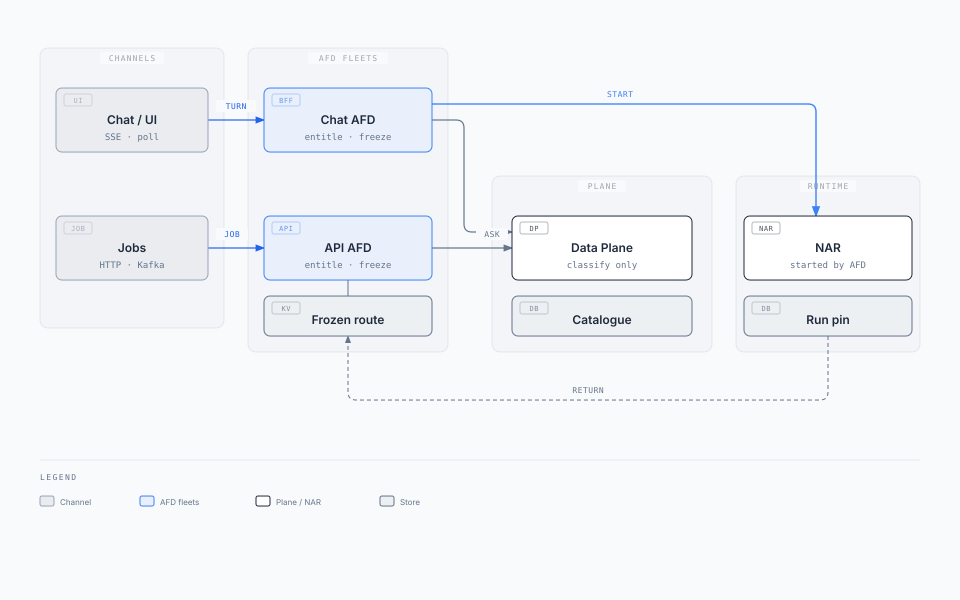
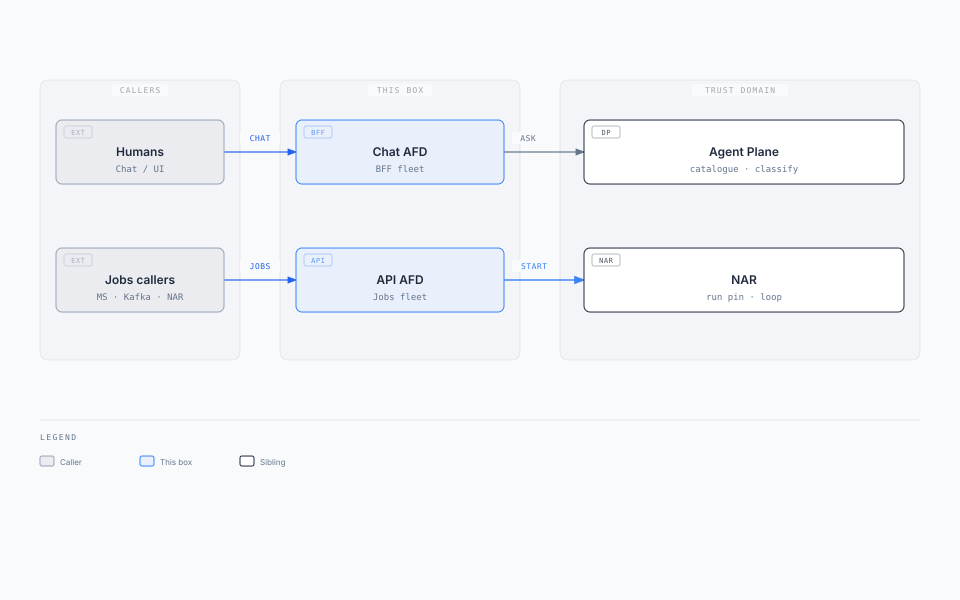
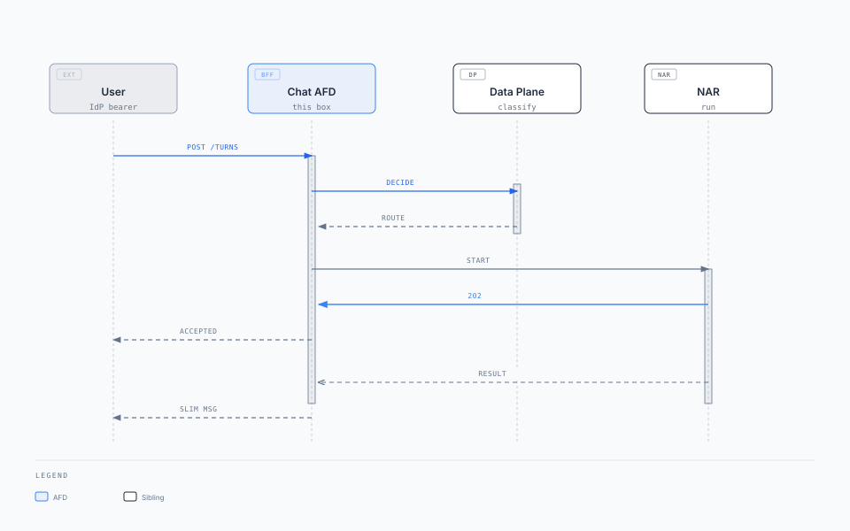
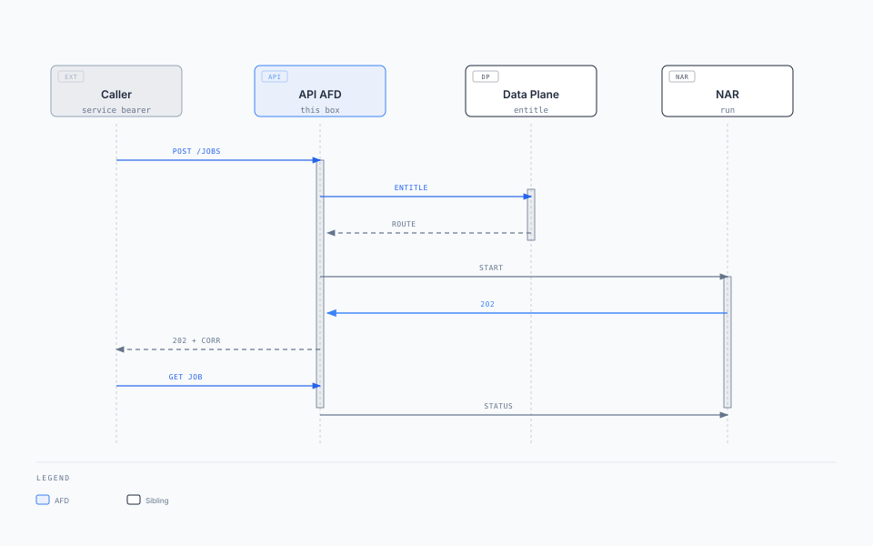

# Agent Front Door — solution architecture and design

**Box:** Chat AFD (BFF) + API AFD (HTTP handler + Kafka job-start worker)  
**Parent:** [Enterprise Agent Fabric](../enterprise-agent-fabric/enterprise-agent-fabric.mdx) · **Behaviour source:** [agent-front-door.mdx](../enterprise-agent-fabric/agent-front-door.mdx)  
**Status:** Draft · **Date:** 2026-08-20  
**Audience:** CTO / chief architect (solution on a page); platform engineer (design)

Two fleets. One contract. Only way into the Fabric. Kafka `{runs_topic}` is AR return, not a third AFD.

---

## 1. Solution on a page

### Business problem

Channels and partner APIs invent their own dispatch. Chat sockets and job bursts share one process, so a hung SSE pool takes down Legal jobs (or the reverse). Callers wait for the memo, so the decide SLO dies. Browsers and domain services dial the Agent Plane or AR and leak auth, routing internals, and side doors into high-risk agents.

### Key requirements

| ID | Requirement (this box) |
| --- | --- |
| FR-1 | Only Chat AFD and API AFD call decide. Kafka ingest is the API AFD. `{runs_topic}` is return, not start. |
| FR-4 | On `route`, this AFD pins `route_id` + versions + `agent_client_id`, async-starts AR, returns slim UI or `202` + `correlation_id`. |
| FR-5 | Chat/UI never sees `route_id`, `run_id`, `agent_client_id`, `confidence`, or `router_layer`. |
| FR-6 | Empty-state chips are eligible + chat-visible. A tap is Layer ①. No start until `outcome=route`. |
| FR-7 | Generic chat classifies. Jobs name `route_id` and skip classifier + clarify, not entitle. |
| FR-8 | Channels never dial `activation_target`. UI, jobs caller, and model never pin. |
| FR-9 | Chat AFD and API AFD are separate fleets (process, autoscaler, failure domain). They share Agent Plane, frozen-route/session store, and start contract. |

Decide+pin+start-ack p99 &lt; 100 ms. Wait only for AR `202`, never the loop.

### Architecture



[Editorial diagram](./diagrams/afd-solution.html)

Entitle → classify (chat) or entitle-only (jobs) → freeze → start. Callers never dial AR.

### Key technology decisions

| Choice | Why |
| --- | --- |
| Two fleets, one contract | Chat is connection-bound (SSE/poll, hints, clarify). Jobs are bursty and skip classify. Shared process couples failure domains (FR-9). |
| AFD writes the freeze, not ACP | Decide SLO stays classify. Pin + start sit on the box that already holds the channel session. |
| Shared KV for freeze, not replica memory | Next `"yes"` lands on another replica. Keyed by `session_id`, TTL 30–60 min. |
| Async start by default | AR loop is seconds to minutes. Pattern 0 is the only sync wait. |
| Kafka `{runs_topic}` is return | Same slim status as HTTP `GET` run. AFD fans out. Not a public start. |
| Kafka job-start worker is API AFD | Topic bind = Layer ① `route_id`. Prevents a third public ingress. |

### Expected outcomes

- One ingress decision for a shared experience; users do not pick chatbots.
- Chat down does not take jobs; jobs burst does not starve SSE.
- No public Agent Plane or AR URL. No channel-dial of Legal or payments.
- Continuations (`"yes"`, `"$500"`) and job retries keep the same pinned route.

### This box owns / does not own

| Owns | Does not own |
| --- | --- |
| Channel auth surface, `session_id`, hints, SSE/poll, jobs OpenAPI | Classify, eligible set, route catalogue |
| Frozen route/session, pin + async start | Run pin, loop, Patterns 0–3 |
| Fan-out of AR status (SSE / `GET` job / Kafka consume) | Agent identity mint, dual check, tool invoke |
| Mapping opaque `hint_id` / `option_id` → `route_id` | Decision audit (ACP writes it) |

---

## 2. Context



[Editorial diagram](./diagrams/afd-context.html)

| Actor | Relationship |
| --- | --- |
| Human on Chat/UI | IdP user bearer. Sees slim messages and opaque options only. |
| Partner / system | IdP service bearer. Posts explicit `route_id` to `{jobs_url}`. |
| Parent AR | Calling-agent bearer. Same jobs contract as partners (not Chat AFD). |
| Agent Data Plane | Internal. Decide, eligible, catalogue row. AFD is the only decide caller. |
| AR | Internal. Start, resume, open-run, status. Channels never see this URL. |
| IdP | Mints user/caller bearer at ingress. After pin, AR asks it for the agent token. |

If they skip this box: browser → Data Plane leaks auth into Plane ①; caller starts AR and the channel dials Legal; Kafka as a third public start invents dispatch.

---

## 3. Container / component architecture

Chat AFD is the turn / hints / SSE handlers plus a hints cache. API AFD is jobs HTTP, the Kafka job-start worker, and status fan-out. Both share the freeze KV. Detail: [solution diagram](./diagrams/afd-solution.html).


| Component | Responsibility |
| --- | --- |
| Chat turn handler | Auth, mint/reuse `session_id`, continuation vs new decide, freeze, start, slim reply. |
| Hints | `GET` eligible ∩ chat-visible. Opaque `hint_id`. Cache per `(claims-hash, channel, route_table_version)`. |
| SSE / poll | After accepted turn. Reads AR HTTP or `{runs_topic}`. Not catalog JSON. |
| Jobs HTTP | `POST` `{jobs_url}` with `route_id`. Entitle, freeze, start. `202` + `correlation_id` (or Pattern 0 body). |
| Kafka job-start worker | Same as jobs HTTP. `route_id` from body or Layer ① topic bind. Missing claims: do not start. |
| Status fan-out | `GET` job and `{runs_topic}` consume. Does **not** call the data plane. |
| Frozen-route/session store | Shared. Keyed by `session_id`. Pin miss: AR `GET /v1/runs?session_id=`, not AR SQL. |

**Stateless handlers.** Do not keep the freeze in replica memory.

**Catalogue row.** After `outcome=route` only, at the pinned version. Cache it. Clarify does not read the table. AFD may read `activation_target` so it knows which AR to `POST`.

---

## 4. Deployment architecture

Cloud-agnostic. One trust domain. Three availability zones.

```text
                    ┌─────────────────────────────────────────┐
  Public / partner  │  Ingress (TLS)                          │
                    │  Chat AFD hostname  ≠  API AFD hostname │
                    └───────────────┬─────────────────────────┘
                                    │
              ┌─────────────────────┴─────────────────────┐
              ▼                                           ▼
     Chat AFD Deployment                         API AFD Deployment
     HPA: connections + turn RPS                 HPA: POST RPS + ingest lag
     AZ-spread                                   + Kafka consumer group
              │                                           │
              └─────────────────────┬─────────────────────┘
                                    ▼
                    Private: Agent Plane, AR, IdP, Kafka
                    Frozen-route KV (multi-AZ, not in-pod)
```

| Concern | Stance |
| --- | --- |
| Ingress | Chat AFD and API AFD are **separate** hostnames, deployments, HPAs. No shared process. |
| Egress | ClusterIP / mesh to Agent Plane and AR. No public Plane or AR URL. |
| Freeze store | Managed Redis/Valkey or equivalent, multi-AZ. Not an in-memory map. |
| Kafka | Job-start topics consumed only by API AFD. `{runs_topic}` consumed by both fleets for fan-out. |
| Scaling | Chat: connections + turn RPS. API: HTTP RPS + ingest lag + result-consumer lag. Split SSE fan-out from the turn/start pool if sockets dwarf turn rate. |
| Failover | One AFD down: the other ingress still works. Freeze store down: continuations degrade to AR open-run; new `route` can still start if start-ack works. |
| Network | IdP tokens on ingress. Workload identity to Plane / AR / Kafka. |

Working capacity (this domain): hundreds of turns/s mixed chat + jobs, not millions. Freeze TTL 30–60 min; scale the KV on active keys, not QPS.

---

## 5. API design

Working path names. Agent Plane and AR are not public. The two fleets do **not** share OpenAPI or a process.

### Auth

| Fleet | Caller auth | Session |
| --- | --- | --- |
| Chat AFD | IdP user bearer (cookie/BFF) | AFD mints `session_id` on a new chat |
| API AFD | IdP service bearer, or calling-agent bearer (parent AR) | No chat session required. Jobs still freeze a route/session for retry stickiness |

Operator read of the decision record is platform-auth only (FR-5). Not a channel API.

### Chat AFD

| Method | Path | When | Success |
| --- | --- | --- | --- |
| `POST` | `/v1/assistant/turns` | Free text, hint tap, or clarify pick (`option_id` → `route_id`) | Slim: `accepted` / `clarify` / `abstain`. Result on SSE/poll |
| `GET` | `/v1/assistant/hints` | Empty state after login | Chat-visible labels + opaque `hint_id`s. Mints `session_id` if missing |
| `GET` | `/v1/assistant/sessions/{session_id}/events` | After accepted turn | SSE (or poll). Slim tokens / final message |

Continuation (`"yes"`, `"$500"`): same `POST` turns. Skip decide. Resume AR.

Turn request:

```json
{
  "session_id": "sess-88",
  "message": "Why was I charged $42?",
  "hint_id": null,
  "option_id": null
}
```

Turn responses (slim; AFD keeps `route_id` server-side):

```json
{ "session_id": "sess-88", "status": "accepted" }
```

```json
{
  "session_id": "sess-88",
  "status": "clarify",
  "prompt": "Did you want a fee explanation or recent transactions?",
  "options": [
    { "id": "opt-1", "label": "Explain a fee" },
    { "id": "opt-2", "label": "Show recent transactions" }
  ]
}
```

### API AFD

| Method | Path | When | Success |
| --- | --- | --- | --- |
| `POST` | `{jobs_url}` (default `/v1/jobs`) | Partner / system / parent AR | `202 { "correlation_id" }`. Pattern 0 may return the body |
| `GET` | `{jobs_url}/{correlation_id}` | Caller poll | Status / slim result from AR HTTP. No data-plane call |
| `consume` | `{runs_topic}` | Result fan-out | Same slim body as `GET`. Ack = Kafka commit. Not a start |

Jobs start:

```json
{
  "route_id": "contract_review",
  "idempotency_key": "job-4412:v1",
  "payload": { "document_id": "doc-19", "matter_id": "m-88" }
}
```

```json
{ "correlation_id": "corr-9f3c" }
```

Idempotency is on **start**, not classify. Same `idempotency_key` must not start a second run (AR enforces; AFD retries the same start).

### Errors and rate limits

| Condition | HTTP | Behaviour |
| --- | --- | --- |
| Missing / invalid bearer | 401 | Do not decide, do not start |
| Empty eligible set / missing job claims | 403 | Fail closed. Jobs: do not start, or `escalate_human` |
| Duplicate jobs `idempotency_key` | 202 | Return the original `correlation_id` |
| AR start-ack timeout | 503 | No fake success. Do not invent a `correlation_id` |
| Decide unavailable | 503 | Fail closed. Do not guess a route |
| Burst | 429 | Shed by fleet. Do not spill chat 429s onto jobs |

Rate-limit Chat AFD on turn RPS + concurrent SSE. Rate-limit API AFD on `POST` RPS per caller identity. Hints refresh when claims or `route_table_version` change; do not pin a catalogue in the browser.

### Call map (AFD → siblings)

| Ingress | → Data Plane | → AR |
| --- | --- | --- |
| UI new turn | Decide. Eligible for chips. Catalogue row on `route` | Start on `route`. Resume on continuation. Open-run on cache miss |
| Jobs HTTP / Kafka ingest / AR agent-start | Decide with explicit `route_id`. Catalogue row on `route` | Start |
| `{runs_topic}` consume / `GET` job | None | Status only |

---

## 6. Data architecture

AFD does not own the catalogue, the decision record, or the run pin.

### Frozen route / session

| Field | Role |
| --- | --- |
| `session_id` | Partition key. Chat thread. |
| `route_id` | Pinned workflow. Absent until `outcome=route`. |
| `route_table_version` | Pin. Nobody re-reads `active`. |
| `activation_target` | Which AR to start. |
| `agent_client_id` | Which robot. Frozen here; AR mints after copy. |
| `correlation_id` | Written after AR `202`. |
| `idempotency_key` | Jobs only. |
| `expires_at` | TTL 30–60 min from last pin / continuation. |

**Consistency:** KV is the session pin, not the system of record for the run. Pin miss → AR open-run API. Do not SQL the AR database.

**Indexes:** primary `session_id`. Secondary `idempotency_key` (jobs, unique, TTL). Optional `correlation_id` for `GET` job lookup if the caller has no session.

**Retention:** TTL only. Audit lives on ACP. Run history lives on AR.

**Hints cache:** `(claims_hash, channel, route_table_version)` → opaque chips. Invalidate on version bump.

---

## 7. Event / messaging design

| Topic | Direction | Partition key | Who | Semantics |
| --- | --- | --- | --- | --- |
| Job-start (configurable) | Inbound | `tenant_id` or `idempotency_key` | API AFD worker | At-least-once start. Dedup via `idempotency_key` on AR |
| `{runs_topic}` | Inbound consume | `correlation_id` | Chat AFD fan-out, API AFD status | At-least-once. Same slim schema as `GET /v1/runs/{id}`. Commit = ack |
| `{runs_topic}` | Not produced by AFD | — | AR produces | AFD must not publish start events here |

`{runs_topic}` consume is **not** job start and does **not** call the data plane.

| Concern | Stance |
| --- | --- |
| Ordering | Per `correlation_id`. Status may go `running` → `completed`. Late `running` after `completed` is ignored. |
| Retries | Job-start: retry start until AR accepts or poison. Do not re-classify on retry. |
| Poison | Missing claims or unknown `route_id`: fail closed, DLQ, do not start. |
| Replay | Safe: idempotent start. `{runs_topic}` replay is fan-out only; UI must tolerate duplicate slim events. |
| Retention | Follow platform Kafka policy. AFD does not archive transcripts here. |
| Delivery | At-least-once. Idempotent consumers on both fleets. |

---

## 8. Sequence diagrams

### Happy path — UI turn



[Editorial diagram](./diagrams/afd-seq-ui.html)

Clarify returns prompt + opaque options. No freeze, no AR. Pick maps `option_id` → `route_id` and re-enters decide as Layer ①.

### Happy path — jobs API



[Editorial diagram](./diagrams/afd-seq-jobs.html)

No classifier. No clarify. Missing claims: do not start.

### Failure — AR start-ack timeout

If AR does not return `202` in budget, AFD responds `503`. It does not mint a `correlation_id`. Caller retries with the same idempotency key.

### Duplicate / idempotent — jobs retry

Same `idempotency_key` on `POST /v1/jobs`. AFD retries the same AR start. AR returns the original `correlation_id`. AFD returns `202` with that id. No second freeze, no second robot mint.

Continuation `"yes"`: skip decide, read freeze, `POST /v1/runs/{correlation_id}/turns`. If freeze TTL miss: `GET /v1/runs?session_id=`, restore pin from AR, then resume.

---

## 9. Failure and resilience design

| Failure | Behaviour |
| --- | --- |
| Chat AFD down | Jobs still work. Inverse is true. |
| One AR / `activation_target` down | Other targets still start. That route: controlled error after `202` or on start-ack timeout. |
| Freeze store down | Continuations → AR open-run. New `route` can still start if start-ack works. |
| Agent Plane down / catalogue unreadable | Do not start. Fail closed. Do not guess. |
| Shared (Memory/RAG/Tools) down | Routing still works. AFD is unaffected; AR degrades. |
| Duplicate Kafka job-start | Idempotent start on AR. |
| Poison job (unknown route, no claims) | DLQ. Do not start. |
| Partial freeze (decide ok, start fails) | No `correlation_id` to caller. TTL the incomplete freeze. Caller retries with same idempotency key. |
| `{runs_topic}` lag | SSE/poll may stall; decide still succeeds. Scale fan-out independently of turn/start. |
| Regional failure | Fail over both fleets and the shared KV. In-flight SSE drops; jobs `GET` recovers from AR. |
| Layer ③ saturated | Plane sheds to `clarify`/`abstain`. AFD does not start. Do not wait on a slower classify. |

**Retries / backoff:** start-ack: short bounded retry (e.g. 1s → 2s → fail). Do not retry decide on a jobs path that already got `route` unless the freeze was never written. Circuit-break AR `activation_target` independently so one hot app does not block start-ack to others.

**DR:** freeze store is reconstructible from AR open-run. Catalogue and audit are not this box. RPO for freeze is "session TTL"; RPO for accepted jobs is AR run pin.

**Anti-patterns (this box):** freeze in replica memory; one autoscaler for UI BFF and jobs URL; Kafka ingest as a third public start; `{runs_topic}` as job start; caller waits for the memo; public Agent Plane URL.

---

## Read next

[Agent Plane](./agent-plane.md) · [Agent Runtime](./agent-runtime.md) · [Agent Capability Registry](./agent-capability-registry.md) · [Behaviour source](../enterprise-agent-fabric/agent-front-door.mdx)
